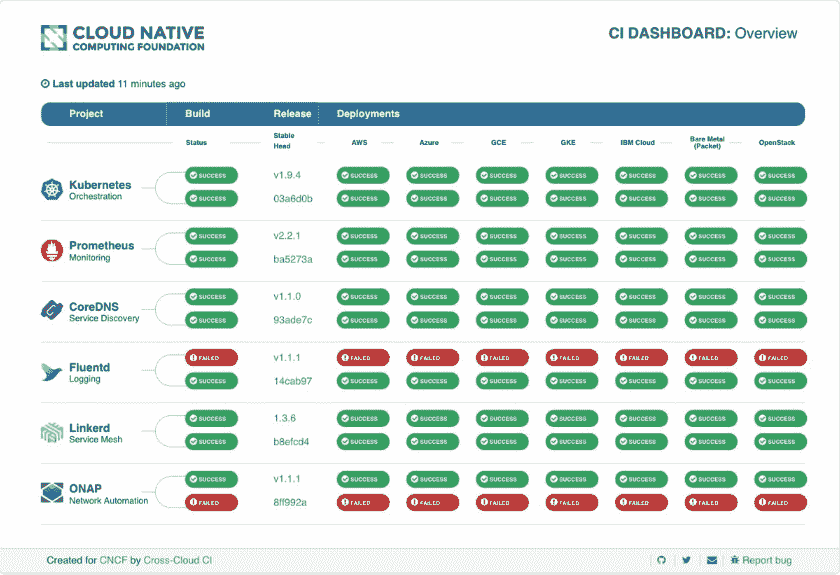

# 云本地计算基金会采用多种云管理工具

> 原文：<https://thenewstack.io/cloud-native-computing-foundation-adopts-multicloud-management-tools/>

供应商们竞相支持公司的混合和多云战略，Kubernetes 通常是他们计划的核心。很自然的，[云本地计算基金会](https://www.cncf.io/) (CNCF)宣布了两个项目来缓解跨云的痛苦。

[CNCF CI 工作组](https://github.com/cncf/wg-ci)发布了 [CI Dashboard v1.3.0](https://cncf.ci/#/) ，它提供了其工作的每日更新，以在 CNCF 生态系统内跨多个云提供商集成、测试和部署项目。

三个组件——构建、跨云、跨项目——组成了跨云测试系统。他们持续验证每个 CNCF 项目在所有受支持的云提供商之间的稳定和最新开发版本上的互操作性。

跨云 CI 项目由跨云测试系统、状态库服务器和仪表板组成。仪表板显示最新版本和最新开发版本的状态。

仪表板第一次包括了[开放网络自动化平台](https://www.onap.org/) (ONAP)，这是一个从包括 AT T 和中国移动在内的电信公司发展而来的自动化项目，运行在 Kubernetes 之上。它使用户能够自动化、设计、编排和管理服务和虚拟功能。

Linux 基金会的网络和编排总经理 Arpit Joshipura 本周在洛杉矶的开放网络峰会上做了一个演示。

他解释说:“演示采用 ONAP，将 Kubernetes 与其他多个 CNCF 项目一起使用，并将两者部署在多个云上——谷歌、Azure、IBM，甚至裸机。”“也就是说，如果你在一个重视网络自动化的电信世界，你现在可以将你的应用容器化，使它们能够跨云移植，你可以将你的开发过程(CI/CD)集成并由 Kubernetes 运行，作为负载的底层，随着我们的发展，允许容器的力量。”

Joshipura 表示，ONAP 为全球超过 60%的用户群实现了连接自动化，消除了运营商将服务连接到基础设施(无论是数据中心还是云)所需的手动工作。

出于历史原因，ONAP 最初运行在两种云上，Rackspace 或 Azure，CNCF 执行董事丹·科恩解释道。

“我们展示的非常令人惊讶的是，当你在 Kubernetes 上运行 ONAP 时，它就像一个通用的翻译层。它允许你在任何云上运行它。你也可以在裸机上运行它。另外，可以做混合云。我们还展示了它在 OpenShift 上的运行情况，”他说。

科恩说，虽然人们原则上理解 Kubernetes 可以在任何云上运行，而 ONAP 可以在 Kubernetes 上运行，“使用不同的界面真的很有挑战性，也很耗时”。“他们都有不同的设置方式。有些东西——防火墙和 DNS 等——需要定制配置。它的巧妙之处在于没有任何手动操作。每天，它都会将最新版本的 Kubernetes 部署到所有这些云上，并将 ONAP 部署到这些云上。”

他说，演示在某些方面低估了这种级别的互操作性现在是可行的。

根据 Joshipura 的说法，这是历史上分离的三个不同世界的融合:公共云；电信网络或服务提供商世界和企业数据中心(软件定义的数据中心)。

“我们说，在 2018 年及以后，这些垂直市场和市场有一个交集，我们开始整合和使用彼此的最佳品种，如果你可以的话，这将为这些服务提供便携性和功能，”他说。

“这是我所说的跨技术领域和跨市场协调的开始。”

一篇博客文章包含两个解释 ONAP 平台的视频:一个设计时环境，用于设计、定义和编程平台；和执行在设计阶段编程的逻辑的执行时环境。

美国电话电报公司的 [Manoop Talasila](https://scholar.google.com/citations?user=Zv5aGj0AAAAJ&hl=en) 深入研究了该平台在一个集中式门户核心中集成和管理不同应用程序的能力。

[https://www.youtube.com/embed/hxuTcvuWGVs?feature=oembed](https://www.youtube.com/embed/hxuTcvuWGVs?feature=oembed)

视频

服务设计和创建(SDC)和集成开发环境(IDE)是设计时框架的子系统，可通过 ONAP 门户访问。SDC 提供了设计服务的工具，并通过拖放界面为服务编排创建了必要的构件。

[AT & T 和开放网络基金会](https://www.fiercetelecom.com/telecom/at-t-onf-to-integrate-multi-gigabit-pon-onap) (ONF)最近宣布与 ONAP 合作整合 ONF 的千兆位 PON(无源光网络)工作。

[云计算原生计算基金会](https://www.cncf.io/)是新堆栈的赞助商。

通过 Pixabay 的特征图像。

<svg xmlns:xlink="http://www.w3.org/1999/xlink" viewBox="0 0 68 31" version="1.1"><title>Group</title> <desc>Created with Sketch.</desc></svg>