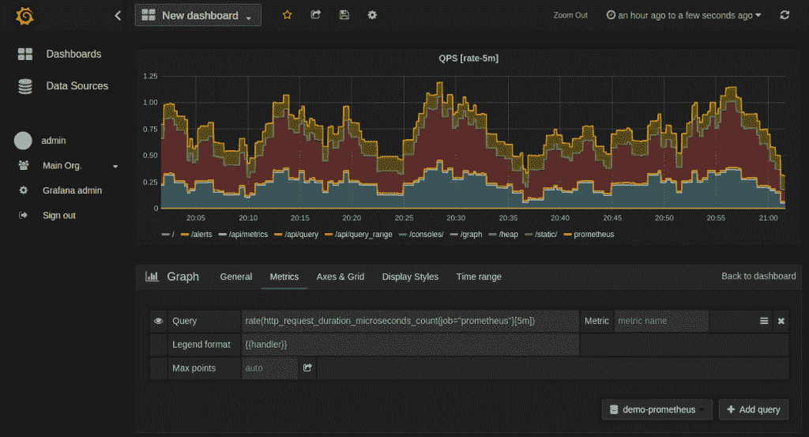
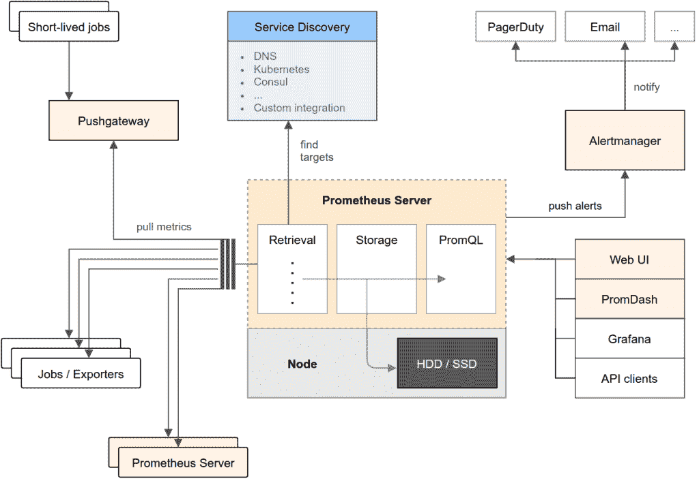
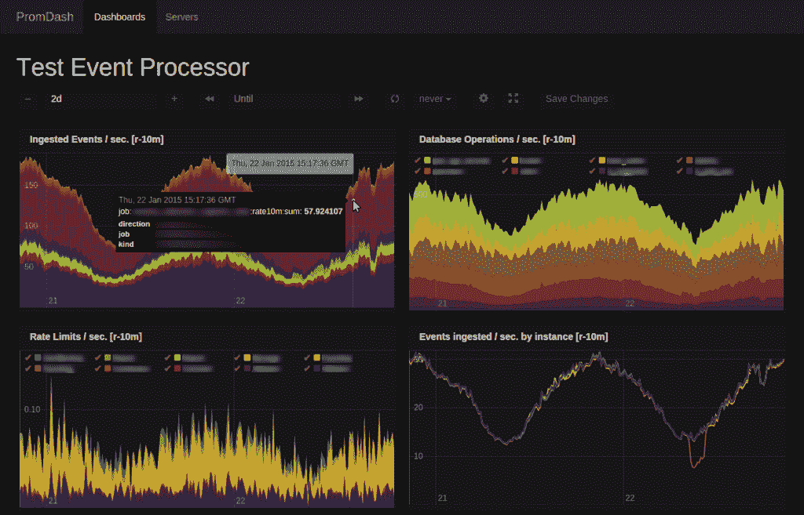

# CNCF 选择普罗米修斯监视器作为其第二个托管项目

> 原文：<https://thenewstack.io/cloud-native-computing-foundation-prometheus-second-hosted-project/>

专注于推进云原生技术的 Linux 基金会组织[云原生计算基金会](https://cncf.io/)，继去年接手 Kubernetes 云编排软件后，已经接受 [Prometheus](https://prometheus.io/) 作为其第二个项目。

最初由 [Soundcloud 开发供内部使用](https://thenewstack.io/soundcloud-relies-open-source-prometheus-monitoring/)，Prometheus 是一个基于谷歌 [Borgmon](https://research.google.com/pubs/pub43438.html) 思想的分布式监控工具，它使用时间序列数据和指标让管理员洞察他们的操作如何执行，特别是那些基于容器和微服务的操作。

CNCF 技术监督委员会主席 Alexis Richardson 说:“像 Prometheus 这样的现代监控和分析工具包是新的云原生范式的关键部分。

## 普罗米修斯简介

Prometheus 是一个开源项目，拥有活跃的用户社区，包括 Digital Ocean、Red Hat 和 Weaveworks。Prometheus 有 200 多个贡献者和 2，300 多个拉取请求。

“Prometheus 是一个社区驱动型组织，来自许多公司的活跃且不断壮大的开发人员团队为这个大型项目和 Prometheus 生态系统做出了贡献。普罗米修斯项目的开发者朱利叶斯·沃尔茨说:“成为 CNCF 的一部分，让用户，尤其是新用户，对普罗米修斯在现代基础设施中发挥的重要作用投下了信任票。

普罗米修斯:格拉夫纳 QPS 仪表板

CNCF 选择 Prometheus 作为其第二个孵化项目，部分原因是 Prometheus 可以帮助使用云原生技术或考虑转向基于云的基础架构的组织。

“它符合云原生计算基金会(Cloud Native Computing Foundation)临时执行董事克里斯·阿尼斯奇克(Chris Aniszczyk)在谈到普罗米修斯时说，它遵循谷歌的分布式云原生架构，就像同样由谷歌开发的 Kubernetes 一样。毫不奇怪，Prometheus 与 Kubernetes 集成在一起，支持服务发现和动态调度服务的监控。

## 在普罗米修斯的引擎盖下

Soundcloud 在将其业务转移到 Kubernetes 后开发了 Prometheus。它是用 Go 写成的，没有外部依赖性，是静态二进制。

普罗米修斯的建筑

Prometheus 允许用户查询、记录和分析数据，但不是以传统的分析方式。通过将数据流标识为键值对，Prometheus 聚合并过滤指定的指标，同时允许进行细粒度的查询。

Prometheus 拥有“灵活的查询语言，允许查询和绘制这些数据。软件工程师 Johannes 'fish' Ziemke [告诉新的 Stack](https://thenewstack.io/soundclouds-prometheus-monitoring-system-time-series-database-suited-containers/) “它具有先进的指标类型，如摘要、从指定时间跨度的总计中构建比率或对任何表达式发出警报。

SoundCloud:普罗米修斯事件处理器仪表板示例

CNCF 将于 11 月 8 日至 9 日在西雅图举办普罗米修斯日。

通过 Pixabay 获得特征图像，通过 Prometheus 获得嵌入图像， [SoundCloud](https://developers.soundcloud.com/blog/prometheus-monitoring-at-soundcloud) 。

<svg xmlns:xlink="http://www.w3.org/1999/xlink" viewBox="0 0 68 31" version="1.1"><title>Group</title> <desc>Created with Sketch.</desc></svg>