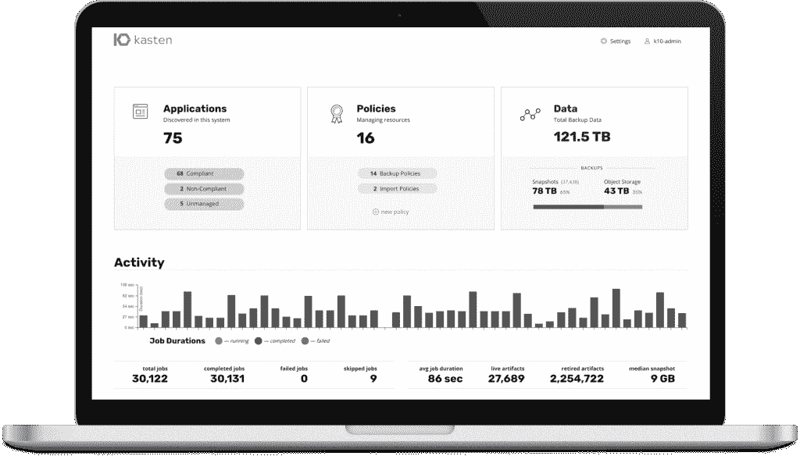

# 云原生数据管理:Kasten 扩大了备份和灾难恢复的范围

> 原文：<https://thenewstack.io/cloud-native-data-management-kasten-widens-reach-of-backup-disaster-recovery/>

该公司宣布，Kubernetes 数据管理提供商 [Kasten](https://www.kasten.io/) 已经扩展了 [K10 企业数据管理平台](https://www.kasten.io/product/)，以包括改进的数据管理、治理和备份功能。

对于治理和合规性，该软件平台提供商表示，它为跨不同地理区域和管辖区的数据管理提供了更严格的数据合规性控制，包括:

*   跨多云环境和不同地理区域同时自动化策略应用。
*   基础设施的可移植性，包括预构建的模板和对 [Azure 磁盘](https://docs.microsoft.com/en-us/azure/virtual-machines/managed-disks-overview)、 [GCE 持久磁盘](https://cloud.google.com/persistent-disk)和[亚马逊网络服务(AWS)弹性块存储(EBS)](https://aws.amazon.com/ebs/) 的扩展支持。
*   提高 RBAC 集成的安全性和自助服务能力，以便直接控制备份和灾难恢复策略。

为了支持 GDPR 的合规性，Kasten K10 有助于更严格地控制组织存储数据的方式，这要归功于可以分别应用于数据快照、备份、灾难恢复和迁移的单独数据保留策略，[Kasten 产品负责人 Gaurav Rishi](https://www.linkedin.com/in/rishigaurav) 告诉新堆栈。“如果您的组织拥有处理数据的应用程序和需要 GDPR 保护的流程，K10 可以让您轻松地将数据移动到符合所有本地数据法规的环境中。”

Rishi 说，K10 平台的 GDPR 和其他数据合规性管理功能包括应用程序合规性状态的自动概述。Kasten 说:“因此，当用户必须处理需要重现应用程序环境配置和状态(包括过去给定时期的底层数据)的审计请求时，这是一个简单的过程。

Rishi 说，基于政策的 Kubernetes 数据管理方法是云原生平台中的一个关键组件，也是经常缺失的组件。根据 [451 Research 的探路者报告:“Kubernetes 备份和应用程序可移植性:实现数据保护现代化”，](https://www.kasten.io/451-modernizing-data-protection) Kubernetes 和容器化环境提供了许多有据可查的优势，同时管理安全性和数据合规性、安全性、存储和灾难恢复可能会继续带来挑战。Rishi 说，该报告的调查结果还显示了在集装箱化环境中运行的大多数应用程序是如何无状态的，从而强调了跨不同云环境和地理位置的数据策略、合规性和备份管理的自动化和可移植性的重要性——这正是 Kasten 的平台所提供的。

Rishi 说，K10 有助于解决无状态数据管理挑战，包括备份管理，因为它“原生集成到 Kubernetes 中”，可以自动发现集群上运行的所有应用程序组件，“并将应用程序视为原子性的单元”。“该平台的范围包括关系数据库，如 NoSQL，以及包含在 Kubernetes 对象中的配置数据，如配置图和秘密，”Rishi 说在云原生应用中，我们观察到这些对象的数量与传统虚拟机管理程序环境中可能看到的相比呈爆炸式增长，”Rishi 说。

Rishi 说，下表显示了 Kasten 客户运行的 173 个应用程序，相当于 K10 管理的 18，000 多个应用程序组件:

“用于自动化数据管理工作流(如备份和灾难恢复)的策略允许您将应用程序组件恢复到您想要的位置，”Rishi 说。

亚马逊网络服务是新堆栈的赞助商。

来自 Pixabay 的特征图像。

<svg xmlns:xlink="http://www.w3.org/1999/xlink" viewBox="0 0 68 31" version="1.1"><title>Group</title> <desc>Created with Sketch.</desc></svg>