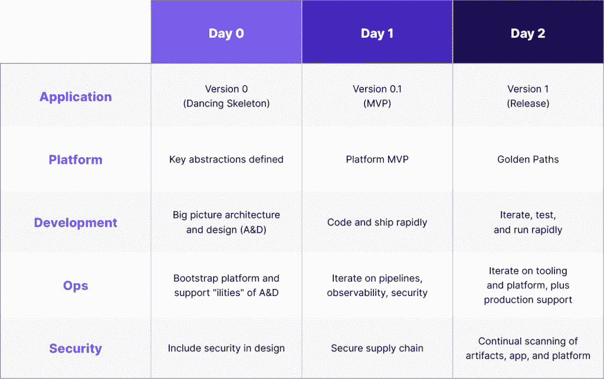

# 云原生第 2 天运营:为什么从第 0 天开始

> 原文：<https://thenewstack.io/cloud-native-day-2-operations-why-this-begins-on-day-0/>

第 2 天运营(Day 2 Ops)对于云原生开发人员来说非常重要，无论他们在组织中承担何种级别的生命周期责任。

 [丹尼尔·布赖恩特

丹尼尔是大使实验室(前身为 Datawire)的开发者关系总监。Daniel 是一名 Java 拥护者和 TechBeacon DevOps 100 影响者，他为几个开源项目做出了贡献。](https://www.linkedin.com/in/danielbryantuk/) 

云本地专家倾向于认为，对于开发人员和他们合作的站点可靠性工程师和 DevOps 团队来说，了解在生产中运行应用程序的每个方面(如果不是关键的话)是非常有价值的。

作为[新开发者体验](https://thenewstack.io/how-the-developer-experience-is-changing-with-cloud-native/)的一部分，我们经常谈到“[左移](https://www.getambassador.io/developer-control-planes/developer-control-planes-a-platform-architects-point-of-view/)”和“全生命周期”开发者责任。它发生在第 0 天和第 1 天之后，第 0 天包括启动所需的资源，第 1 天侧重于构建设计、基础架构和持续集成/持续交付。第 2 天运营延伸到部署后发生的所有事情。

第 2 天运营包括产品发货后必须进行的所有活动，例如观察/监控、分析和故障排除，以及相应的软件维护和优化。在传统的软件开发中，软件发布的每一步都是独立的。云计算的发展使得这些努力持续不断。第二天的活动并不专门分配给非开发部门。

当我们在大使小组讨论期间与[云领导者交谈时，这些关于云原生第 2 天运营的想法得到了回应。月球的卡斯帕·尼森解释说:“第二天是关于左移。给予开发人员在生产中运行事物的所有权。对于作为平台工程师和架构师的我来说，这是关于创建抽象概念并使我们的开发人员运行软件变得容易。为他们提供监控、记录、跟踪以及管理生产服务所需的一切。我们试图建立一个平台，在这个旅程中支持开发者。”](https://www.youtube.com/watch?v=NrZw23zLsqw)

## 早在第 0 天和第 1 天就为第 2 天的运营进行设计

在同一次小组讨论中，小组成员一致认为，第二天的操作，如安全性、可靠性和可观察性，应在设计过程的早期就考虑并包括在内。

同样，这是开发人员职责、开发人员体验以及架构师如何为这些开发人员创建简单方便的最终用户体验之间的平衡。尼森解释说，“Lunar 的新工程师会被告知，运行软件的这些方面需要融入他们创建的代码中。”

[Kubermatic](https://co.linkedin.com/in/damian-m%C3%A1rquez-86730520b)的高级解决方案架构师 Damian Márquez 是大使活动的另一位小组成员，他对这些观点表示赞同:“当设计的架构易于工程师和开发人员工作时，您需要了解他们需要看到什么。什么能见度对他们来说是重要的。这是工程师和建筑师之间的共生学习过程。我们越早开始规划和设计过程，每个人得到的教育就越多，特别是对于开发人员的体验。他们需要了解应用程序的整个生命周期，这让我们有能力改变我们正在构建的事物的顺序。”

除了对纳入准则的长期结果的考虑之外，另一位大使播客嘉宾，云名人 Kelsey Hightower，讨论了关注这一责任的重要性。 [Hightower 将开发人员的责任描述为对“他们添加到代码中的成分”负责并能够证明其合理性](https://www.getambassador.io/developer-control-plane/dcp-insights-kelsey-hightower/)，他提倡在采用软件材料清单(SBOM)或 [SLSA](https://security.googleblog.com/2021/06/introducing-slsa-end-to-end-framework.html) 之前，非常清楚自己在每一步能做什么的重要性，即使是在非正式的层面上。你将被要求理解和回答你所做的一些选择。除了开发人员之外，每个人都需要意识到他们在管道中的责任。”

## 构建一个开发者平台来简化第 2 天的开发者之旅

正如 Nissen 所说，使第 2 天的操作对开发人员来说更容易访问，包括抽象出正确的东西，并在开发人员创建服务时赋予他们默认和自动化的能力，这将让他们在整个生命周期中遵循它。从架构的角度来看，通过引入一个开发人员平台，开发人员可以获得他们需要的一切，从可见性到可观察性到性能指标，这些都是为开发人员体验量身定制的，因此以这种能力与工程师合作变得更加容易。

无论开发人员是新手，使用平台作为入职工具，还是有经验的开发人员，只需点击一个按钮，通过五个步骤就可以启动并运行服务并投入生产，开发人员平台都能满足简化开发人员旅程的需求。

Nissen 补充道，“从开发人员的角度来看，该平台使入门变得容易，并获得仪表板和有意义的默认指标的所有好处，以及自动检测的库。平台架构师应该为开发人员提供他们可以使用的最佳实践和默认设置。”

尼森解释说，在 Lunar，他们利用 Spotify 创立的、现已成为 CNCF 的项目 [Backstage](https://backstage.io/) 建立了他们的内部开发者平台。

## 总结:第 2 天的开发人员责任

如果更快地交付软件的云原生承诺要完全实现，开发人员的体验需要松散地成形，以减少摩擦，并实现对代码、其依赖性、源代码控制、服务所有权以及编码、交付和运行软件所需的一切的清晰可见性。

在传统的软件开发中，软件的部署后生命周期并不属于开发人员的责任，即使是现在，也不总是在开发人员的手中。云原生的承诺是让开发人员能够更快地编码和交付——为了有效地做到这一点，他们需要考虑他们的代码对“运行”流程的影响和依赖性，无论他们在应用程序的运行中有多实际。

作为分手的建议，马尔克斯说，“防御性地编码——优雅地降级。”在当今快速变化的云原生环境中，防御性编码是确保第 2 天操作顺利运行的一种方式，即使发生事故，对代码的组成部分承担全部责任的开发人员也可以更清楚地了解和更快地修复任何问题。

<svg xmlns:xlink="http://www.w3.org/1999/xlink" viewBox="0 0 68 31" version="1.1"><title>Group</title> <desc>Created with Sketch.</desc></svg>