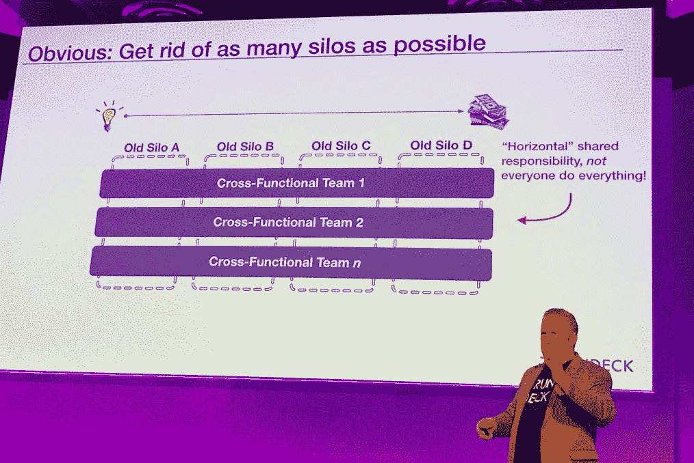

# 云原生 DevOps:操作启示录的四骑士

> 原文：<https://thenewstack.io/cloud-native-devops-four-horsemen-of-the-operations-apocalypse/>

*这篇文章是由 [CloudBees](https://www.cloudbees.com/) 赞助的系列文章的一部分，探索“[云原生 DevOps](https://thenewstack.io/doing-devops-the-cloud-native-way/) 的新兴概念请每周一查看未来的部分，并在 2019 年初关注电子书。*

[RunDeck](http://www.rundeck.com/oaas) 、 [Damon Edwards](https://twitter.com/damonedwards) 的联合创始人以一个熟悉而痛苦的故事开始了他的[伦敦 DevOpsDays](https://devopsdays.org/events/2018-london/program/) 演讲，讲述了一个不知名的组织采用了最新的技术——云、Docker、微服务、Kubernetes——只是为了在出现问题时争夺复杂性。

首先，一个桥接调用发生了，这只会产生许多问题。首席开发人员将其升级到 Scrum Master。实在想不通。问题变得越来越大，现在每个人都在打电话，而且越来越多——网络工程师、业务经理、应用程序经理、首席开发人员、网站可靠性工程师(SRE)、系统管理员、中间件经理、SVP、参谋长、两个技术副总裁、更多的中间件人员……名单还在继续。

最终，整个网络都瘫痪了，所以运营团队正在关注这个问题。其他人意识到最初的中断完全是因为更换了防火墙。

“能改回来吗？”

"好的，填一张表格，我们下周会填的."

“但这是紧急情况！”

最后，该公司增加了一名客户参与经理，“他必须测试所有产品，而不是信任 SRE，”Edwards 说。

当一切都搞定后，第二天 SVP 想知道:

*   发生了什么事？
*   这是谁的错？
*   我们可以增加哪些流程和批准来防止这种情况再次发生？

“他们有数字化、敏捷、开发运维转型和站点可靠性工程。在技术方面，他们有云、Docker、Kubernetes 和微服务。然后，高管团队会问，为什么所有事情都耗时太长、成本太高，”爱德华兹说。

但是在所有这些闪亮的工具和文化变革中，运营被忽视了。

Edwards 说传统的 SVP 智慧说:

*   我们需要更好的工具。
*   我们需要更多的人。
*   我们需要更多的纪律和对细节的关注。
*   我们需要更多的变更审核和批准。

他认为，我们需要忘记这种所谓的传统主义的四大支柱，并“真正挑战运营工作的智慧”，去追寻他所谓的运营启示录的四骑士:

1.  筒仓
2.  售票队列
3.  苦工
4.  低信任度

今天我们来分析一下如何将这些恶魔拒之门外。

## 1.跨公司筒仓

爱德华兹称这只是一种不同的工作方式，在这种方式下，孤岛或传统的部门划分被拆除，IT 部门的每个人都可以分享:

*   常见的积压
*   通用工具
*   共同的背景

他接着说，理想情况下，每个人都以同样的方式使用工具，每个人都有一套共同的优先事项。

“没有什么东西是孤立存在的，尤其是在企业中，你总是需要从别人那里得到一些东西。这就是这些脱节开始发生的时候。爱德华兹说:“我们的工具并没有真正排列起来，我们的能力也没有排列起来，环境或过程也没有排列起来。”。

“为此进行优化只会造成脱节。“筒仓妨碍了反馈循环，妨碍了学习和质量，”他说。

Edwards 继续说，这不仅仅发生在开发和运营中，也发生在环境、网络和客户团队中，每一个都相互隔离，导致负面的业务影响。

## 2.售票队列

“我们创建了一个门票队列来解决筒仓，”爱德华兹说。他引用了上面的故事，说“然后我在等待什么。我不知道我在问什么。我不是防火墙工程师，但我在一个空白框中输入内容，试图扩展我需要的内容。”

他说，这使得排队不仅降低了业务流程和开发工作的速度，而且购票排队非常昂贵。

他引用了 [Donald G. Reinertsen 关于产品开发流程原则的讲话](https://www.slideshare.net/SebastianRadics/the-principles-of-product-development-flow-a-summary),因为队列会产生问题:

*   更长的周期时间
*   增加的风险
*   更多的可变性
*   更多开销
*   质量较差
*   动力不足

毕竟，人们等待某事的时间越长，就会变得越超然。

“我们谈论了很多价值流和最终目标，但我们分割了目标，我们在分配和混淆目标，”爱德华兹说。

他接着解释说，每个目标都变得像雪花一样——独特、脆弱、技术上可以接受，但不可复制。这使得自动化变得更加困难。

“唯一比自动化坏掉的东西更糟糕的事情是自动化稍微有点问题的东西，”爱德华兹说，并指出门票队列是瓶颈的一个巨大贡献者。

他说，当他们推动主要管理层关注保护团队容量，而运营部门一再拒绝时，票证队列会进一步聚集，并变得更加糟糕。他说，后者被解释为运营部门害怕变化，但很多时候他们只是试图保护容量。

## 3.苦工

由于**[【SRE】](https://thenewstack.io/site-reliability-engineering-cloud-native-operations/)**站点可靠性工程越来越受欢迎，尤其是在 DevOps 世界中，“辛劳”是一个更常见的术语。首先，让我们区分辛劳和开销。管理费用是不直接影响生产服务的重要工作。它可以是从设定目标到人力资源活动到团队会议的任何事情——重要但不一定影响代码。

另一方面，辛劳通常包括以下内容:

*   **手册**
***   重复的*   能够自动化*   不是战略或价值驱动的*   反复唤醒待命设备*   无创意*   不太容易扩展**

 **爱德华兹说:“这可能是必要的，但应该被视为有点讨厌的事情。”

> "过度的劳累阻碍了我们今天的进步."—达蒙·爱德华兹

在谷歌和许多公司，经理们试图将 SRE 团队的工作量控制在 50%以下。这并没有推动公司前进，坦白地说，这可能会挫伤你的工程师的积极性。谷歌特别指出，他们担心更大的工作量意味着 sre 将成为严格的运营或严格的开发角色，而他们应该同时与这两者合作。

爱德华兹说:“你希望将这种辛苦保持在可管理的能力范围内，因为工程对两件事很重要——增加商业价值和减少辛苦，这样你就有更多的时间来改善业务。”

## 4.信任度低

决策是在哪里做出的？我们如何把事情升级来做决定？

爱德华兹说，所有的工作都是有背景的，答案总是取决于某些东西。当您在处理复杂的分布式系统时，尤其如此。然而，编写代码的人仍然不经常做出重大决策。

爱德华兹问道，“如果这些人有背景，为什么我们要把它升级到那些没有什么形象的人”的决策中。

在 DevOps 中，您需要重新考虑有多少决策实际上需要升级，以及有多少权力应该委托给实际增加业务价值和使用工具的人。

## 我们如何吓跑“末日预言”中的四骑士？

爱德华兹的第一步是创建跨职能团队，打破尽可能多的孤岛。

“这是一种共享的端到端服务责任。爱德华兹解释说:“不是每个人都做所有的事情。“网飞谈了很多关于‘没有 devo PS’——这都是关于那些从摇篮到坟墓都有责任的团队。

另一方面，他表示，谷歌模式是开发和运营的混合体，从开发到 SRE 都有明确的移交要求，然后 SRE 可以将错误的预算后果推回开发。双方对质量的重视程度是一样的。

> “这是一种共享的端到端服务责任。”—达蒙·爱德华兹

现在，爱德华兹说你不能完全摆脱排队买票。组织只需要知道它们何时被用作通用工作管理系统。

Edwards 说:“票据在记录真实的问题、事件、异常和必要的批准流程方面非常出色。"这个想法是你减少所有的干扰."

总的来说，爱德华兹说，成功的 DevOps 是关于向左转移采取行动的能力，为每个人提供相同的工具和支持，以更安全的方式做事。

透明度的另一部分是跟踪辛劳水平，并与团队分享这些水平。爱德华兹呼应了谷歌将辛劳限制在 50%的工作，但表示组织需要资助实际上积极减少辛劳的努力。他推荐阅读大卫·布兰克-埃德尔曼的《寻找 SRE》一书，以学习如何开展减少辛劳的活动。

最后，爱德华兹警告说，你应该挑战上述传统智慧，将运营纳入你的数字化转型战略——毕竟，这是 DevOps 的战略——并花时间了解四骑士是如何破坏 Ops 工作的。专注于消除孤岛并限制它们的队列。鼓励他们尽可能关注自助式运营即服务(OaaS)。

<svg xmlns:xlink="http://www.w3.org/1999/xlink" viewBox="0 0 68 31" version="1.1"><title>Group</title> <desc>Created with Sketch.</desc></svg>**