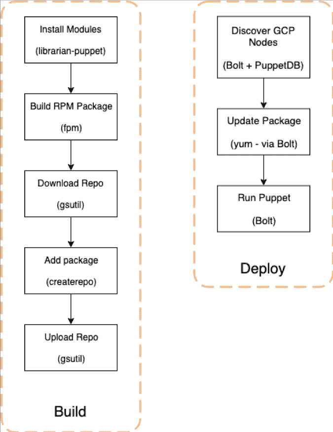

# 云原生无主傀儡，带 Bolt 和 PuppetDB

> 原文：<https://thenewstack.io/cloud-native-masterless-puppet-with-bolt-and-puppetdb/>

[傀儡](https://puppet.com/)赞助本帖。

 [克雷格·沃森

Craig 是 ForgeRock 的高级系统工程师，拥有咨询、企业和初创企业的系统管理经验，包括全球范围内 Google Cloud 和 Amazon Web Services 上的公共云环境。他在木偶社区有八年的经验，开发了许多锻造模块。](https://www.linkedin.com/in/craigwatson1987/?originalSubdomain=uk) 

向云计算的转变不可否认地改变了 IT 对基础设施的思考方式。服务器可以被视为一次性的、不可变的实例，其生命周期以分钟、小时或天来衡量。相比之下，巨石柱可以在退役前停留数周、数月或数年。

不过，在很大程度上，使用 Puppet 进行配置管理的标准方法自物理基础设施时代以来就没有改变过。它被简单地移植到了云中，并添加了一些额外的工作区来自动化诸如证书签名和撤销之类的任务。

作为一个支持一家跨国公司开发尖端软件的 IT 团队，我们的目标是将我们的核心 Atlassian 软件堆栈(吉拉、Confluence 和 Bitbucket)以及其他服务重新部署到云中。

这需要一种新的方式来思考我们如何管理配置，并提出了许多问题——我们是否在每个云中创建一个傀儡主人？在每个地区？我们是否为所有云运行单个主服务器？如果有，我们把它放在哪里？

当使用 Puppet Bolt 和动态 PuppetDB 清单结合一些简单的编排时，masterless Puppet side 完全解决了这些问题，允许跨云兼容性、近乎无限的可扩展性和大大降低的复杂性。

## 木偶大师:时光倒流

在管理物理基础设施时，试运行服务器通常是一个不常见的冗长过程。使用 Puppet，客户机生成新的证书请求，并通过主服务器上的 SSH 手动签名。然后在新服务器上手动运行 Puppet。

没有有意识的规划、监控和维护；主服务器可能会过载，并且在傀儡主服务器停机的情况下，新的服务器无法供应，现有的服务器也无法用新的配置进行更新。

## 计划图编制

我们决定设立高层次的目标，并随着时间的推移完善项目。关键目标过去是，现在仍然是:

### 不要面向未来——让未来成为可能。

这让我们专注于确保我们的解决方案适合未来，而不会分心去计划每一个可能发生的事情。围绕这一核心目标，更普遍的要求是解决方案应该:

***简单*** —为了提高工程效率，新的基础设施应尽可能简单，同时满足以下其他要求。

***可扩展*** —我们要求基础架构随业务扩展，从几个实例扩展到数百个实例，而无需定期进行全新的平台迁移项目。

***原生云*** —当我们将服务迁移到公共云中时，我们应该尽可能地利用云功能—在需要物理环境的地方，我们应该将它们视为云环境。

**一旦提交被推送，就可以使用自动化持续集成测试管道对其进行独立验证。**

*—也许是最具挑战性的，这是为了确保项目作为一个整体保持足够的灵活性，可以根据业务需求部署到亚马逊网络服务或谷歌云平台上。*

 *## 为什么是云原生？

云计算基金会 [将](https://github.com/cncf/toc/blob/master/DEFINITION.md) 定义为:

*【云原生】技术支持弹性、可管理和可观察的松散耦合系统。与强大的自动化相结合，它们允许工程师以最少的劳动频繁地、可预测地做出高影响力的改变。*

在云迁移和解决方案设计中经常被忽略的一点是平台的短暂性。当设计一个云原生解决方案来按需添加和删除计算资源(也称为自动扩展)时，服务器在被破坏之前理论上可以存活几分钟。

在这种情况下，除了运行 Puppet 和配置系统所花费的时间之外，增加证书签名的开销会大大降低自动扩展的效率，因为服务器通常会在启动后的两三分钟内提供流量服务。

要成为真正的云原生，应用程序应该能够以优雅的、无状态的方式容忍不光彩的失败。

## 无主木偶:一个勇敢的新世界

在无主部署中，代码库被部署到服务器本身，而不是将傀儡代码部署到中央主服务器，从而允许单个实例在与任何其他实例完全隔离的情况下进行配置。

无主的木偶也引发了一些有趣的问题。如果没有中央主服务器来控制哪个服务器获得什么配置:

*   你如何定义一个服务器接收哪个角色？
*   用什么机制来存储木偶代码？
*   变革是如何展开的？

## 实例元数据:云 ENC

使用 Puppet“roles and profiles”模式，我们可以很容易地将我们的配置模块化成通用的概要文件，这些概要文件被组合成一个角色。例如，“web”角色可能包括 Nginx 和 PHP-FPM 配置文件，以及更通用的基本或安全配置文件。

云实例可以访问各种元数据，我们可以利用这些元数据来构建 Hiera 数据结构，作为 Puppet 代码库中的外部节点分类器(ENC)。

由于云平台对元数据使用不同的 [Facter](https://puppet.com/docs/facter/3.11/index.html) 模式，我们的实现使用引导脚本将每个元数据存储在/etc/facter/facts.d 中的静态文本文件中，允许每个变量使用一致的名称——只要脚本将元数据输出到正确的位置，我们的 Hiera 代码库就完全与云无关。

如果云提供商之间存在差异(例如，用于 Elasticsearch 的 GCE 和 EC2 集群发现机制)，我们可以使用虚拟事实添加一个 Hiera 层。

## 操作系统存储库的代码分发

为了分发我们的木偶代码库，我们利用我们的云提供商的对象存储——即亚马逊 S3 和谷歌云存储。这些系统是作为服务提供的，没有运营开销需要我们管理，我们只需上传文件并访问它们。

当我们使用 CentOS 时，我们已经使用了一个 Yum 插件，使 AWS 和 GCP 上的实例能够使用 gs://和 s3:// URIs 而不是 https://，本地处理这些存储库——对于基于 Debian 的系统，也存在 APT 包管理器的传输。

打包 Puppet 代码库的工作已经委托给 Jenkins，它也作为我们与 Gitlab CI runners 的持续集成平台。在通过 rspec-puppet 和 puppet-lint 运行测试后，Jenkins 使用 fpm 将代码库编译成 RPM 包，然后同步到 GCS 和 S3 Yum 库。

## 用螺栓编排木偶

触发 Yum 更新或按需执行 Puppet 二进制文件的任务落到了 Puppet 的武器库中一个相对较新的工具上:Bolt。Bolt 通过 SSH 连接到远程系统，允许以干净、自动化和可共享的方式运行特定任务。

该工具可以读取“计划”——描述操作的文档，例如升级操作系统包或重新启动系统服务，由于计划可以用 Puppet 代码编写，因此它享有 Puppet 本身提供的相同功能——完整的数据类型、丰富的逻辑，当然还有 Puppet 社区，因为 Puppet Forge 上的许多模块正在为它们管理的资源添加 Bolt 任务。

## PuppetDB: Bolt 的动态库存

虽然 Bolt 通过 SSH 连接到机器，但它需要在配置中定义一个清单。虽然这适用于静态基础设施，但是在云环境中，我们需要一个动态的、可查询的数据源，以便确定 Bolt 应该连接到哪里。



为此，我们使用 PuppetDB。顾名思义，PuppetDB 是支持傀儡主人的核心底层数据库。它在每个节点上都保存了一些数据，但最重要的是，它在登记到主节点时记录了每个节点的事实。

可以(在高流量 mastered Puppet 安装中，强烈建议)使用 PostgreSQL 数据库后端将 PuppetDB 设置为一个独立的应用程序，由于该应用程序是无状态的，它非常适合作为标准的多层 web 应用程序部署到云环境中。

对 Bolt 来说至关重要的是，PuppetDB 提供了一种丰富的查询语言——PQL，以允许返回数据，例如，可以在数据库中搜索包含 httpd 包的节点，或者操作系统事实等于 CentOS 的节点。

对于我们的用例，我们用 Bash 脚本包装 Bolt 命令实用程序，而不是使用 Bolt 的本地包管理模块。这使得传递诸如 yum update 或 puppet apply 之类的显式命令变得更加容易，还可以用用户友好的开关来包装 PQL 查询，以查询特定的机器角色和环境，以及将返回的节点集限制在一台机器上进行金丝雀模拟运行测试。

在未来的项目迭代中，这将被使用 Puppet 语言的完全参数化的 Bolt 计划清单所取代，但是当前的 Bash 包装器允许我们启动项目。

## 连接所有这些，第一部分:木偶和木偶

要让一个无主的 Puppet 节点向一个独立的 PuppetDB 安装发送事实、编译的目录和运行后报告，需要一点点 Puppet 配置。

首先，我们使用 Puppet 的 routes.yaml 文件告诉 Puppet 二进制文件将资源发送到哪里。下面的文件是大量试验和错误的结果，主要是因为无主木偶不太容易记录。此外，所有要遵循的代码片段都被验证可以与 Puppet 6.4.2 和 PuppetDB terminus 6.4.0 一起工作:

```
---
apply:
  facts:
    terminus:  facter
    cache:  puppetdb_apply
  catalog:
    terminus:  compiler
    cache:  puppetdb
user:
  catalog:
    terminus:  compiler
    cache:  puppetdb
  resource:
    terminus:  ral
    cache:  puppetdb
  facts:
    terminus:  facter
    cache:  puppetdb_apply
master:
  catalog:
    terminus:  compiler
    cache:  puppetdb
  resource:
    terminus:  ral
    cache:  puppetdb
  facts:
    terminus:  facter
    cache:  puppetdb_apply

```

还需要通过编辑 puppet.conf 将 puppet 配置为向 PuppetDB 发送报告。这是完全可选的，但是 PuppetDB 有各种可用的仪表板，允许自顶向下的 UI 视图显示节点的 Puppet 状态:

```
[main]
  storeconfigs  =  false
  report  =  true
  reports  =  puppetdb

```

最后，可以用 puppetdb.conf 来配置 PuppetDB 服务器的位置。与 routes.yaml 文件一样，下面是一点实验的结果:

```
[main]
submit_only_server_urls  =  https://puppetdb.${ENVTYPE}.${DNS_ROOT_DOMAIN}:443
soft_write_failure  =  true

```

上面的例子使用 Bash 脚本中的变量从元数据中获取服务器的位置。submit_only_server_urls 和 soft_write_failure 选项用于确保如果 PuppetDB 服务器不可用，Puppet 仍将继续运行。

## 将它们连接在一起，第二部分:Bolt 和 PuppetDB

设置 Bolt 连接到 PuppetDB 是在 Bolt 的 bolt.yaml 配置文件中添加一些设置的简单例子:

```
---
Puppetdb:
  server_urls:  ["https://puppetdb.&lt;%= $facts['envtype'] %&gt;.&lt;%= $facts['dns_root_domain'] %&gt;:443"]
  cacert:  /etc/pki/tls/certs/ca-bundle.crt

```

这个文件通过 Puppet 部署到 Jenkins 用户的~/中。puppetlabs/bolt 目录，并使用 Puppet 的 EPP 模板语法来公开与引导脚本相同的元数据。

因为与 PuppetDB 的通信是不可协商的 HTTPS，所以我们通过一个公共的(但被列入白名单的)负载平衡器来公开我们的 PuppetDB 实例，它可以处理 SSL 终止。

为了消除管理和分发自签名证书的需要，我们使用来自每个云提供商的托管 SSL 证书，该证书由 Let ' s Encrypt certificate authority 签名。CA 包含在大多数操作系统的信任存储中，所以我们只需将 Bolt 指向本地 CA 包。

## 结论:完整的管道和最终想法

该项目成功地帮助 ForgeRock 的 IT 基础设施团队大幅缩短了新系统的上线时间，简化了我们的配置管理流程，并在长期内提高了团队的吞吐量，减少了工作量。

我们实施了一个解决方案，该解决方案节省了工程开销，并允许在没有任何重大设计变更的情况下实现接近水平的可扩展性，同时又是*云原生*，允许我们利用丰富的可用元数据并利用云提供商的服务，以及*云不可知*，允许在没有供应商锁定的情况下实现可移植性。

利用 Bolt 和 PuppetDB，我们可以大规模地部署我们的更改，部署到一个或多个实例，并且我们能够使用 vagger 在本地和通过自动化管道连续地全面测试我们的代码库。

尽管这个项目已经取得了很大的成功，但是在获得正确的配置，特别是将一个独立的、没有主人的 Puppet 节点连接到 PuppetDB 时，还需要进行大量的反复试验。

我们仍然在 Puppet 输出中看到许多警告，因为 Puppet 二进制文件的报告和缓存层的一些组件仍然试图连接到主服务器，但是这些并没有影响功能或性能。

也可以说，PuppetDB 本身现在是我们的单点故障，因为 PuppetDB 堆栈的中断将使 Bolt 无法填充其库存。但是，这只会影响对现有服务器的更改——任何新的实例仍然能够正确地配置自己，而无需联系 PuppetDB。

至于 Bolt，必须提供用户和 SSH 密钥来允许远程命令运行并不理想——作为 Bolt 的准前身 Mcollective 的大量用户，使用 RPC 界面的能力将是一个非常受欢迎的新功能——尽管 Bolt 本身仍然年轻，并继续经历重大的发展。

如果您对任何内容有疑问，或者对任何未涵盖的内容有疑问！—以上，请在 Twitter 上联系我，并查看我在 2019 年 PDX Puppet ize 上的演讲，在那里你会看到所有这一切的行动——无论是面对面还是通过视频记录，这些视频将在活动结束后不久由 Puppet 提供。

PDX 发生在俄勒冈州的波特兰。10 月 9 日至 10 日。这是一个为期两天的多轨道会议，重点关注更广泛的 Puppet 用户社区，包括以用户为中心的 DevOps 和基础架构交付讲座以及实践研讨会。

Puppetize 是一个非常棒的活动，虽然我是第一次在波特兰发言，但我是一个连续的校友，参加了 2014 年、2016 年和 2018 年的活动——木偶社区是一个鼓舞人心的地方，我也很高兴能见到社区成员，听到关于采用木偶云的战争故事，包括哪些没有成功。

CNCF 是新堆栈的赞助商。

通过 Pixabay 的特征图像。

<svg xmlns:xlink="http://www.w3.org/1999/xlink" viewBox="0 0 68 31" version="1.1"><title>Group</title> <desc>Created with Sketch.</desc></svg>*