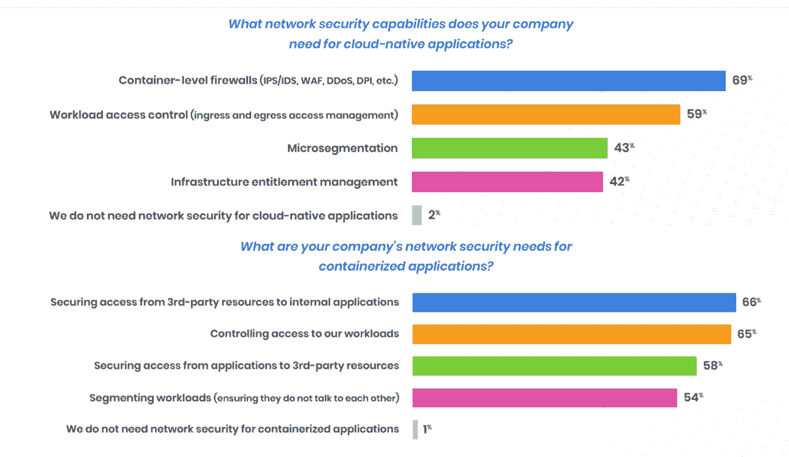
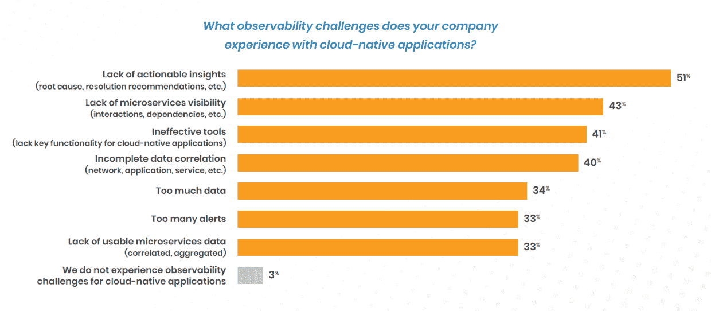

# 云原生安全性尚未解决合规性挑战

> 原文：<https://thenewstack.io/cloud-native-security-hasnt-solved-compliance-challenges/>

现代的基于云的分布式网络可能缺乏一个明确的边界来保护，但它们仍然需要网络安全。几乎所有的组织都知道:[在 Tigera 四月份的报告](https://www.tigera.io/lp/state-of-cloud-native-security-market-report-22/)中，98%的受访者表示他们需要网络安全来保证他们[云原生](https://thenewstack.io/category/cloud-native/)应用的安全。

不幸的是，很难提供可审计的证据来证明正在提供[安全性](https://thenewstack.io/category/security/)。这就是为什么 84%的研究参与者表示，他们发现满足云原生应用程序的合规性法规具有挑战性。

云原生安全公司 Tigera 委托对至少有 10 名员工的公司中负责安全和容器相关工作的 304 人进行了调查。79%的受访者表示，他们的容器需要访问内部应用程序，如数据库，63%的受访者需要访问第三方基于云的服务。

资料来源:Tigera，“2022 年云安全状况”

结果显示了网络安全要求如何反映云本机应用程序安全的特定需求:

*   69%的调查参与者表示他们需要容器级防火墙
*   59%的人说他们需要工作负载访问控制，来管理进出集群的内容。

然而，更有可能与传统网络安全相关的需求，如微分段和基础设施授权管理，不太可能被调查参与者提及。

一些涉及云和应用安全的人认为防火墙和 VPN 是传统技术，但像 Tailscale 这样的公司也证明了对新虚拟网络的需求。事实上，云原生应用的本质意味着网络安全方法和术语有了新的含义。

Tigera 的研究显示，受访者正在区分“云原生”和“容器化”应用。当 Tigera 调查的受访者被问及“容器化应用程序”的网络安全性时(与之前他们被问及的“云原生应用程序”的问题相比，这只是一个微小的变化)，分段的重要性大幅提升，尽管控制对工作负载的访问仍然是首要需求。

容器化和云原生应用有什么区别？实际容器的存在，但是用户有其他不太明确的方式来看待这个主题。

## 报告集装箱活动的挑战

当被问及更广泛的云原生挑战时，68%的受访公司认为容器安全具有挑战性，其次是网络安全(60%)、合规性(57%)和可观察性(39%)。

调查参与者期望运行时安全性和工作负载保证作为容器安全功能，但意识到图像扫描是最好留给 [CI/CD](https://thenewstack.io/category/ci-cd/) 工具的事情。

虽然可观察性并不是最大的痛点，但报告容器活动的能力与一些最大的安全挑战直接相关。当被问及他们的可观察性挑战时，51%的调查参与者抱怨缺乏可操作的见解，而接下来最常见的问题是跟踪特定类型的信息。

资料来源:Tigera，“2022 年云安全状况”

最后一轮的可观察性工具并不是针对法规遵循用例的。这就是为什么 77%的受访者表示，在他们的组织试图满足容器级合规性要求时，查找和关联所有相关数据是一项挑战。他们报告说，整理必要报告的额外时间和精力也很繁重。

正是这些可审计的报告可能会成为最大的问题。监管机构要求提供进出云原生应用的流量证明和数据。必须提供关于端点和身份管理的跟踪记录。

即使存在现有的策略即代码解决方案，它们是否被设计为满足这些类型的用例？如果没有，那么就有一个迫切的需求等待着被满足。

资料来源:Tigera，“2022 年云安全状况”

## 零信任和 CNAPPs

由于公司新技术战略的本质，遵守法规不会是一个简单的解决办法。

Tigera 首席营销官 [Utpal Bhatt](https://www.linkedin.com/in/ubhatt/) 告诉新堆栈:“传统的安全解决方案是为单一应用程序设计的，重点是通过在应用程序周围建立一堵墙来防止应用程序访问。”。“这种方法在 Kubernetes 环境中不起作用，因为工作负载广泛使用内部网络进行通信。”

这就是为什么[云原生系统需要零信任安全策略](https://thenewstack.io/why-cloud-native-systems-demand-a-zero-trust-approach/)，Tigera 在这种方法变得流行之前就已经使用过了。该公司将自己标榜为云原生应用程序保护平台(CNAPP)。

最近的一份 [Gartner 报告](https://info.aquasec.com/gartner_cnapp)指出，这一类别与云工作负载保护平台(CWPP)、云安全状态管理(CSPM)和云身份授权管理(CIEM)之间的区别很模糊。

云原生应用很复杂，但网络安全的基础没有改变。最终用户培训是必不可少的，除此之外，[零信任](https://thenewstack.io/what-is-zero-trust-security/)的五大支柱似乎与网络安全课程中教授的内容非常相似:

1.  网络。
2.  应用程序工作负载。
3.  身份。
4.  数据。
5.  设备(物理安全)。

如果将网络接入和身份与零信任相结合，就得到零信任网络接入网( [ZTNA](https://thenewstack.io/what-is-zero-trust-network-access-ztna/) )。ZTNA 安全解决方案基于定义的控制策略远程连接组织，这些策略清楚地传达了谁有权访问什么，以及该访问被授予多长时间。

大多数新堆栈的读者真的不关心供应商如何称呼自己，但是所有的缩写都很混乱。69%的调查对象需要容器防火墙。网络、应用程序和容器防火墙之间的细微差别真的无关紧要。保证我们的安全。

资料来源:Tigera，“2022 年云安全状况”

<svg xmlns:xlink="http://www.w3.org/1999/xlink" viewBox="0 0 68 31" version="1.1"><title>Group</title> <desc>Created with Sketch.</desc></svg>