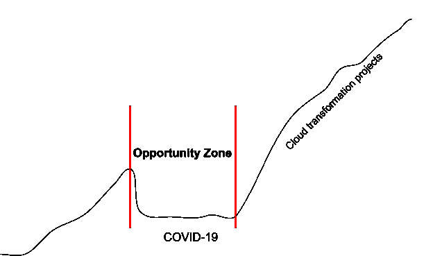

# 新冠肺炎时代的云安全

> 原文：<https://thenewstack.io/cloud-security-in-the-age-of-covid-19/>

来自帕洛阿尔托网络公司的 Prisma 赞助了这篇文章。

 [马特·乔迪

Matt 拥有近二十年的安全领导经验，目前是 Palo Alto Networks 公共云的首席安全官。](https://www.linkedin.com/in/mattchiodi/) 

新冠肺炎已经把对基于云的远程访问工具的需求推到了令人难以置信的水平。然而，虽然大多数 IT 和网络安全领导者现在都专注于远程访问和保护这种访问，但一个同样具有挑战性的问题正在逼近:在短暂的放缓之后，**云转型项目因新冠肺炎**而强势回归**。安全专业人员必须为这些项目的复兴做好准备。**

云并不新鲜。但在新冠肺炎时代，高管和普通大众尝到了云带来的弹性。例如，微软指出，在意大利，在一个月的时间里，团队产品的每月用户的电话和会议增加了 775%。

这导致了我喜欢称之为机会区的东西(见上图)，它带来了三个可能永远不会再出现的独特机会。安全专业人员的发展机会就在这里:

1.  **反思的时候到了。**新冠肺炎危机迫使我们大多数人放慢脚步，思考超越“一切照旧”的问题这种“全球放缓”让我们有机会思考和分析。在后新冠肺炎时代，我们当前的安全计划能够有效应对风险吗？虽然基础设施即服务(IaaS)和平台即服务(PaaS)的企业云转型项目暂时放缓，但攻击者并没有放缓。最近的 [Unit 42 研究](https://unit42.paloaltonetworks.com/cloud/)发现威胁参与者利用云基础设施实施恶意的新冠肺炎相关操作。虽然新冠肺炎现在可能处于前沿和中心，但它可能会永远改变某些用户的行为。你的安全程序准备好了吗？现在是时候召集你的团队，分析当前和潜在的未来状态，并制定计划。
2.  **转换的时间到了。**在新冠肺炎之前，安全团队刚刚开始尝试[云原生安全](https://live.paloaltonetworks.com/t5/Blogs/The-Future-of-Cloud-Native-Security/ba-p/313992)。最近的 [Unit 42 云威胁报告](https://unit42.paloaltonetworks.com/cloud-threat-report-intro/)强调了这一点，该报告强调了常用基础设施作为代码(IaC)模板的巨大漏洞。无论您的安全团队是否在利用 IaC 模板，您的开发人员已经在利用了——而且可能已经利用了很长时间。对于云原生安全的未来，您现在可以做出哪些改变？如果您的安全计划的基石一直依赖于第三层防火墙和基于 IP 的漏洞扫描器等传统工具，现在是时候开始使用[云原生安全平台](https://www.paloaltonetworks.com/prisma/cloud) (CNSP)或 Gartner 现在称之为云原生应用程序保护平台(CNAPP)的价值证明(POV)了。
3.  **实验时间到了。在危机时期，人们通常对尝试新事物有更高的容忍度。企业经常寻找新的收入来源，这导致了新的风险偏好，倾向于以不同于以前的方式做事。由于大多数新项目都是数字化的，白板上的想法很可能最终会出现在云中。您如何定位您的团队，以获得跨虚拟机、容器和无服务器的完全可见性、治理和合规性，包括内部和云中？这个问题至关重要，因为机会区面向整个企业，而不仅仅是安全部门。这意味着其他人也会进行实验。什么样的安全新领域会被打破，你将如何超越被压抑的需求？**

## 从小处着手

虽然新冠肺炎危机已载入史册，但它为安全专业人员提供了一个前所未有的机遇。安全专家的问题是:你会利用这次危机成为你组织中的新领导吗？这个机会之窗不会永远敞开；事实上，我们都希望它尽快关闭。从小处着手，快速扩展，快速失败，充分利用这一千载难逢的机会。

来自 Pixabay 的特征图像。

<svg xmlns:xlink="http://www.w3.org/1999/xlink" viewBox="0 0 68 31" version="1.1"><title>Group</title> <desc>Created with Sketch.</desc></svg>