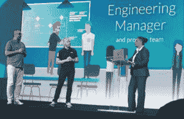

# CloudBees 扩展到软件交付管理领域

> 原文：<https://thenewstack.io/cloudbees-expands-into-software-delivery-management/>

[CloudBees](https://www.cloudbees.com/) 赞助本帖，由新栈独立撰写。

“这是数据，数据，数据，”正如[cloud bees](https://www.cloudbees.com/)’[Anders wall gren](https://twitter.com/anders_wallgren?lang=en)在谈到利用软件开发工具的指标来改善交付渠道的趋势时所说。

数据是 CloudBees 在旧金山 [DevOps World | Jenkins World](https://www.cloudbees.com/devops-world) 上预览的新软件交付管理产品的核心。

Jenkins CI 服务器[的创建者 Kohsuke Kawaguchi](https://kohsuke.org/) 在 DevOps World 主题演讲中庆祝了[技术的 15 周年纪念日](https://www.cloudbees.com/press/jenkins-celebrates-15-years-transforming-software-delivery)，指出了它对全球无数行业的影响。

Jenkins CI 服务器的创建者 Kohsuke Kawaguchi 庆祝其成立 15 周年。

CloudBees 首席执行官兼联合创始人[Sacha laboury](https://www.linkedin.com/in/sachalabourey)重申了它的影响力——1500 万开发者使用的技术。他指出，该公司最近收购了提供功能标志服务的 Rollout，以及发布自动化领域的领导者 Electric Cloud，作为对其未来的暗示。

他说，微软的软件处于软件交付生命周期的中心，从这里开始，“我们将从中心向上走，”他在周三的主题演讲中说。

他说，所有这些信号都在我们的头上飞过，可以用来帮助组织在交付软件方面变得更有效和更快。

软件交付管理(SDM)创建了一个数据层，从一个组织在其软件交付管道中使用的所有工具中聚集数据。汇丰银行[devo PS 工程首席信息官 Rajeev Mahajan](https://www.us.hsbc.com/) 说，他的组织中可能有多达 60 种工具。

SDM 是一个新的类别，解决了 CRM 一直在解决的销售和营销问题或财务 ERP 问题，Labourey 在接受采访时说。

CloudBees 产品营销副总裁 [Shawn Ahmed](https://www.linkedin.com/in/shawnahmed/) ，在周三的会议上领导了一个演示，讲述了他领导一个由 100 名开发人员组成的公司的经历，他们使用的多种工具与运营团队使用的不同。就在那时，他意识到信息孤岛正在阻碍组织的速度和效率。

“随着组织进行开发运维，许多团队正在做许多不同的事情，一些做移动，一些做后端系统或前端…他们以不同的方式运营，但他们以某种方式连接在一起，如应用程序、后端服务、web 应用程序。”

随着组织的成长和开发运维的扩展，最终会出现许多孤岛。没有一个地方可以找到数据来定义这些团队的表现，”Labourey 说。

[https://www.youtube.com/embed/4iJC_HMsxUM?feature=oembed](https://www.youtube.com/embed/4iJC_HMsxUM?feature=oembed)

视频

SDM 创建了一个统一的开发运维数据模型，聚合了与开发运维、团队和工具相关的所有数据。从这些数据中，它能够洞察团队的表现。

“在复杂的环境中，很难知道某些特定任务是否会阻碍下游的其他任务。这不仅仅是提供对 DevOps 的深入了解，还包括定义整个组织的流程，以及定义您希望您的组织在软件交付方面的行为，”他说。

例如，当一家银行有成千上万的开发人员对生产流程进行更改时，他们如何验证流程的核心租户、安全规则，并了解和解决瓶颈，而不增加流程的摩擦？

其价值交付模块跟踪流程中的贡献和需要解决的障碍。产品概述是与产品相关的数据和开发的仪表板。

Cloudbees 的 Shawn Ahmed、Ben Williams 和 Marina Harrell 预览了其即将推出的软件交付管理产品。

CloudBees 在本次活动中宣布的[计划功能首次展示管理](https://www.cloudbees.com/blog/how-cloudbees-makes-software-delivery-management-possible)，将支持基于定义的策略使用功能标志进行首次展示。效率仪表板将帮助用户专注于流程改进。

它宣布了一个早期的预览程序。

该公司还宣布:

*   [Accelerator 11.1](https://www.cloudbees.com/press/cloudbees-accelerator-now-offers-cloud-bursting-and-android-q-build-acceleration-two-more-ways)移动开发平台的增强功能，通过在大型廉价服务器集群上分发构建，加快构建、QA 和测试周期。它增加了对微软 Azure 和谷歌云平台上云爆发的支持，以及对 Android Q 设备开发的支持。
*   [cloud bees Flow](https://www.cloudbees.com/press/new-cloudbees-flow-platform-raises-bar-custom-built-release-processes)9.1 版本，基于原 ElectricFlow 编排平台的应用发布编排(ARO)平台。
*   [与谷歌云合作](https://www.cloudbees.com/press/cloudbees-and-google-cloud-partner-accelerate-application-development-anthos)基于谷歌的 Kubernetes 即服务 Anthos 支持的开源技术，提供一个现代化的 DevOps 平台。CloudBees 和 Google Cloud 是新成立的持续交付基金会(CDF)的创始成员，这是一个开源的、厂商中立的合作组织，由业界顶级开发者、最终用户和厂商组成。

“开发人员需要以最适合其业务的方式构建和运行应用程序，无论应用程序是在本地运行还是在云中运行。这越来越意味着采用与 Anthos 的混合方法，这允许开发人员在云中运行关键应用程序，而无需完全消除他们的内部基础设施，”Google Cloud 混合云合作伙伴关系总监 Rayn Veerubhotla 说。

<svg xmlns:xlink="http://www.w3.org/1999/xlink" viewBox="0 0 68 31" version="1.1"><title>Group</title> <desc>Created with Sketch.</desc></svg>