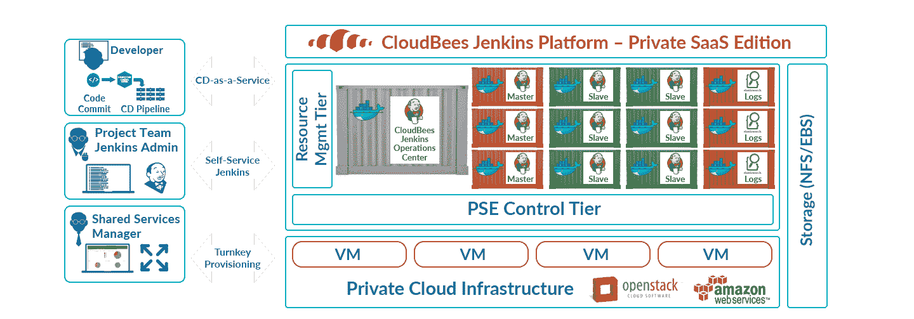

# CloudBees 为私有专用云提供自助式 Jenkins

> 原文：<https://thenewstack.io/cloudbees-offers-jenkins-private-saas-self-service-model/>

为了支持快速发展的 DevOps 计划， [CloudBees](https://www.cloudbees.com) 在其提供企业级 [Jenkins](https://jenkins-ci.org/) 的产品系列中增加了一个“私有软件即服务版本”，这是一个开源开发自动化工具。

对于组织来说，该软件将为开发团队提供一种简单的方法，使他们能够在[持续集成/持续交付](https://thenewstack.io/heroku-officially-embraces-cicd-automating-staging-github/)管道中管理他们的项目，而无需等待系统管理员首先提供软件。

[私有 SaaS 版](https://www.cloudbees.com/products/cloudbees-jenkins-platform)将运行在亚马逊网络服务的专用公共云部署上(据报道可能在夏天支持 Azure ),以及运行在 OpenStack 上的私有云部署上。

CloudBees 产品营销高级总监 Dan Juengst 表示，私人 SaaS 版[将使](https://www.cloudbees.com/products/cloudbees-jenkins-platform/private-saas-edition)公司能够轻松地向 100 个或更多的项目团队提供 Jenkins。该公司已经在云中提供了企业版和 Jenkins，这两者都是针对较小的组织或团队的。

Juegnst 解释说，它被描述为 CloudBees 现有企业产品的“超集”，“私有的 SaaS 版本实际上更像是一个交钥匙的詹金斯即服务版本”。“一旦你安装了私有的 SaaS 版本，它就真的变成了一个自助式的詹金斯实现。任何项目团队都可以登录[到它]，然后詹金斯将为他们提供和配置。”

他说，该软件包将为您组织内的项目团队提供弹性、规模和按需访问。它使用 Docker 容器来大规模部署 Jenkins，使用 Mesos 来增加容错和弹性。

用户可以在意外故障时自动启动新的 Jenkins 资源，无需操作员干预即可从故障状态中恢复，并且他们可以通过 NFS 网络连接存储或通过 AWS 的弹性块存储配置自动存储备份，以实现无缝故障转移。内置分析将有助于了解团队以及 Jenkins 生态系统在整个公司的表现。

CloudBees 首席执行官 Sacha Labourey 此前曾表示，随着 Jenkins 2.0 于今年晚些时候推出，该公司将宣布针对管理大规模部署和基础设施的公司的新产品。

这是私人 SaaS 版的市场，[美国的定价](http://www.theregister.co.uk/2016/02/23/cloudbees/)为每年 121，000 美元起，用于在多达 32 个服务器核心上实施 Jenkins。虽然以前的定价是基于“主软件”和“可执行软件”的数量，但私有 Saas 版将按核心进行定价。

据该公司称，截至 1 月 31 日，Jenkins 在全球有 128，525 个活跃安装。

Juegnst 表示，CloudBees 还将在未来一年半的时间里对开源 Jenkins 项目进行巨额投资，以帮助改善用户体验和功能。这是一个越来越拥挤的空间，Codeship、Drone.io、Semaphore、Travis CI、Shippable 以及惠普和其他大大小小的供应商都提供持续集成/持续交付产品。

[在一份由 Perforce Software 委托的报告中，由 Evans Research 调查的 65%的组织表示他们已经开始走上持续交付的道路，尽管只有 28%的组织表示他们的组织对所有项目都使用 CD。有趣的是，46%的人认为他们的竞争对手已经采用了 CD，这强调了在实践的驱动者中更快地生产软件的竞争压力。](https://www.perforce.com/pdf/continuous-delivery-report.pdf)

*特征图片:* [云厂](https://www.flickr.com/photos/outofideas/178040396/in/photolist-gJvd1-kovtik-pxaJVR-a3dg3X-7q5H2F-nZNAdK-5orCyA-aB3Lnd-kadvU2-nP9PFv-myntcg-7hLZEH-bdn5gx-ciWWr-pv5cYm-beWduH-mynwak-nNQKs2-kPzFje-kPASLm-kV1VTr-bgGiGH-9TB5Ne-iY3vgA-dkFYLt-uaoLjj-8cqts1-eUPyGE-68DrFv-7hR2NX-e2wQpK-pWqD1n-kiK6Xz-dWAeh7-oYEWm2-oGbLtF-baC88-fke7Bp-afajTC-7s2iV2-vVKxqu-ekNAbT-bpD1nV-aKENGc-bK4rLz-qe3e2u-p7Kbw-khtkKU-dCkLEe-yD2hS9) *由* [凯斯](https://www.flickr.com/photos/outofideas/)，*授权于 **CC BY-SA 2.0** 。*

<svg xmlns:xlink="http://www.w3.org/1999/xlink" viewBox="0 0 68 31" version="1.1"><title>Group</title> <desc>Created with Sketch.</desc></svg>