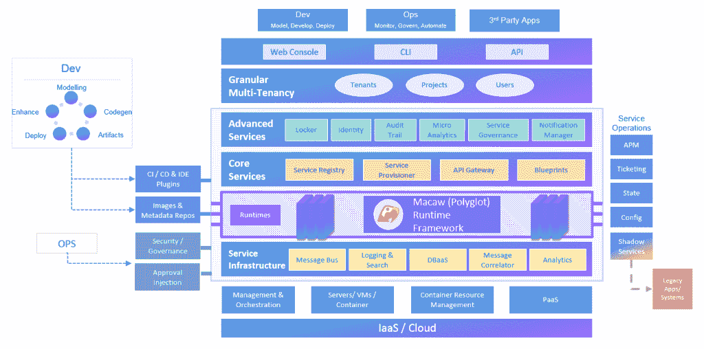
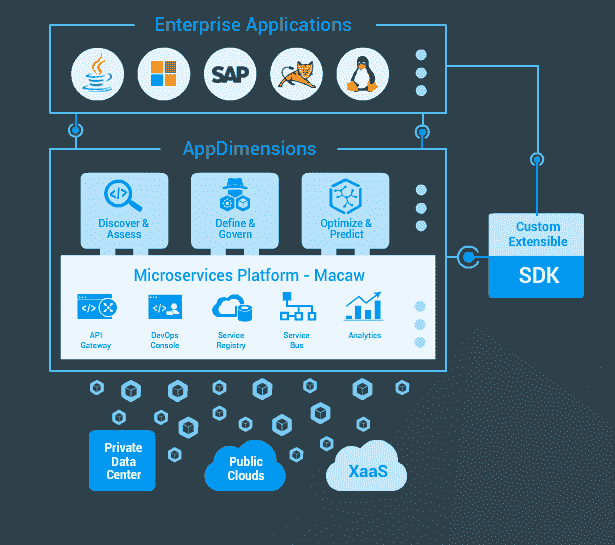

# Macaw 推出致力于管理企业级微服务的平台

> 原文：<https://thenewstack.io/cloudfabrix-launches-macaw-new-microservices-platform/>

虽然围绕微服务的想法有相当多的讨论，但令人惊讶的是，企业可以随时采用的专用软件包或服务很少，以迁移到新的架构。加利福尼亚州普莱森顿的初创企业 Macaw Software 旨在纠正这一问题，推出了一个名为 Macaw 的平台，专门用于开发、部署和管理企业级微服务。

“在我们看来，微服务平台很少。负责 Macaw 产品管理和市场营销的 Tejo Prayaga 说。

在微服务架构中，应用被分解成单独的服务，这些服务可以封装在容器中。这种方法允许最终用户和软件供应商更快速地更新和部署他们的应用程序，特别是如果与持续集成和交付系统一起使用，以尽可能地自动化应用程序开发和部署的工作流。

[Macaw](https://www.macaw.io/) 提供了一个软件包来建立一个微服务架构，这个架构不仅可以跨越用户自己的服务器，也可以跨越云提供商的服务器。Macaw 提供了 API 网关、用户控制台、服务注册中心、服务总线和监控工具。

用户可以添加预配置的运行时，以及其他可以作为服务部署的预打包开源应用程序，如数据库、消息传递和负载平衡。

用 Macaw 的话说，这个平台也是指令性的。该平台提供了基础代码和一套企业级软件部署模式的蓝图，以及内置的可扩展性和安全控制，潜在地允许企业“专注于他们需要编写的面向业务的服务，”Prayaga 说。

[Macaw 软件的 Satyan Raju 讨论微服务](https://thenewstack.simplecast.com/episodes/macaw-softwares-satyan-raju-discusses-microservices)

Macaw 是 CloudFabrix 的全资子公司，该公司最初于今年早些时候[带着](https://thenewstack.io/cloudfabrix-applies-governance-legacy-system-modernization/) [AppDimensions](https://cloudfabrix.com/marketing/docs/GPaaS-Datasheet.pdf) 上市，这是一个将安全和公司治理应用于应用管理的平台。AppDimensions 实际上是建立在 Macaw 之上的。当该公司向潜在客户推销时，许多人询问底层微服务平台。

尽管微服务一词现在在讨论中非常流行，但很少有公司提供明确定义(或营销)的微服务软件平台。这并不是说金刚鹦鹉没有竞争对手。有很多 DevOps 供应商工具可以解决这个问题，包括 Cloud Foundry、Docker、CoreOS、Rancher、Kubernetes、CloudBees、Mesosphere、Red Hat 等等。

Prayaga 说，虽然这些产品中有许多确实结合了微服务原则，但它们并不是为整个微服务生命周期而明确设计的。“我们提供的是服务级别的治理，Kubernetes 提供的是容器级别的管理和协调，”Prayaga 说。

相反，所有这些工具都是微服务拼图的一部分，可以在 Macaw 下合理化。Macaw 有一个插件架构，允许企业使用他们选择的容器引擎、编排引擎和开发工具。Macaw 完全不知道客户想要使用或已经使用的底层技术。

该公司已经在私人测试版中测试了几个月，周一发布了更广泛的测试版审查。

金刚鹦鹉赞助了这个故事。CoreOS、Docker 和 Mesosphere 是新堆栈的赞助商。

<svg xmlns:xlink="http://www.w3.org/1999/xlink" viewBox="0 0 68 31" version="1.1"><title>Group</title> <desc>Created with Sketch.</desc></svg>