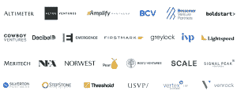

# Cloudflare 使用其 Workers 平台为初创公司筹集了 12.5 亿美元

> 原文：<https://thenewstack.io/cloudflare-raises-1-25-billion-for-startups-using-its-workers-platform/>

缓存提供商 [Cloudflare](https://www.cloudflare.com/lp/ppc/overview-x/?utm_source=google&utm_medium=cpc&utm_campaign=*_DG_%7c_NAMER_%7c_ENG_%7c_G_%7c_Search_%7c_Brand_%7c_Umbrella_%7c_Pure_Brand&utm_content=&utm_term=cloudflare&campaignid=16728793807&adgroupid=138731271487&creativeid=590566229177&&_bt=590566229177&_bk=cloudflare&_bm=e&_bn=g&_bg=138731271487&_placement=&_target=&_loc=9004402&_dv=c&awsearchcpc=1&gclid=CjwKCAjwvsqZBhAlEiwAqAHElVd0k-oGwFZLACUN4r6y3LQpVLadJjYgi5Ff0PzYr_lAoNujo29xShoCOrMQAvD_BwE&gclsrc=aw.ds) 已经召集了一个风险投资公司财团，承诺投入 12.5 亿美元支持那些核心基础设施建立在 Cloudflare 工人技术上的初创公司。

[Cloudflare Workers](https://workers.cloudflare.com/) 是一个全栈开发平台，包括云存储、网站托管、SQL 数据库和无服务器产品。工作人员可以帮助开发人员完成管理任务，如配置 DNS 记录、维护证书，以及更复杂的任务，如扩展集群和构建复杂的部署管道。

Workers 还包括一个覆盖超过 275 个城市和 100 个国家/地区的庞大全球网络，其代码可以快速一致地自动部署。开发人员可以通过可编程网络管理全球分布的应用程序，该网络可以连接到他们需要与之对话的任何系列。该平台提供分层定价，包括面向刚刚入门的开发者的免费层。

Cloudflare 战略目录 [Mia Wang](https://www.linkedin.com/in/miaywang/) 和负责特殊项目的高级副总裁 [Alex Dyner](https://www.linkedin.com/in/alex-dyner-ab16b/) 在最近的[博客文章](https://blog.cloudflare.com/workers-launchpad/)中解释道:“我们对工人感到兴奋，不仅因为我们在其上构建了自己的基础设施，还因为我们看到了其他人在其上构建的令人难以置信的东西。

Cloudflare 本身没有为这个名为 [Workers Launchpad](https://www.cloudflare.com/lp/workers-launchpad/) 的项目提供任何资金或做出任何资金决策。所有融资决定将由参与该计划的 26 家风险投资公司做出，包括 Bessemer Venture Partners、Firstmark、Greylock 和 Lightspeed。

所有申请创业必须有他们的核心基础设施必须建立在工人。

不在工人身上？没问题。可以报名了。 [Cloudflare for Startups](https://www.cloudflare.com/forstartups/) 只接受邀请，因此感兴趣的公司应该尽快填写一页的申请，因为只提交初始询价没有坏处。

申请后的流程如下:每个创业公司的申请都会经过由几位前创业者和风投老手组成的 Launchpad 团队的审核。最有前途的申请人将在相应的位置与风险投资合伙人匹配，并保证向他们的风险投资合伙人推介。Launchpad 获奖者将每季度公布一次。

参与 Cloudflare Workers Launchpad 的风险投资家。

所有在 2022 年 10 月 31 日之前申请的创业公司都有资格参加 2022 年冬季工人创始人班，其中包括额外的支持，如导师指导、营销机会、与投资者的推介辅导、Cloudflare 领导力参与，以及在虚拟工人创始人训练营周期间就如何建立成功的企业提供从招聘到营销和销售等主题的建议。该计划以虚拟演示日结束，允许每个参与者向世界展示他们一直在建造的东西。

外部融资总额少于 300 万美元的 Workers Launchpad 申请人可以自动获得 Cloudflare 的启动计划，该计划包括 Cloudflare 的 Pro 和业务计划的所有元素(每年价值 2，400 美元)，以及其流视频产品、Teams Zero Trust security suite 和 Workers platform 的更高层。该公司最近在计划中增加了产品，如[电子邮件安全](https://developers.cloudflare.com/email-security/)、 [R2](https://www.cloudflare.com/products/r2/) 、[页面](https://pages.cloudflare.com/)和 [KV](https://www.cloudflare.com/products/workers-kv/) 。

## **Zaraz 的成功故事**

去年，Cloudflare [收购了](https://venturebeat.com/enterprise/cloudflare-acquires-zaraz-to-speed-up-websites-and-solve-third-party-bloat)云工具管理器 [Zaraz](https://www.cloudflare.com/products/zaraz/) ，这是一家 2021 年末完全由工人建立的以色列初创公司。Zaraz 保护并加速第三方网络工具。Zaraz 用一个单一的请求取代了网站上运行的每个工具的多个网络请求。这最终将杂乱的扩展网络简化为一个轻量级的应用程序。

。Zaraz，“让我们看到了建立在我们平台上的全球社区的力量，让我们有动力帮助建立在工人基础上的初创公司找到成长所需的资金、指导和支持，”博客作者写道。

据该公司称，Cloudflare 在其网络上运行着全球约 20%的网站。

感兴趣吗？[在此申请](https://www.cloudflare.com/lp/workers-launchpad/)！并加入 discord 与[工人社区](https://discord.com/invite/V3GEduuBjP)接触。

<svg xmlns:xlink="http://www.w3.org/1999/xlink" viewBox="0 0 68 31" version="1.1"><title>Group</title> <desc>Created with Sketch.</desc></svg>