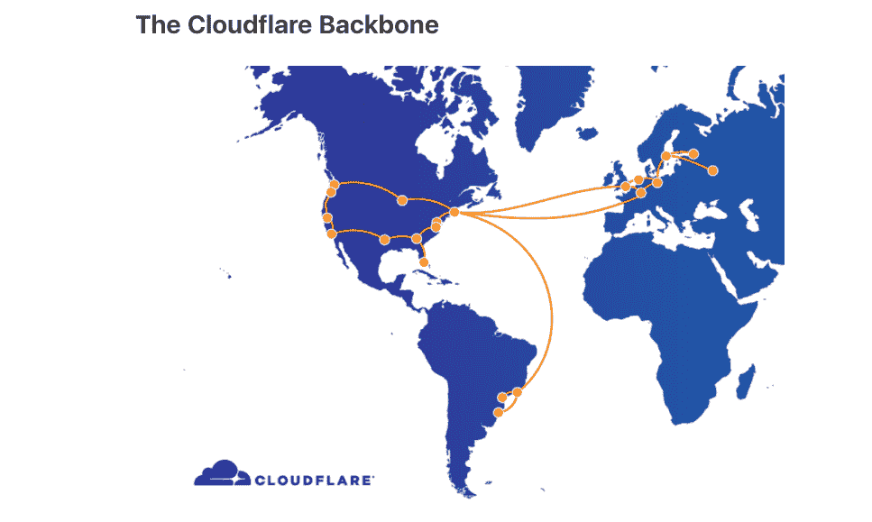
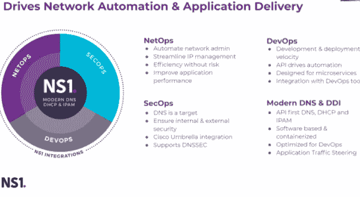

# Cloudflare 的网络关闭说明了为什么 DNS 是一个 DevOps 问题

> 原文：<https://thenewstack.io/cloudflares-network-shutdown-shows-why-dns-is-a-devops-problem/>

几周前 cloud flare[的大范围中断](https://techcrunch.com/2020/07/17/cloudflare-dns-goes-down-taking-a-large-piece-of-the-internet-with-it/)凸显了 DNS 连接固有的脆弱性，以及建立冗余以帮助确保这种最坏情况永远不会发生的重要性。

虽然看起来是一个网络运营难题，但通过在软件生产周期的最开始建立冗余和其他检查，将解决方案部署到位以减轻此类灾难的发生在很大程度上是一个 DevOps 问题，涉及开发人员和安全团队以及 NetOps。

NS1 首席技术官和联合创始人乔纳森·苏利文[告诉新堆栈:“这实际上是关于每个级别的冗余。”。](https://www.linkedin.com/in/jonathansullivan1/)

Cloudflare 首席技术官 [John Graham-Cumming](https://www.linkedin.com/in/john-graham-cumming-519779177/?originalSubdomain=pt) 在一篇博客文章中写道，虽然 Cloudflare——NS1 的竞争对手——确实在其基础设施中内置了 DNS 冗余，但其网络基础设施中的流量下降了约 50%,并导致 cloud flare 互联网属性和服务中断 27 分钟。

乔治亚州的路由器过载导致 Cloudflare 中断。Cloudflare 了解到的防止此类事件再次发生的一种方法是对 Georgia 路由器的 BGP 会话流量进行限制。Graham-Cumming 写道，这将导致路由器关闭，从而将流量从主干网的这一部分分流出去，吸引主干网上的流量。修复还包括确保单个路由器位置不会吸引如此大量的流量而导致过载。

照片:云辉

然而，没有一个网络提供商的基础设施是 100%安全的。“如果你对如何避免这种[类似 Cloudflare 的灾难]感兴趣，如果你是 Cloudflare 的客户，唯一的办法就是有两家 DNS 提供商或两家供应商，”Sullivan 说。

例如，一个组织可能依赖于两家 DNS 供应商，然后通过网络结构使用中间件，如 [Terraform](https://www.terraform.io/) ，以利用这两家供应商提供的共同特性。例如，DNS 记录可能指向存储在三个不同数据中心或云环境中的应用程序。Sullivan 说，然后记录被写入 NS1 的 API 和另一个供应商的 API，以增加冗余。

然而，在这种情况下，“你有点束手束脚，因为你只能利用两个地方都存在的功能，”沙利文说。“但是，如果正常运行时间真的是最重要的事情，我们往往会看到人们“选择两家供应商为其关键领域提供冗余，然后”利用我们来处理其他特定类型的工作负载。”

Sullivan 说 NS1 的另一个独特选择是，客户可以“利用 DevOps 的所有趋势”，例如采用 Terraform，并“有能力去云提供商那里，按一下按钮，打开新的基础设施，”Sullivan 说。“有了像我们这样的供应商，您可以拥有物理上逻辑上独立的 DNS 交付网络，并获得冗余和隔离。”

Sullivan 说，如果 NS1“受到大规模 DDoS 攻击(T1)，”你仍然拥有另一个网络，完全独立于我们，它拥有你所有的配置、所有的高级流量管理能力和所有的功能。

## 损害控制

当然，当网络中断发生时，组织寻求保护自己免受的附带损害各不相同。有些人可能会因为无法远程上传代码到 Git 存储库而损失开发人员的生产力，而其他人可能会在几个小时内损失数百万美元。然而，无论是哪种情况，所有 DevOps 团队，包括开发、安全和运营以及 NetOps，都必须在构建应用程序的最开始阶段就考虑 DNS 和连接性。

沙利文说:“防止中断通常是事后的想法，因为你忙于运营和建设你的业务，这是‘如果它没有坏，就不要修复它，但有时 DNS 和网络连接就像是一个纸牌屋，有时令人难以置信的是，它在存在几十年后仍然有效。冗余必须是您在构建应用程序时要考虑的事情——因为之后的下拉会非常痛苦，在某些情况下，如果没有完整的应用程序重写，这是不可能的。"

<svg xmlns:xlink="http://www.w3.org/1999/xlink" viewBox="0 0 68 31" version="1.1"><title>Group</title> <desc>Created with Sketch.</desc></svg>