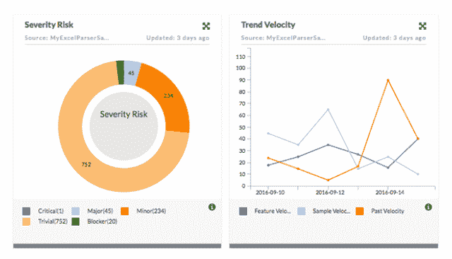

# CloudMunch 希望完成 DevOps 反馈循环

> 原文：<https://thenewstack.io/cloudmunch-aims-close-devops-feedback-loop/>

[CloudMunch](http://www.cloudmunch.com/) 的产品和战略高级副总裁 [Krishnan Subramanian](https://www.linkedin.com/in/krishnansubramanian) 说:“通过与客户交谈，我们发现虽然自动化连续交付渠道很重要，但缺少的部分是实现反馈循环。

监控和日志软件包正在迅速向成为[【开发运维中心】](https://thenewstack.io/logdna-aims-make-logging-predictive-machine-learning/)的概念靠拢，以监视和管理工具和流程，正如 [Fixate IO](http://fixate.io/) 分析师 [Chris Riley](https://twitter.com/HoardingInfo) 之前[观察到的](https://thenewstack.io/logdna-aims-make-logging-predictive-machine-learning/)。

CloudMunch 的[devo PS Intelligence Platform](http://www.cloudmunch.com/blog/)——被 Adobe、松下和霍尼韦尔等公司使用——从 CI/CD 平台中常用的所有工具中收集信息，并报告如何获得更高的效率。

智能平台旨在通过以下功能完成反馈循环:

*   针对来自各种工具、阶段和角色的指标的统一管理面板。
*   开发运维仪表板，提供基于 sprint、角色、发布/部署、构建等结果的建议。
*   管理人员和执行人员可以使用仪表盘来执行治理，并跟踪各种团队的整个软件交付过程的成本、质量和生产率。
*   支持 DevOps 工具，如 Puppet、Chef、Ansible、Jenkins、Github、Subversion、吉拉、Sonarqube、NewRelic、cAdvisor、Artifactory、VersionOne、Cruise Control、Heapster、Perforce、Amazon Web Services、Google Cloud、Docker、Kubernetes、Mesosphere 和 OpenShift。

虽然 Subramanian 将 [Datadog](https://www.datadoghq.com/) 列为其最接近的竞争对手之一——Hygeia 是另一个——但他说其他基础设施监控和应用性能管理产品侧重于运营方面。

新产品“不是实时监控解决方案，而是洞察层。你需要实时监控来立即采取行动，但我们认为，你需要收集一周或一个月的数据来查看开发或测试流程，以获得可操作的见解，”他说。

它有助于回答诸如“代码质量如何影响这个 sprint？”

对于开发人员来说，这可能意味着对环境健康状况和版本转换的可见性，以及分阶段、测试和修补的自动化。与此同时，工程师可以查看跨服务的流失率、稳定性和性能趋势，以及跨版本的团队生产力。

## 提供背景

华盛顿贝尔维尤。总部位于的公司成立于 2012 年，最初是一个自动化的 SaaS 平台，用于连接多个开发人员工具。今年早些时候，它发布了核心平台的 2.0 版本。

智能平台不使用代理，而是依靠 API 通过模板收集数据。

然后，它使用 Cloud Munch 所谓的自动化任务来标准化来自各种工具的数据，以便可以在上下文中使用。Subramanian 说，这种环境是它的关键区别。

用户所要做的就是对不同工具的连接进行身份验证，这大大减少了设置所需的时间

展望未来，它可以从客户那里收集信息并提出建议，包括实时收集。虽然它已经将 ChatOps 集成到平台中，但它将与其他 Slack 和其他聊天工具集成，以便在那里接收通知和警报。它希望在从开发人员到生产人员的多个角色中添加更多工具，并使其无缝连接，并使用机器学习来提供每个级别的上下文——正如 Riley 所描述的“魔法酱”,至少在监控和日志记录领域是如此。

[英特尔的 Matthew Brender 讨论遥测技术和英特尔 Snap 工具](https://thenewstack.simplecast.com/episodes/intels-matthew-brender-discusses-telemetry-and-the-intel-snap-tool)

特写照片通过 CloudMunch。

<svg xmlns:xlink="http://www.w3.org/1999/xlink" viewBox="0 0 68 31" version="1.1"><title>Group</title> <desc>Created with Sketch.</desc></svg>