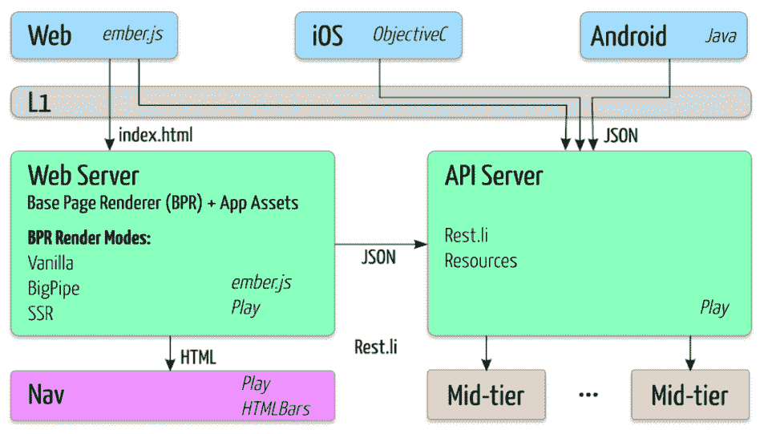
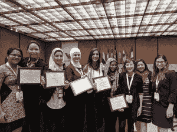
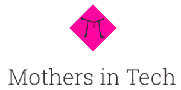

# LinkedIn 工程师的 AI 工作获得 CloudNOW 创新奖的认可

> 原文：<https://thenewstack.io/cloudnow-names-linkedins-neha-jain-one-top-women-cloud-work-using-ai-reduce-bias-hiring/>

LinkedIn 人才解决方案团队的成员，高级软件工程师 [Neha Jain](https://www.linkedin.com/in/nehajainhbti/) 正在开发一个利用云、机器学习和其他尖端技术的招聘应用程序。她的工作包括创建一种新的学习模式，以便在考虑多样性要求的同时，更容易锁定具有特定技能的候选人。

“这一切都是为了给合适的人才找到合适的机会，”贾恩在接受采访时说。以及尽可能缩短找到合适的全栈开发人员或摇滚明星销售助理所需的时间。

Jain 惊讶地发现，她已经被提名为今年[Cloud now’](http://cloud-now.org/)s奖项的十位获奖者之一，该奖项旨在表彰那些帮助开创云计算和新兴技术的女性。她的提名不仅来自于她在利用机器学习为 LinkedIn 创造新服务方面的开创性工作，还来自于她作为导师在霍尔伯顿软件工程学校(一所专注于非传统学生的代码学校)和 LinkedIn 内部所做的贡献。

## 开创性的 ML 模型

Talent Solutions 团队决定从头开始构建他们的系统，利用 LinkedIn 最新的本土技术堆栈 [Pemberly](https://engineering.linkedin.com/blog/2016/12/pemberly-at-linkedin) ，该堆栈通过允许浏览器加载 Ember.js [的代码，同时向用户传输数据](https://engineering.linkedin.com/blog/2016/12/pemberly-at-linkedin)，从而提高浏览器的性能。所有用户提交的数据都被输入到贾恩帮助设计的新型[机器学习](/category/machine-learning/) (ML)模型中。它在线学习，利用用户反馈实时改进结果。

彭伯里烟囱

这是突破性的，因为大多数机器学习是离线进行的。例如，卡耐基梅隆大学(CMU) Libratus 计算机[在今年早些时候击败了玩德州扑克的人](https://thenewstack.io/computers-can-now-bluff/)，每天晚上都被断开连接，并被带回卡耐基梅隆大学学习当天的程序。该产品仍处于测试阶段，因此更多细节将在发布时公之于众。

与此同时，她正在让 LinkedIn 的其他团队利用她的改进。根据 CloudNOW 评委的说法，在整个过程中，她非常有效地提出了关于新产品用户体验的正确产品问题，确保团队专注于处理机器学习方面的正确挑战，并确保他们在构建这个异常复杂的产品时都很开心。

## 最重要的技能

她还在公司外分享了自己的知识。Jain 在[工程多样性会议](http://engineering.sjsu.edu/mep/conference-for-engineering-diversity/)上做了主题发言，并在[提升女性技术职业](http://bayarea.act-w.org/#speakers)会议上主持了机器学习研讨会的介绍，分享了她所学到的一些东西。

Neha Jain 与学员在霍尔布顿学校毕业

Jain 在 LinkedIn Talent Solutions 团队的工作只是她被提名的原因之一。自 2015 年霍尔伯顿软件工程学校成立以来，她一直是该校的[导师](https://blog.holbertonschool.com/mentor-spotlight-neha-jain/)。起初，她担心自己没有足够的知识成为一名导师，她自己的导师告诉她“你知道什么，或者你如何达到行业专家的标准，都不重要。总有人知道的比你少，你可以教他们。”

PiMothers.com，由耆那教创立

这种解决问题的心态让她创建了 PiMothers，这是一个 STEM 的母亲社区，她们可以在这里分享自己平衡工作和生活的经验。妇女们通过谷歌表单将她们的故事提交到博客上，然后贾恩将其转换成谷歌文档，并在发布前发送出去供审查。“我意识到我是瓶颈，”她说。所以她用 Zapier 自动化了这个过程。

Jain 说，作为一名软件工程师，最重要的技能是学会如何解决问题。其他一切都可以在工作中或自己学习。“如果你向来自不同背景的学生灌输解决问题的技能，没有什么会阻止他们在工作中取得成功，”她说。

12 月 5 日，CloudNOW 第六届年度“云上顶尖女性”活动举行。

<svg xmlns:xlink="http://www.w3.org/1999/xlink" viewBox="0 0 68 31" version="1.1"><title>Group</title> <desc>Created with Sketch.</desc></svg>