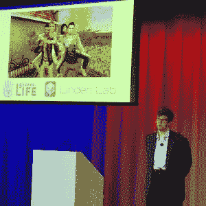
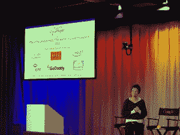
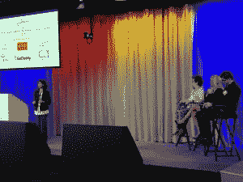

# CloudNOW 的颁奖活动庆祝了女性的创新

> 原文：<https://thenewstack.io/cloudnows-award-event-celebrated-womens-innovations/>

周三，250 多人聚集在加州山景城的谷歌园区，庆祝 12 个项目，这些项目代表了云技术的广泛应用和数小时的辛勤工作。

非盈利组织 CloudNOW 从 100 个提交的项目中选出了第五届年度[十大云创新女性奖](https://cloud-now.org/events/)。

林登实验室的塔拉·赫尔南德斯

因其辛勤工作而闻名的人包括:

*   [塔拉·赫尔南德斯](https://www.linkedin.com/in/tara-hernandez-755b263)，林登实验室[的系统和构建工程主管](https://www.lindenlab.com/)，他使用云来支持下一代[第二生命项目 Sansar](http://uploadvr.com/project-sansar-linden-lab-preview-vr/) 中的虚拟现实。
*   [Monique Morrow](https://ch.linkedin.com/in/moniquejeannemorrow) ，思科新前沿工程的首席技术官，他开创了一种通过数字足迹为难民提供身份证件的可穿戴设备，即“人性化物联网”
*   [鲁帕尔·帕特尔](https://www.linkedin.com/in/rupalvocalid),[VocaliD](https://www.vocalid.co/)的首席执行官和创始人，他允许使用两秒钟的发声片段制作新的声音，允许以前没有声音的人听起来更像他们自己，而不像一个 40 岁的女人*咳嗽 Siri 咳嗽*。
*   [玛丽·斯滕泽尔-普尔](https://www.linkedin.com/in/mary-stenzel-poore-250b6421)，负责研究的高级副院长，[俄勒冈健康与科学大学](http://www.ohsu.edu/xd/)，因其使用云结构帮助癌症识别和有针对性的治疗方案。

其中几个项目涉及云部署的自动化、持续交付、极其痛苦的 VMWare 升级，以及从过时的软件迁移到云环境中的微服务。完整的获奖者名单可以在[这里](https://cloud-now.org/events/)找到。

## 创新是挣来的

所有项目的共同主题是项目团队内部或不同业务之间的协作，不断变化的团队结构，当然还有开源。还有远大的梦想。

Mai-Lan Tomsen-Bukovek 发表主题演讲

“它始于梦想，”Kiva.org董事会执行主席朱莉·汉娜在她的主题演讲中说。这些女人敢于梦想。世界就是这样改变的。“一个梦想可以改变一千个现实。这是唯一有过的东西。”

亚马逊网络服务公司(Amazon Web Services)简单存储服务(S3)副总裁兼总经理‪向与会者(包括各种各样的学生和技术领域的女性)保证，创新是可以学习的。

她说，创新不是天赋。这是一种技能，需要练习。为了变得擅长，你必须失败。她说，创新需要一些失败的元素。“实验对创新至关重要。如果你没有失败，那就是你想得不够远大，”她向众人保证道。“要么是这样，要么是你自欺欺人。”

获奖者 Shaheeda Nizar 来自 GoDaddy，在评委(L-R) Jean Atelsek、Becky Wanta 和 Julien 栗林诚一郎面前展示

获胜者有四分钟的时间向评委和与会者推销他们的项目，以争夺一个最高的获胜者(只有吹牛的权利)。对这些项目进行评判的是 451 Research 的分析师让·阿特尔塞克；Becky Wanta ，太平洋赔偿保险公司的执行副总裁，曾任米高梅度假村的首席信息官；以及[朱利安·栗林诚一郎](https://www.linkedin.com/in/julienbarbier)霍尔伯顿学校[的联合创始人兼首席执行官](https://www.holbertonschool.com)。

赢得评委奖的是埃里卡·布雷西亚、负责自动化云部署的首席运营官·比特纳米和 VocaliD 的首席执行官兼创始人鲁帕尔·帕特尔。

汉娜总结了奖项。“我站在前人的肩膀上，”她说，“我不断问自己，‘我怎样才能让肩膀长得足够大，让别人可以站在上面？’"

特写:艾丽卡·布雷西亚。所有照片由 T.C. Currie 拍摄。

<svg xmlns:xlink="http://www.w3.org/1999/xlink" viewBox="0 0 68 31" version="1.1"><title>Group</title> <desc>Created with Sketch.</desc></svg>