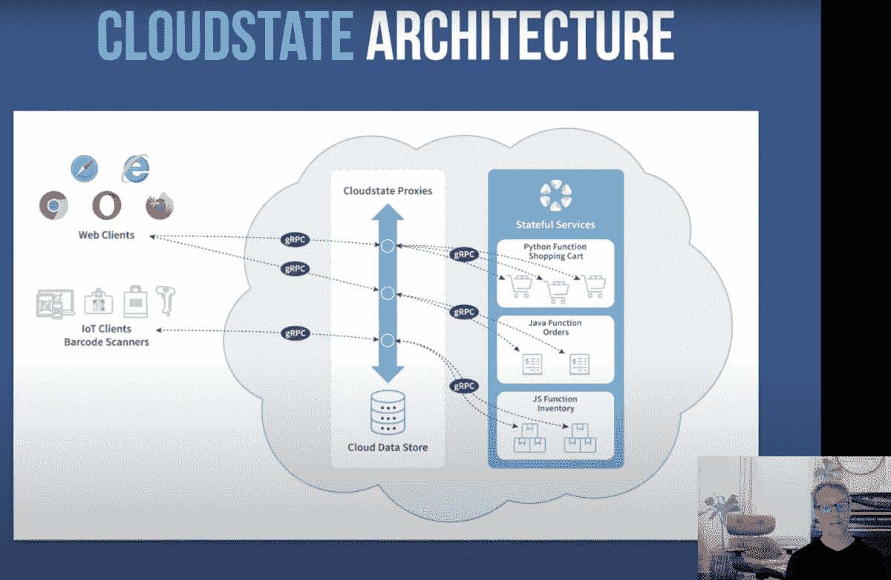

# Cloudstate 是 Lightbend 定义无服务器 2.0 的尝试

> 原文：<https://thenewstack.io/cloudstate-is-lightbends-attempt-to-define-serverless-2-0/>

 [理查德·麦克马努斯

理查德是《新书库》的高级编辑，每周撰写一篇关于云原生互联网未来发展的专栏文章。此前，他在 2003 年创立了读写网，并将其打造为全球最具影响力的科技新闻和分析网站之一。](https://twitter.com/ricmac) 

无服务器有其局限性；其中最主要的是国家管理。AWS Lambda 是目前[占主导地位的无服务器平台](https://thenewstack.io/theres-a-service-for-that-amazon-web-services-and-serverless-computing/)，根据[法令](https://aws.amazon.com/lambda/faqs/)，它的功能是无状态的——[意味着](https://www.webopedia.com/TERM/S/stateless.html)Lambda 函数中不可能有先前交互的记录。但是一个相对较新的开源项目有望改变这一切。由云原生厂商 [Lightbend](https://www.lightbend.com/) 于去年 8 月推出的 cloud state，旨在通过向组合中添加有状态功能来为“无服务器 2.0”建立基础。

我采访了 Lightbend 的云架构师和 Cloudstate 的技术负责人詹姆斯·罗珀，他谈到了为什么需要有状态功能，以及为什么 Lightbend 最近加入了无服务器的行列。

在上个月的 KubeCon 上，Roper 陪同 Lightbend 创始人兼首席技术官 Jonas Bonér 参加了一场关于 Cloudstate 的会议。Bonér 在开幕演讲中表示，无服务器不仅仅是一种服务(FaaS)，顾名思义，这是一种允许用户轻松执行功能的服务。AWS Lambda 是最初的 FaaS 服务，但 Cloudstate 希望将无服务器扩展到 Lambda 之外。Bonér 说，Cloudstate 的目标是支持通用应用程序的开发，包括在线银行、电子商务购物车和消息传递等有状态应用程序。

[https://www.youtube.com/embed/D3bYGIo2kiQ?feature=oembed](https://www.youtube.com/embed/D3bYGIo2kiQ?feature=oembed)

视频

几周后，在我和 Roper 的谈话中，我问他为什么开发人员想要使用无服务器构建有状态的应用程序？他回答说，无服务器最终是为了减少摩擦。

“如果我们认为功能即服务是我们如何消除这种摩擦的第一次迭代，”Roper 解释说，“下一次迭代[……]是查看状态管理，以及如何消除这种摩擦；这样一来，开发人员不仅可以在第一天就高效工作，还可以生产出可扩展的、有弹性的、有弹性的生产就绪代码，并根据他们的需求进行扩展。”

罗珀补充说，超越 FaaS 也意味着处理国家管理的微妙之处。

“当我们谈论状态时，我们不仅仅谈论持久化的状态，我们还谈论协调化的状态，这可能包括会话状态。”

## 云州的方法与 FaaS 有何不同

应该注意的是，FaaS 无服务器模型并不排除使用有状态数据——只是您必须通过连接到数据库或另一个存储系统来实现。一个 [AWS Lambda FAQ](https://aws.amazon.com/lambda/faqs/) 这样说:

*“虽然 AWS Lambda 的编程模型是无状态的，但你的代码可以通过调用其他 web 服务来访问有状态数据，比如亚马逊 S3 或亚马逊 DynamoDB。”*

这种方法的主要问题是应用程序必须与数据库或存储服务对话，这需要由开发人员来设置和配置。借用 Roper 的术语，这给创建有状态应用程序的过程增加了“摩擦”。在 Cloudstate 模型中，应用程序不再负责来回访问数据库来管理状态。这现在由 Cloudstate 协议处理，它充当应用程序和数据存储之间的中间人。以下是项目文档对此的解释:

*“在传统的 n 层架构中，一层(应用层)将调用另一层(数据库层)来检索和操作其状态。【……】cloud state 反转这种模式。应用程序代码不调用状态管理系统，状态管理系统调用应用程序代码。”*

为了实现这种反转，Cloudstate 使用“状态管理代理”和 gRPC 远程过程调用来传达状态。在 KubeCon 会议上，Bonér 使用了以下图表来说明:

“状态管理的协议方法的本质，”Bonér 后来通过电子邮件向我澄清说，“是它抽象出(隐藏和委托)了后端管理状态的所有机制，并让用户功能/服务只需要关心域数据本身，而不是如何持久化、复制、缓存、保持一致等。此外，现在由于后端代表所有的*功能管理状态，它可以看得更广，看到一般的使用模式，并优化跨服务的数据管理(分片、缓存、批处理等)。)."*

## 光弯没有服务器

Cloudstate 的灵感来自于一个基于 Kubernetes 的开源无服务器框架——[Knative](https://knative.dev/)，并将与它结合使用。Cloudstate 也将作为托管服务加入 Lightbend 的产品线。罗珀将这一战略描述为“一个支点”。

“所以历史上我们有一堆开源项目，然后我们出售订阅，人们自己运行，”他说。"而 Cloudstate 正在向管理、托管、销售服务方面发展."

Lightbend 目前的关键产品是 [Akka](https://akka.io/) ，这是一个开源项目，用于构建在 JVM (Java 虚拟机)上运行的并发和分布式应用程序。Akka 由 Jonas Bonér 于 2009 年创建，并在 2011 年公司成立时成为 Lightbend 的创始技术之一(当时名为 Typesafe)。Lightbend 的另一项基础技术是 Scala，一种流行的基于 Java 的编程语言。

Cloudstate 是 Akka 平台的最新扩展。“Cloudstate 是一个基于 Akka 的开源项目，在 Kubernetes 上运行，”Roper 解释道。

从某种意义上来说，Lightbend 是跳上了无服务器的肥缺——根据 MarketandMarkets 的数据，无服务器市场预计在未来五年内每年增长 22.7%。在去年 8 月 Cloudstate 发布之前，Lightbend 的主页上甚至没有提到“无服务器”这个词。但它现在被列为公司的核心产品之一，打着 [Akka Serverless](https://www.lightbend.com/akka-serverless) 的旗号(这是即将推出的 Cloudstate 的托管服务版本)。

但是对于 Lightbend 来说，应对无服务器市场在技术上也是有意义的，因为 Akka 平台的优势之一是其在分布式系统中管理状态的能力——如上所述，这是 FaaS 范式所缺乏的。但是，Akka 不一定容易部署。因此，让它成为一个无服务器平台对 Lightbend 的客户也有好处。

正如 Roper 解释的那样，Cloudstate 的灵感来自于 Akka 的部署挑战和无服务器平台中缺少的有状态功能的组合。

“有几件事凑在一起，”罗珀说。“首先，我们希望解决 Akka 的部署问题，我们看到了 Akka 成为云技术中非常重要的一部分的机会。我们看到了无服务器的差距。”

## 云州会被接受吗？

Cloudstate 是在无服务器中标准化有状态功能的一项努力，因此 Lightbend 需要收集社区对它的支持。我问 Roper，云原生生态系统中的所有关键参与者是否都支持 Cloudstate 项目？他回答说，他们一直在与来自 [Dapr](https://dapr.io/) (微软的一个开源事件驱动运行时)和 Knative 背后的公司(包括谷歌、VMware 和红帽)的人交谈。

该项目的势头是否增强还有待观察；而且值得注意的是，还有备选的[有状态无服务器](https://thenewstack.io/serverless-in-the-enterprise-building-stateful-applications/)项目可供选择，比如 Azure Durable Functions(基于 [Dapr](https://dapr.io/) )和 [RIFF](https://projectriff.io/) 。但似乎 Lightbend 致力于无服务器模式，并有很多动机来实现其无服务器 2.0 愿景——包括加强 Lightbend 自己的核心平台 Akka。

Lightbend、Amazon Web Services、Red Hat 和 VMware 都是新堆栈的赞助商。

通过 Pixabay 的特征图像。

*目前，新堆栈不允许直接在该网站上发表评论。我们邀请所有希望讨论某个故事的读者通过推特或脸书与我们联系。我们也欢迎您通过电子邮件发送新闻提示和反馈:[feedback @ thenewstack . io](mailto:feedback@thenewstack.io)。*

<svg xmlns:xlink="http://www.w3.org/1999/xlink" viewBox="0 0 68 31" version="1.1"><title>Group</title> <desc>Created with Sketch.</desc></svg>