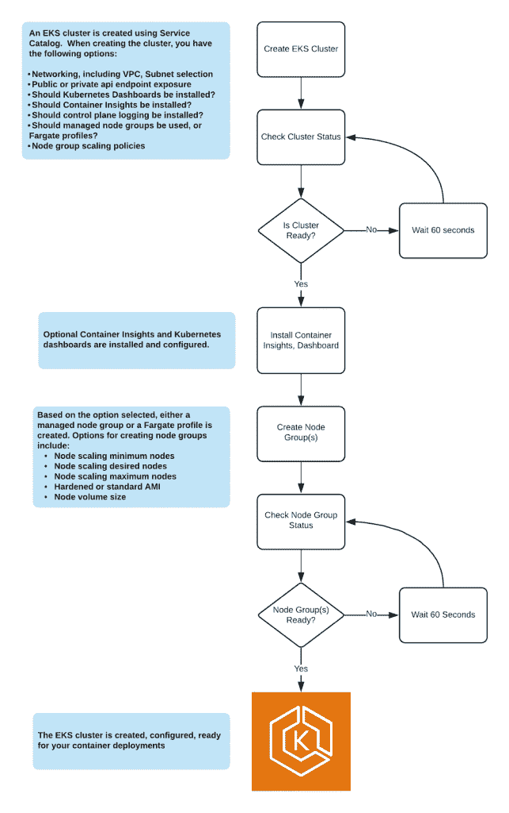

# 云计算为亚马逊云原生工作负载带来了 HIPAA 合规性

> 原文：<https://thenewstack.io/cloudticity-brings-hipaa-compliance-to-amazon-cloud-native-workloads/>

一些公司十多年前就开始向云迁移，而另一些公司还没有开始。延迟的原因是多种多样的，但对于一些政府法规来说，如[医疗保险便携性和责任法案(HIPAA)](https://www.hhs.gov/hipaa/for-professionals/privacy/laws-regulations/index.html) ，该法案规定了医疗保健行业公司的数据隐私问题，也是延迟的原因。对于数据保留和加密方面的要求，保持现有技术比采用最新技术更容易。

[Cloudticity](https://www.cloudticity.com/) 是一家[亚马逊网络服务(AWS)](https://aws.amazon.com/) 托管服务提供商，一直致力于帮助医疗保健公司迁移到公共云。该公司已经将 Cloudticity Managed Kubernetes 添加到其[托管云解决方案](https://www.cloudticity.com/managed-cloud)中，用于那些可能已经迁移到公共云，但现在希望开始使用 Kubernetes 运行分布式应用程序的公司。当然，部署和运行 Kubernetes 本身就很有挑战性，但是在此基础上增加 HIPAA 合规性会使事情变得更加困难。

在一篇详细介绍新服务的博客文章中，Cloudticity 技术和产品总监罗伯·威廉姆斯简洁地总结了这个问题:

*即使是经验丰富的 Kubernetes 专家，手动设置一个基本的 Kubernetes 集群也可能需要几个小时。威廉姆斯写道:“如果你考虑到实施适当的安全、警报、健康检查和仪表板的需求，Kubernetes 管理很快就会成为一项全职工作。但对大多数公司来说，雇人做 Kubernetes 是不合理的。*

在接受 New Stack 采访时，Williams 解释说，Cloudticity 的新托管 Kubernetes 服务有助于医疗保健公司使用亚马逊的基础设施即代码产品在[亚马逊弹性 Kubernetes 服务(EKS)](https://aws.amazon.com/eks/) 或[弹性容器服务(ECS)](https://aws.amazon.com/ecs/) 上部署 Kubernetes。在使用强化映像创建 Kubernetes 集群之前，该模板将引导用户完成一系列配置问题，例如虚拟专用云(VPC)、命名、子网以及私有和公共 API 端点。同时，该模板将启动 Cloudticity 的日志和可视化工具，这些工具与代码一起运行。

Williams 进一步解释说，首先，制作该模板是为了从基础架构的角度确保 HIPAA 合规性，同时也是为了满足日志记录、加密和其他基本法规要求。

“我们的模板旨在让您部署在符合 HIPAA 的基础架构中。这意味着，结合我们用于构建 VPC 的其他模板，我们可以确保您将 Kubernetes 集群部署到没有公共访问的私有子网中，”Williams 说。“我们提供强化、加密的亚马逊机器映像(AMI ),以确保根据 HIPAA，您的静态数据是加密的。我们还确保您正在推送日志，并且将这些日志保存在一个您可以到达且不会丢失的位置。”

虽然当你想到快速移动和打破事物时，HIPAA 合规企业可能不是第一个想到的公司，但 Williams 说，许多要求 Cloudticity 提供该功能的公司都是小型创业公司，他们希望利用 Kubernetes，但他们没有能力雇用整个 Kubernetes 团队。

“我们与许多小型初创公司和一些中型公司合作，他们正在扰乱这个市场。他们已经接受了这项技术，”威廉姆斯说。“他们已经接受了云及其带来的所有好处。

到目前为止，Cloudticity 一直是亚马逊唯一的托管服务提供商，但 Williams 也提到，该公司将在未来几个月内转移到 Microsoft Azure，预计届时将推出同类型的托管 AKS 产品。

亚马逊网络服务是新堆栈的赞助商。

特写图片由达科斯托亚诺维奇从 Pixabay。

<svg xmlns:xlink="http://www.w3.org/1999/xlink" viewBox="0 0 68 31" version="1.1"><title>Group</title> <desc>Created with Sketch.</desc></svg>