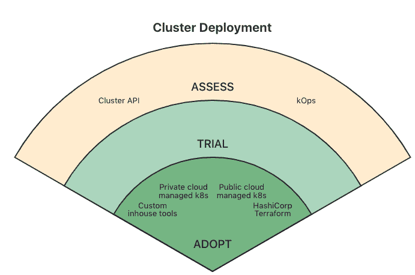

# 用于 Kubernetes 多集群部署的集群 API、kops 还是两者都有？

> 原文：<https://thenewstack.io/cluster-api-kops-or-both-for-kubernetes-multicluster-deployments/>

根据最近的一项研究，Kubernetes 集群部署和管理领域的两个新兴解决方案 Cluster API 和 kops 正在争夺开发人员的注意力。

我们知道 Kubernetes 的采用继续呈指数增长。与此同时，工具和平台的数量也在同步增长。然而，许多组织不知道部署——更不用说管理——Kubernetes 环境的最佳方式。

一个很好的例子是使用集群 API 和 kops 工具来部署 Kubernetes。其中一个是否会取代另一个，或者两者是否会继续结合使用，还有待观察。随着组织集体获得经验，这很可能是一个反复试验的问题，而 Kubernetes 的部署和管理仍然是一项进行中的工作。

这是从[云本地计算机基金会](https://cncf.io/?utm_content=inline-mention)的[第五终端用户技术雷达](https://www.cncf.io/announcements/2021/06/23/cncf-end-user-community-provides-insights-into-kubernetes-cluster-management-with-technology-radar/)中获得的信息之一，这是一套基于 CNCF 终端用户社区经验的新兴技术指南，其主题是多集群管理。

在“评估”类别的技术雷达中仅有的两个解决方案中，kops 提供了一种部署和关闭集群的自以为是的方法，也可用于配置云基础架构。另一方面，集群 API——CNCF Kubernetes 的一个子项目——是部署 Kubernetes 集群的一种更加简化的方法，在创建集群时，通过 API 提供的选项更加有限。

作为评估类别中的选项，是否或在多大程度上采用其中一个或两个解决方案还有待观察。例如，Cluster API 作为一种方法，以预定的方式描述正在部署的 Kubernetes 集群的节点，而集群本身是一个 Kubernetes 对象，[社交媒体分析提供商](https://github.com/recollir) [Meltwater](https://www.meltwater.com/fr) 的首席工程师 Federico Hernandez 告诉新堆栈，他参与了这一版本的 CNCF 雷达。

与集群 API 相比，kops 提供了更多的集群实例，同时为用户提供了更多配置集群的选项。埃尔南德斯说:“kops 非常固执己见，这是一件好事，因为你可以提出最适合你的思维和工作方式的意见。”

埃尔南德斯说，这两种选择都是“积木”。kops 可能有一天会提供一个 API 选项来部署集群，但是这种情况还远未确定，而集群 API 和 kops 预计不会在不久的将来成为竞争选项。

埃尔南德斯说:“你需要定义那些积木最适合你的方式。”“我不一定认为你最终只会选择其中一个。”

CNCF 最终用户社区的受访者被问及他们的组织对不同的 Kubernetes 集群管理选项有什么建议。

与 kops 和用于 Kubernetes 部署的集群 API 一样，CNCF 雷达报告也揭示了组织如何使用各种不同的工具和最佳实践进行多集群管理。尽管如此，集群管理的一些趋势已经开始巩固。例如，在 Kubernetes 的发展过程中，“社区引擎是由简化集群供应流程的倡议推动的，与基础设施环境无关，”CNCF 的生态系统倡导者 Katie Gamanji 说。

“技术雷达团队发现运营商是管理集群和核心服务的首选工具，”Gamanji 说。“处理一个以 Kubernetes 为中心的平台很难，但它的灵活性和构建模块支持创建定制资源，以最大限度地减少配置开销并简化集群管理。

在不久的将来，各种工具的整合也应该能够满足更广泛的需求。Gamanji 说，虽然不可否认的是，Kubernetes 的采用在过去几年中呈指数增长，但工具的广泛使用导致了众多自举提供商的有机增长。

这应该为整合做好准备，或者至少，工具和平台提供商——尤其是云供应商，应该越来越多地在同一个保护伞下提供许多不同的工具。

“其中一些工具专注于使用云提供商创建集群，如[亚马逊网络服务](https://aws.amazon.com/?utm_content=inline-mention)，谷歌云平台，微软 Azure，阿里云，而其他工具，如 kubeadm，则提供本地和裸机引导功能，”Gamanji 说。“但是，看一下这些工具，就支持的云提供商和功能而言，很难找到共同点。在保持互操作性的同时进行整合是必不可少的，社区在这方面投入了巨大的努力。在这种情况下，可以重点介绍的工具之一是集群 API，它为本地和公共云提供商的集群初始化提供了一个统一且可持续的接口。”

[https://www.youtube.com/embed/mjg_x9iYEIc?start=2086&feature=oembed](https://www.youtube.com/embed/mjg_x9iYEIc?start=2086&feature=oembed)

视频

<svg xmlns:xlink="http://www.w3.org/1999/xlink" viewBox="0 0 68 31" version="1.1"><title>Group</title> <desc>Created with Sketch.</desc></svg>