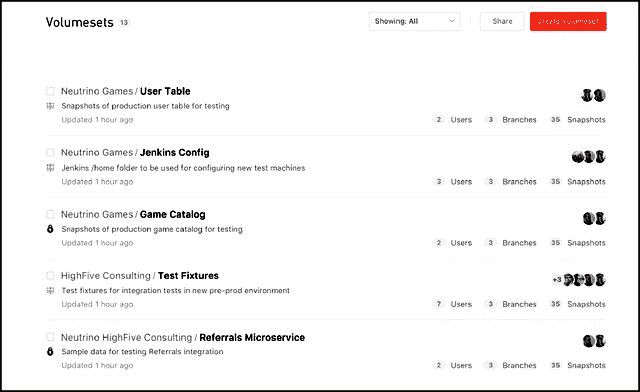
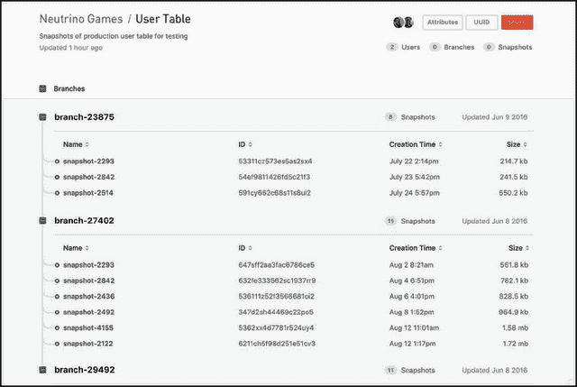

# ClusterHQ 打开数据卷的存储库 FlockerHub

> 原文：<https://thenewstack.io/clusterhq-opens-flockerhub-repository-data-volumes/>

ClusterHQ 正致力于围绕数据容器建立一个业务模型，数据容器是一种可移植的卷，可以作为持久的虚拟存储设备，在容器化环境中的应用程序之间共享。该公司的持久容器系统 Flocker 是首批利用 Docker 可扩展性模型的系统之一。

现在，该公司正在寻求建立在这种业务模式上，增加一项部署和交换数据量的服务:容器环境管理数据容器的方式与管理代码容器的方式没有太大的不同。名为[的 FlockerHub](https://clusterhq.com/flockerhub/introduction/) ，这个软件可以存储、共享和组织你的 Docker 数据卷。

“FlockerHub 线路接口 **fli** 的使用并不取决于 Flocker 的使用，”ClusterHQ 的产品副总裁 [Mohit Bhatnagar](https://twitter.com/mobhat) 在与新堆栈的讨论中解释道。“ **fli** 的设计宗旨是，如果您能够访问 Linux 操作系统上的任何 Docker 数据卷，我们也能够访问它。所以云从公有云延伸到私有云，实际上是延伸到开发者的笔记本电脑。 **fli** 和 FlockerHub 不需要 Flocker。"

## 不是弗洛克的中心

你能真正理解 FlockerHub 是什么和做什么的唯一方法是打破你头脑中 FlockerHub 和 Flocker 之间的关系。在 Docker 中，[数据卷是文件系统清楚地显示它包含数据的任何容器](https://docs.docker.com/engine/tutorials/dockervolumes/)。除此之外，真的没有更多的规范。

**fli** 命令行工具拍摄数据卷的快照。数据管理员定义拍摄这些快照的时间和频率。这些快照中的任何一个都可以作为卷装载到容器中。如果您将 Flocker 添加到这个场景中，它可以用来将这样的卷呈现为持久数据容器，并促进活动代码容器和数据卷之间的通信。

正如 ClusterHQ 营销副总裁 Michael Ferranti 告诉我们的那样，在审计数据存储和访问它们的代码的演变时，定期拍摄数据库快照对测试非常有用。“有些人可能想使用早期版本的数据库，”Ferranti 解释道。“假设他们在星期二晚上 11:32 从一个用户那里得到一个错误报告，并且他们想要在该错误报告的时间使用该数据库中的数据，因为他们有一个假设，即该错误报告在某种程度上与该州有关。如果他们使用上一次快照的状态，那实际上已经以某种有意义的方式改变了，他们将不再能够诊断错误。”

**fli** 工具可以捕获数据量的*增量*(仅仅是变化)，而 FlockerHub 系统知道如何对这些变化进行编目，以便它们作为不同版本的整体呈现给开发人员。

“我们相信，这种捕捉任何 Docker 数据量状态并将其推送到内部 VPC 回购的能力，将在欺诈等用例中具有广泛的适用性，”Bhatnagar 补充道。跨云迁移的备份和恢复可能是另一种情况。

## 不仅仅是“GitHub for Data”

尽管 ClusterHQ 不是第一个将自己的产品描述为“GitHub for data”的供应商，但 Bhatnagar 觉得有一个关键的区别必须指出，即使以他公司自己的比喻为代价:GitHub 是非常以开发人员为中心的。与此同时，他为 FlockerHub 设想的用例，如欺诈检测和取证系统分析，超出了开发人员的领域，进入了更广泛的 IT 部门。

我问 ClusterHQ 的高管，一个组织如何避免其版本控制系统失去控制，多次写入和覆盖导致几乎难以理解的潜在同等可行版本的混乱。这与数据仓库工程师所追求的“单一真理观”背道而驰。

ClusterHQ 认为答案在于访问控制。它的计划是让存储库对所有卷实施细粒度的访问控制，防止个人随意发布增量。理论上，你不能阻止任何开发人员使用 **fli** 来产生这些增量，但是存储库可以阻止她发布它们，从而声明它们是有效的。

“你不希望欺诈环境是由外部来源编写的，而不是欺诈的目的，”他说。“这就是这个系统的美妙之处。以一个欺诈环境为例:在给定的时间点，我可以对其进行快照。我现在不写入快照；就像 **git** 一样，我可以创建它的一个分支。”

Ferranti 说，这种分支能力可能对开发人员执行数据库模式升级很有用。“很多时候，你可以采取多种策略来实现这种改变，”他说。“一个有用的方法是拿一个测试卷，用 **fli** 做两个副本，对两个都应用你的模式升级，运行测试，看看哪一个在你的测试套件中表现更好。这完全是**fli**的本地用例。”

Bhatnagar 解释说，作为一种灾难恢复工具，可以保留代表所需恢复状态的数据量，然后按需恢复到活动环境中。该功能将在 Q1 2017 版中推出。

## 确保你的光环在直线上

最初，FlockerHub 将作为集群总部的托管服务提供。然而，Bhatnagar 评论说，“肯定会有客户不希望数据离开他们的 DMZ 的情况。这可能意味着他们希望数据保留在本地，或者在他们的 VPC[*亚马逊虚拟私有云*]环境中。”他说，为了解决这些客户的隐私问题，ClusterHQ 将于 2017 年在 Q1 发布针对 VPC 和内部部署的独立版本的 FlockerHub。

“我们认为容器管理问题是一个难题，”ClusterHQ 的 Bhatnagar 承认。“为了解决一个棘手的技术问题，通常你必须在一个不可知的生态系统中进行。因此，我很自豪也很高兴支持这一点:我们谈到的所有功能都与编排框架和容器层无关。它真正支持多种云；你可以在任何 Linux 机器上部署 fli，包括笔记本电脑。我们绝对认为云的定义需要包括开发人员的笔记本电脑。我们本着真正的开源精神来做这件事，并且不知道不同的基础设施，同时确保高水平的集成。"

这是一种崇高的说法，但正如我们在最近几个月所看到的，容器化数据困境的解决方案有几个新兴的竞争者，包括 [Red Hat 重新利用 Java 中间件](https://thenewstack.io/red-hat-jboss-data-grid-not-just-storing-java-objects-anymore/)、 [Mesosphere 的“容器 2.0”方法](https://thenewstack.io/mesospheres-container-2-0-unites-stateless-stateful-workloads/)，以及 [EMC 将容器客户端库](https://thenewstack.io/emc-pushes-alternative-dockers-persistent-storage-volumes/)注入到该方案中。我们会看到当他们互相冲突时，他们都是多么不可知论者。

Docker 是新堆栈的赞助商。

Techarrow 在公共领域拍摄的一个古董保险箱内部的图片。

<svg xmlns:xlink="http://www.w3.org/1999/xlink" viewBox="0 0 68 31" version="1.1"><title>Group</title> <desc>Created with Sketch.</desc></svg>