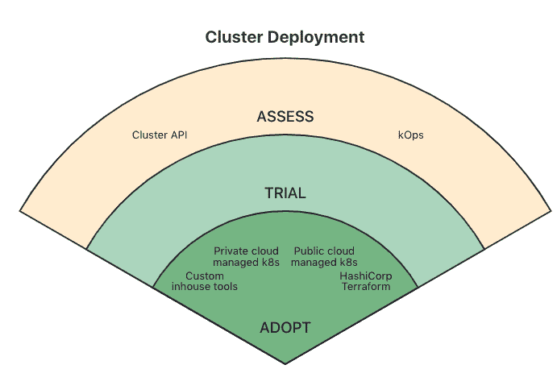

# CNCF 评估 Kubernetes 多集群管理工具

> 原文：<https://thenewstack.io/cncf-assesses-tools-for-kubernetes-multicluster-management/>

一旦他们试用了 Kubernetes，许多组织就希望扩展他们的 K8s 部署，并在许多集群上运行工作负载。但是管理多个集群需要一套新的工具，这些工具可以自动执行许多日常和手动任务。因此，在第五份技术雷达报告(T1)中，[云计算基金会(T3)根据终端用户社区的反馈，调查了可用于多集群管理的工具。](https://cncf.io/?utm_content=inline-mention)

[CNCF 评估 Kubernetes 多集群管理工具](https://thenewstack.simplecast.com/episodes/cncf-assesses-the-tools-for-kubernetes-multicluster-management)

在本期 New Stack Makers 播客中，我们采访了两位帮助编写这份报告的人，他们是社交媒体分析提供商首席工程师 Federico Hernandez 和融水工程团队负责人 Simone Sciarrati。我们讨论了报告的发现以及多集群管理工具的前景是如何形成的。共同主持这一集的是 Alex Williams，他是 New Stack 的创始人和发行人，也是 Tech Radar 的组织者，CNCF 生态系统副总裁 Cheryl Hung。

“如果你从一个(集群)开始，那么你可能不会考虑到在某个时候，你会有多个集群，”Sciarrati 说。“那么，哪些工具将适用于这种情况呢？CNCF 正在提供这种指导和可用资源的概述，并为你应该考虑的事情提供某种指导。”

调查发现，这项工作的各个部分使用了广泛的技术，包括 CNCF 仍在发展的 KOPS 和 T21 集群 API 标准。

但该报告更有趣的一点是，组织如何继续依赖内部开发的工具——即使是那些已经依赖 Kubernetes 托管服务提供商的最终用户。“这样做的原因是为了使 Kubernetes 构建模块适应 Kubernetes 处理和运行的应用程序的内部工作方式，以及该公司内部的整个生态系统。”埃尔南德斯说。“因此，你有一个托管的 Kubernetes，但你需要以某种方式管理托管的 Kubernetes，以便它在你的公司中以你希望的方式工作。”

另一个因素是组织如何继续集成其传统基础架构和运营，即使他们已经迁移到云原生环境。

Sciarrati 说:“你有现有的基础设施，你有公司现有的要求、政策和做事方式，然后你把 Kubernetes 放在那里。”“因此，你通常需要调整 Kubernetes 以适应现有的竞争环境，而不是调整公司。”

<svg xmlns:xlink="http://www.w3.org/1999/xlink" viewBox="0 0 68 31" version="1.1"><title>Group</title> <desc>Created with Sketch.</desc></svg>