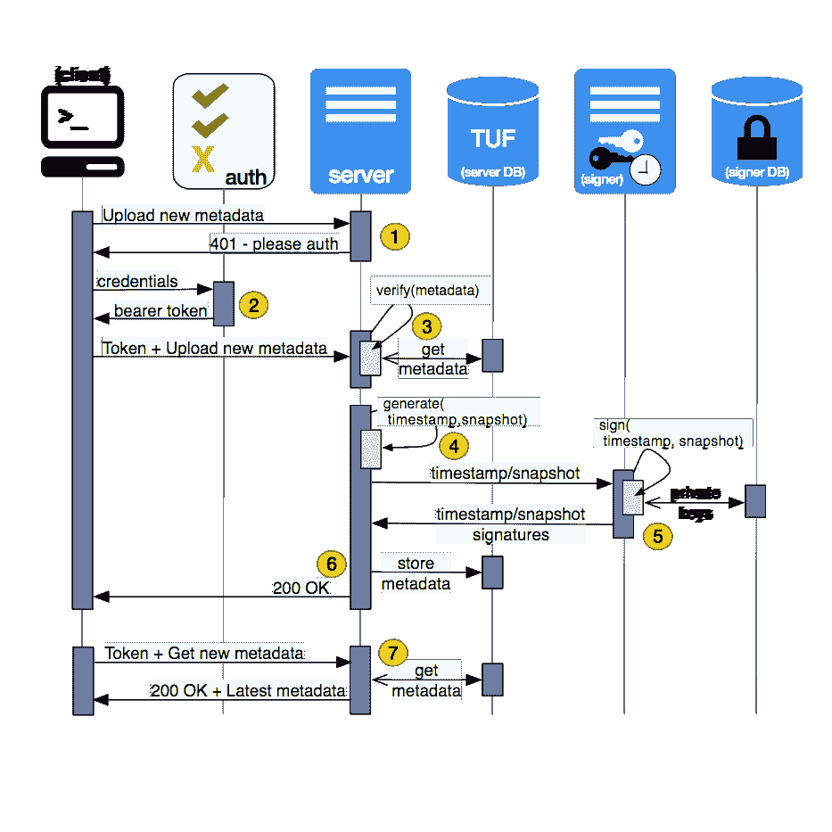

# CNCF 通过公证、TUF 采用为云原生堆栈带来安全性

> 原文：<https://thenewstack.io/cncf-brings-security-cloud-native-stack-notary-tuf-adoption/>

[云原生计算基金会](https://www.cncf.io/)继续大力构建其开源云原生技术组合。CNCF 的技术监督委员会投票决定接受 Docker 开发的[公证](https://github.com/docker/notary)可信内容框架和构建公证的规范 [TUF](https://github.com/theupdateframework) ，分别作为第 13 和第 14 个托管项目。

这些组织在本周于布拉格举行的欧洲开源峰会上宣布了新成员。

 [公证一目了然

*   865 GitHub 群星
*   156 叉
*   45 贡献者
*   8 维护者
*   2600+提交者
*   34 发布者](https://github.com/theupdateframework) 

由 Docker 于 2015 年发布，公证人管理所需的元数据，以确保容器图像更新的完整性，即使是在不可信的网络上和链接到受损的注册中心。该软件允许开发人员在开发的每一步签署应用程序，阻止恶意内容被注入工作流。

公证人提供一个客户端和一对服务器应用程序来托管签名的元数据和签名职责。它包含在 Docker 企业版和社区版中，是 Docker 的[莫比项目](https://mobyproject.org/)的一个组件。

公证客户端、服务器和签名者之间的交互。

华为、摩托罗拉解决方案、VMWare、LinuxKit、Quay 和 Kubernetes 也使用公证人。

 [TUF 一瞥

*   517 GitHub 群星
*   74 叉
*   27+投稿人
*   2700+提交](https://github.com/theupdateframework) 

公证人是基于[更新框架(TUF)规范，](https://www.theupdateframework.com/)规范，最初设计用于保护分布式系统的软件更新。TUF 提供了一种保护资源安全的设计，即使加密密钥或服务器遭到破坏。TUF 早于当前流行的容器，最初是为任何形式的软件分发而开发的。

Kolide 监控平台使用 TUF 实现通过自动更新程序安全地分发 [osquery](https://osquery.io/) 。

TUF 最初是在 2009 年由纽约大学教授[贾斯汀·卡波斯](http://engineering.nyu.edu/people/justin-cappos)编写的，并由 NYU 坦登工程学院的卡波斯安全系统实验室进一步开发。

公证人和 TUF 加入了以下 CNCF 项目:Kubernetes、Prometheus、OpenTracing、Fluentd、linkerd、gRPC、CoreDNS、containerd、rkt、CNI、Envoy 和 Jaeger。

云本地计算基金会是新堆栈的赞助商。

通过 Pixabay 的特征图像。

<svg xmlns:xlink="http://www.w3.org/1999/xlink" viewBox="0 0 68 31" version="1.1"><title>Group</title> <desc>Created with Sketch.</desc></svg>