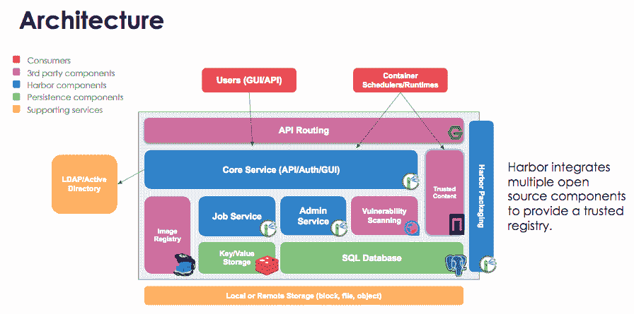

# CNCF 的云原生堆栈从 VMware 获得私有容器注册表

> 原文：<https://thenewstack.io/cncf-cloud-native-stack-gets-a-private-container-registry-from-vmware/>

[云本地计算基金会](https://www.cncf.io/)已经接手了 VMware 的[港](https://goharbor.io/)容器注册表，作为[沙盒级托管项目](https://www.cncf.io/projects/)。

Harbor 是一个注册表[，用于存储容器图像](https://github.com/vmware/harbor/blob/master/README.md)。对于容器管理，该软件还为用户管理、漏洞检查、访问控制、活动监控和实例之间的复制提供安全性和合规性支持。

通常，容器注册是作为服务提供的，要么由云提供商提供，要么由 Docker 等软件供应商提供。Harbor 可以在内部建立，因此更接近开发环境，并且与现有的安全实践更加紧密地交织在一起。

“在我们正在走向的多云世界中，服务的可移植性给了用户更多信心，因此当他们看到不同的基础架构产品来运行云原生环境时，他们知道无论他们选择什么样的云，这项服务都不会改变，”VMware 云原生工程总监克林特·麦显杰在接受新堆栈采访时说。

该软件可以由不能使用基于云的注册中心的组织内部运行，或者用于多云部署，以提供跨云的一致的容器部署模式。

在 2017 年的一次技术展示中，VMware 中国云原生研发首席架构师[海宁(Henry)张](https://www.linkedin.com/in/henryxnzhang/)表示，同步功能是许多用户已经部署的功能。您为特定映像设置了复制策略，它将与目标同步。

“当你把一个新的图像推送到 Harbor，它将被逐步复制到其他网站，”张说。“这非常有用，受到很多用户的喜爱。”

港口一览

*   4743 颗 GitHub 星星
*   1369 把叉子
*   91 名投稿人
*   4968 次提交
*   49 个版本

如果您需要确保随着时间的推移构建完全相同的映像，私有存储库提供的控制也很有帮助，这与公共存储库不同，在公共存储库中，映像可能会随着错误修复或其他更改而更新。Harbor 以横向扩展的方式运行，以确保不会出现瓶颈。可以设置注册表的多个副本，这些副本可以共享相同的存储资源，也可以各自使用自己的存储资源。张说，这种方法对地理上分布的集群很有效。

除了存储容器，该软件还可以通过集成 Red Hat 的 [Clair](https://github.com/coreos/clair/) 漏洞扫描服务，定期扫描容器图像，以寻找已知的漏洞。用户还可以将该策略应用于漏洞管理，阻止任何具有已知漏洞的依赖项下载。

麦显杰说，数字签名功能允许组织建立一个可信的开发和部署过程，确保生产中运行的内容是它应该是什么。

根据[该项目的 GitHub 页面](https://github.com/vmware/harbor/blob/master/README.md)，Harbor 也有这些特性:

*   **基于角色的访问控制**:用户被授予访问某些项目的权限。例如，一些用户可以只拉图片，而开发者可以拉和推图片。
*   **LDAP/AD 支持** : Harbor 可以与轻量级目录访问协议或微软活动目录安装接口，用于用户验证和管理。
*   **公证**:图像真实性可以通过数字签名服务来保证，以保证内容可信。
*   **图形用户门户**可用于浏览和搜索存储库以及管理项目。
*   **审计**:记录所有存储库操作。
*   **应用编程接口** : Harbor 提供了一组 RESTful APIs，涵盖了大部分管理操作。

通过使用 Helm chart，Harbor 可以在任何 Kubernetes 环境中轻松设置，它还将支持所有依赖的服务，并在应用程序的整个生命周期中管理它们。麦显杰指出，开发团队正在为 Harbor 开发 Kubernetes 控制器，这将允许软件完全自我管理，根据需要扩展服务。

“我们希望 Harbor 由 Kubernetes 运营。我们希望有一个由用户或管理员管理的客户资源，”麦显杰说。

对于个人用户，该软件也可以通过 Docker Compose 文件轻松安装在笔记本电脑上。

Harbor 于 2014 年作为 VMware 内部项目在中国启动，最初用于内部项目。该公司在 2016 年将项目代码作为开源发布。Pivotal Container Service (PKS)和 vSphere Integrated Containers 已经在生产环境中使用 Harbor。

到目前为止，该软件已被 300 多家公司使用，包括中国移动、JD.com、Rancher、OnStar Shanghai、Talking Data、腾讯云、Tenxcloud 和 TrendMicro 等公司都使用了该技术。中国初创企业 Caicloud 正在提供港口驱动的集装箱服务。

从 Kubernetes 容器编排引擎开始，CNCF 一直在采用开源技术，这些技术共同提供厂商中立的云计算。Harbor 是 CNCF 领导的第 24 个项目。CNCF 沙盒是[早期项目](https://github.com/cncf/toc/blob/master/process/graduation_criteria.adoc)的家园。

此前，VMware 也已经向 Linux 基金会捐赠了 [Open vSwitch](https://www.openvswitch.org/) 和 [IO Visor](https://www.iovisor.org/) 项目。

VMware 并不是唯一提供开源容器注册的公司。红帽公司还提供今年早些时候收购的 CoreOS 码头。

[https://www.youtube.com/embed/tI5xMe24fJ4?feature=oembed](https://www.youtube.com/embed/tI5xMe24fJ4?feature=oembed)

视频

云计算原生计算基金会、Red Hat 和 VMware 是新体系的赞助商。

通过 Pixabay 的特征图像。

<svg xmlns:xlink="http://www.w3.org/1999/xlink" viewBox="0 0 68 31" version="1.1"><title>Group</title> <desc>Created with Sketch.</desc></svg>