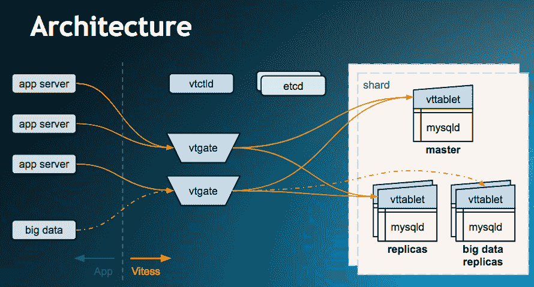

# CNCF 的 Vitess 在 Kubernetes 的帮助下扩展 MySQL

> 原文：<https://thenewstack.io/cncf-host-vitess/>

YouTube 开发的一项跨多个服务器分片大型 MySQL 数据库的技术， [Vitess，](http://vitess.io/)已经成为[云原生计算基金会](https://www.cncf.io/kubecon-cloudnativecon-events/)的第 16 个托管项目。

Vitess 是为“那些因为 MySQL 的功能而喜欢它，但因为它的扩展性不好而选择不使用它的人”而创建的， [Sugu Sougoumarane](https://twitter.com/ssougou) 在接受 New Stack 采访时说，他是 Vitess 的创始人之一，现在是以 Vitess 为中心的创业公司 [PlanetScale Data](http://www.planetscaledata.com/) 的联合创始人兼首席技术官。

“人们对使用 MySQL 有些犹豫，因为它无法扩展。但是现在有了 Vitess，这可以被认为是一个已经解决的问题，”他说。

Sougoumarane 解释说，Vitess 用户分为两个阵营。一个阵营是大量 MySQL 用户，他们已经知道如何在多个服务器上共享 MySQL 数据库以提高性能，但宁愿使用 Vitess 也不愿维护自己的软件。第二类往往是规模较小的组织，它们的单个 MySQL 实例已经不够用了。

Vitess 的采用表明，CNCF 技术监督委员会(TOC)正在认真研究云原生操作所面临的持久存储挑战，该委员会本周对新技术进行了投票。上周，TOC [也在](https://thenewstack.io/cncfs-rook-project-brings-storage-capability-cloud-native-workloads/)投票通过了 [Rook 云端原生存储接口](https://rook.io/)。

## 维特斯建筑

Vitess 是一个数据库集群系统，用于 Oracle 监管的开源关系 SQL 数据库管理系统 MySQL 的水平扩展。它在不同的服务器上分割数据库，在内部封装了分割路由逻辑。应用程序不使用 Oracle MySQL 驱动程序，而是部署 Vitess API 驱动程序，实际上将 MySQL 呈现为一个云原生数据库。用户可以根据需要拆分和合并碎片。在幕后，该软件依靠 CNCF 的开源 [Kubernetes](/category/kubernetes/) 容器编排引擎，通过使用容器集群来加速自动伸缩。

Vitess 还提供其他云原生功能，如支持自动故障转移/恢复、复制和滚动升级。它支持多种分片方案，用户可以自己创建。它还带有主管理和性能管理工具。

Vitess 带来了 NoSQL 数据库的巨大可伸缩性，同时保持了基于 SQL 的 MySQL 的一致性模型。在过去的十年中，许多用户已经完全放弃了 MySQL 和其他 SQL 兼容的数据库，这些数据库提供了数据一致性的严格保证，转而选择了更松散、更容易扩展的 NoSQL 数据存储。

这些用户认为他们不需要事务性属性，但是“你会遇到越来越多的用例，你希望从数据中得到更好的保证，”Sougoumarane 说。所以许多人最终在应用程序本身中实现了所需的事务属性。他说，结果是，“这些应用程序最终会变得比实际情况复杂得多”。

 [一目了然

*   105 名贡献者
*   5413 颗 GitHub 星星
*   15 个版本
*   13，733 次提交
*   707 叉](http://vitess.io/) 

当然，并非所有用户都选择了 NoSQL。许多组织，如 Slack 或脸书，更倾向于使用 MySQL，尽管他们需要比数据库系统开箱即用更大的可伸缩性。有一些方法可以扩展标准的关系数据库，但是，它们会增加维护工作量。最初，可以通过制作副本来扩展数据库，以便可以从多个副本中读取相同的数据。最终，写性能成为一个问题，因此下一步是将不同的表拆分到它们的服务器上，最终，单个表必须拆分到多个服务器上，这变得很难管理，并且随着时间的推移会变得更糟。

Vitess 旨在隐藏所有这些复杂性。去年，亚马逊网络服务设计了自己的类似 MySQL 的数据库服务， [Aurora](https://aws.amazon.com/rds/aurora/) ，[具有多主数据库读写能力](https://thenewstack.io/aws-takes-kubernetes-offers-serverless-database-service/)，有效地赋予了该服务几乎无限的横向扩展能力。像 Vitess 这样的技术可以提供相同的功能，但不会将最终用户绑定到特定的云服务。

## 经过生产测试，Kubernetes 就绪

Vitess 于 2010 年开始作为 YouTube 的一个内部项目，旨在建立一个代理服务器(该元素现在被称为“VTGate”)，旨在池化连接(MySQL 中的一个缓慢点)，并缓冲可能导致 MySQL 实例崩溃的有毒查询。

最初，Vitess 是为了在裸机上运行。但当 YouTube 在 2013-14 年迁移到谷歌云时，YouTube 开发者需要为在容器化环境中运行的软件配备设备，这种环境由容器编排软件管理，非常像 Kubernetes。所以开发人员将抽象和 API 构建到 Vitess 中，这样它就可以在这样的环境中工作。

因此，“当 Kubernetes 发布时，我们几乎已经准备好了，”Sougoumarane 说。Kubernetes 帮助管理 Vitess 可以生成的成千上万个节点。"如果没有 Kubernetes，您将不得不编写许多定制的启动脚本来进行部署. "如果一台服务器出现故障，Kubernetes 可以在其他地方恢复一个节点，并在新的配置中重新平衡应用程序。

后端组件是用 Go 编程语言编写的。该软件支持 MySQL 回到 5.6 版本，以及 MySQL-knockoff MariaDB 回到 10 版本。可以备份到网络文件服务器，也可以备份到 blob 存储区。

Vitess 是 CNCF 承担的第 16 个项目，旁边是 Kubernetes、Prometheus、OpenTracing、Fluentd、Linkerd、gRPC、CoreDNS、containerd、rkt、CNI、Envoy、Jaeger、公证人、TUF 和 Rook。根据 CNCF 毕业标准 v1.0 ，Vitess 已被接受为孵化级项目。

任何 CNCF 孵化项目的一个要求是，它被至少三个独立的最终用户成功地用于生产。在这里，Vitess 得到了很好的覆盖:BetterCloud、Flipkart、Quiz of Kings、Slack、Square Cash 和 Stitch Labs 都使用该软件，此外还有 YouTube 本身。使用范围可以跨越移动应用程序、游戏公司、金融机构、零售和其他企业。

Sougoumarane 说，例如，Stitch Labs 在 Kubernetes 上运行了大约 100 个碎片，每秒处理超过 10 万个查询(QPS)。Slack 是另一个部署 Vitess 的组织。该公司希望继续使用 MySQL，尽管其快速增长的服务需要每天处理数十亿个 MySQL 事务。“我们需要一个能够提供熟悉的全功能 SQL 界面的解决方案，并希望继续使用 MySQL 作为后备存储来保持我们的运营知识和舒适度，”Slack 高级员工工程师[迈克尔·德默](https://www.linkedin.com/in/demmer/)在一份声明中说。" Vitess 是实现这一目标的自然选择，并且迄今为止为我们提供了很好的服务."

Booking.com、GitHub、HubSpot、Slack 和 Square 都积极参与了这个项目。

[https://www.youtube.com/embed/q65TleTn2vg?feature=oembed](https://www.youtube.com/embed/q65TleTn2vg?feature=oembed)

视频

<svg xmlns:xlink="http://www.w3.org/1999/xlink" viewBox="0 0 68 31" version="1.1"><title>Group</title> <desc>Created with Sketch.</desc></svg>