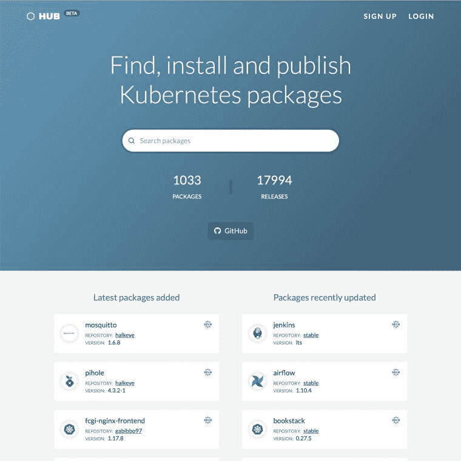
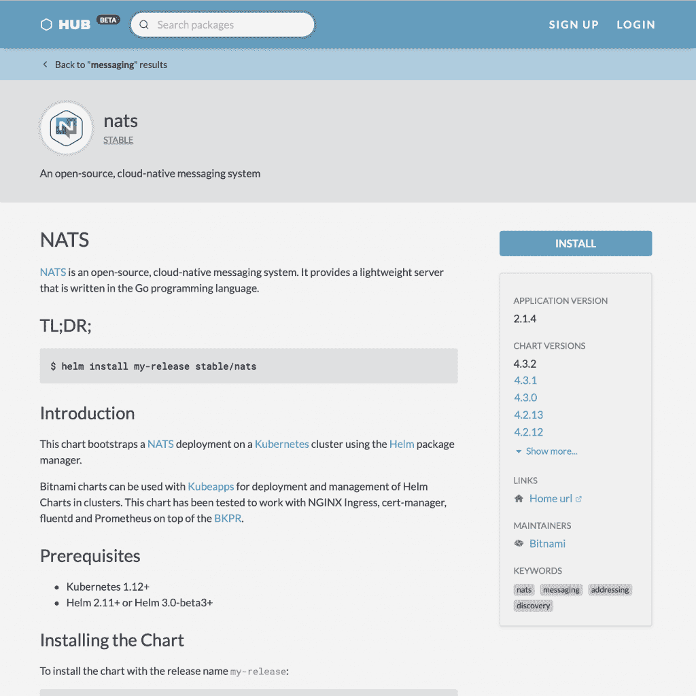

# CNCF 推出 Kubernetes 套餐一站式中心

> 原文：<https://thenewstack.io/cncf-launches-a-one-stop-hub-for-kubernetes-packages/>

现在，如果一个 Kubernetes 用户正在寻找一个舵轮图，那么[舵轮中心](https://hub.helm.sh)是一个值得访问的地方。类似地，可以在 [OperatorHub](https://operatorhub.io/) 找到运营商，而 Falco 配置、开放策略代理(OPA)策略以及其他与云原生相关的应用和配置仍然可以在其他位置找到。

现在，[云计算原生计算基金会](https://www.cncf.io/) (CNCF)正在寻求通过开发 CNCF 中心来解决这种蔓延，这是一个仍处于“预阿尔法状态”的新项目，根据 CNCF 技术监督委员会(TOC)贡献者[马特·法里纳](https://www.linkedin.com/in/matthewfarina/)的[消息](https://lists.cncf.io/g/cncf-toc/message/4305)，该项目希望能够“为 CNCF 项目寻找、安装和发布软件包和配置”。

“发现用于 CNCF 项目的工件可能很困难，”GitHub 上的 [CNCF 中心自述文件](https://github.com/cncf/hub)解释道。“如果每个需要共享人工制品的 CNCF 项目都创建自己的中心，这将为每个项目创造大量的重复工作，并为那些试图找到要消费的人工制品的人带来支离破碎的体验。CNCF 中心试图通过为消费者提供任何 CNCF 项目都可以利用的单一体验来解决这个问题。”

法里纳在去年 11 月的 KubeCon 之后的一次关于创建这样一个中心的早期会议后写的一份 [CNCF 文件](https://docs.google.com/document/d/1X8wMOyzDHIJLKrq6dkoYbJlpBN8AnX1mLIQwA28jOaA/edit#)进一步描述了对该中心作为一个 web 应用程序的渴望，该应用程序“使人们能够发现他们可以安装到由 CNCF 项目支持的 Kubernetes 集群中的应用程序”，引用了 [Helm Hub](https://hub.helm.sh) 、 [OperatorHub](https://operatorhub.io/) 和 [Packagist](https://packagist.org/) 作为灵感来源。该文档接着列出了 CNCF 中心开发的八个具体要求标准，包括 Apache 2 许可证下的可用性、在出现问题时收集用户联系信息的需求，以及“设计为在 Kubernetes 内运行，并且不应假设任何特定的公共云供应商 API”的需求此外，该中心将有一个面向公众的搜索 API，Helm Charts 和 Falco rules 被明确要求包括在内，其他类型如 Operator Framework 和 KUDO 将在未来包括在内。

除了项目的“预 alpha”状态，目前还在讨论它是否将尝试作为沙盒阶段的成员项目加入 CNCF，或者由 CNCF 本身作为服务提供。该讨论目前计划在未来的 TOC 会议上进行，项目自述文件进一步描述了“欢迎拉动式请求，尤其是那些支持其他 CNCF 项目的请求。”

在目前的版本中，该中心有一个首页，列出了最近添加和更新的软件包，并带有一个搜索栏。根据 Farina 的大纲文档，虽然没有明确说明，但似乎 CNCF 中心是为了托管关于软件包的元数据，而不是软件包本身，因此每个单独的软件包页面都包括软件包的各种版本、安装说明、描述和安装的先决条件等信息。

在撰写本文时，该中心列出了 1，052 个包和 18，597 个版本。

<svg xmlns:xlink="http://www.w3.org/1999/xlink" viewBox="0 0 68 31" version="1.1"><title>Group</title> <desc>Created with Sketch.</desc></svg>