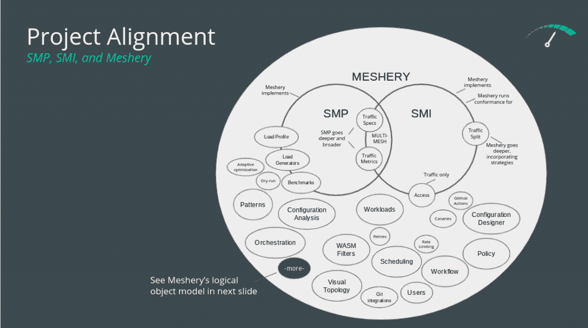

# CNCF 项目带来了服务网格互操作性、基准

> 原文：<https://thenewstack.io/cncf-projects-bring-service-mesh-interoperability-benchmarks/>

本月早些时候， [Meshery](https://github.com/meshery/meshery) 和[服务网格性能(SMP)](https://github.com/service-mesh-performance/service-mesh-performance) 项目在沙盒级别加入了[云本地计算基金会](https://cncf.io/?utm_content=inline-mention) (CNCF)。

Meshery 是一个多服务网格管理平面，提供服务网格及其工作负载的生命周期、配置和性能管理，而 SMP 是一个标准，用于捕获和描述基础架构容量、服务网格配置和工作负载元数据的详细信息。

当项目在 4 月份第一次申请加入时，技术监督委员会(TOC)有一个问题需要澄清:它们是否应该与[服务网格接口(SMI)](https://github.com/servicemeshinterface/smi-spec) 项目相结合或者以某种方式保持一致？

两个项目背后的部分公司 Layer5 的创始人 Lee Calcote 解释说，这对于 CNCF 来说是一个诱人的前景，但是至少在目前，这两个项目将继续各自独立的道路。

卡尔科特说:“对于 TOC 来说，这一特殊考虑的诱人之处在于，这意味着 CNCF 将会有一个项目，该项目将会说，‘这就是形成服务网格的原因’，然后这里的事情是[验证](https://meshery.io/service-mesh-interface)事实上，这是某种服务网格。”。“因此，在一个项目中，它定义了服务网格，验证了它们实际上遵守了这些规范，即它们是自己所说的那样，然后 Meshery 在此基础上做了更多工作，帮助人们成功运行服务网格。”

同时担任 CNCF 网络特别兴趣小组(SIG)主席的 Calcote 说，他随后向 CNCF 展示了以下图表，显示了三个项目之间的关系。他说，就目前而言，SMI 和 SMP 都是“相对年轻的项目，它们都还在思考自己长大后想做什么”，可能会考虑在以后进行整合，而 Meshery 的关注点比这两个项目更大，肯定会保持独立。

SMI 致力于定义适用于服务网格的最广泛的特征，寻找最小的公分母，而 Meshery 则反其道而行之，试图强调各个服务网格的差异和优势。与此同时，SMP 更像是一种规范，致力于提供一种通用格式来捕获和描述服务网格自身性能的数据。

与 SMI 相比，Calcote 说“SMP 本质上更深入。试图解决的一部分是这个长期存在的问题，这是今天采用服务网格的人、明天将采用服务网格的人、已经采用服务网格的人都面临的问题，我应该衡量什么来考虑我的服务网格的运行效率？”

在这三个项目之间，用户不仅可以通过一个公共 API 与任何 SMI 兼容的服务网格进行交互，还可以测量不同服务网格的性能，最后，还可以利用这些服务网格的特定优势，与它们进行交互并对其进行操作。

“这是一个多网格的世界，Meshery 和 SMI 的方法略有不同，因为 Meshery 有 10 个不同的适配器用于 10 个不同的服务网格，它这样做是为了让每个单独的服务网格展示其差异化的价值，而 SMI 实现相同目标的方法是提供一个统一的抽象集，一个统一的 API 集，”Calcote 解释说。“网状结构不会将你的互动限制在最小公分母上。相反，它揭示了每个网格的差异化价值。”

SMP 和 Meshery 的部分目标是不仅在不同的服务网格之间提供更高级别的互操作性，而且以“网格标记”的形式为用户提供关于这些不同服务网格的性能的易于访问的信息，以便更好地选择哪一个最适合他们通过 [MeshMark](https://smp-spec.io/) ，SMP 旨在根据进行此类评估所需的众多特征和条件，为比较不同的服务网格设置提供一个基准。

“我们试图为人们提供工具来描述这些环境的性能。这里的特征并不局限于服务网格。他们不仅考虑了网格。这实际上是 SMP 不同于 SMI 的部分原因。SMP 说，“这是所有的东西，是你的集群和节点。“这是你正在运行的工作负载，”卡尔科特说。除了 Meshery 之外，它的部分目标是以一种厂商中立的方式帮助促进服务网格的选择，帮助人们理解运行一堆代理所涉及的开销。"

有了这些信息，他们就可以使用 Meshery 来部署和操作 10 个服务网格中的任何一个。Calcote 说，Meshery 将试图补充现有的服务网格控制平面，以便使操作更容易，并增加其他功能，如促进混沌工程，甚至承担某种程度的业务逻辑，因为它可以访问网络上移动的每个数据包。

Calcote 说:“部分原因是，服务网格是云原生基础设施中不可避免的新层，随着时间的推移，它将成为无处不在的组件。”“在网络中可以做很多事情，有很多智能，所以 Meshery 作为一个管理平面，可以选择其中的一些功能。”

<svg xmlns:xlink="http://www.w3.org/1999/xlink" viewBox="0 0 68 31" version="1.1"><title>Group</title> <desc>Created with Sketch.</desc></svg>