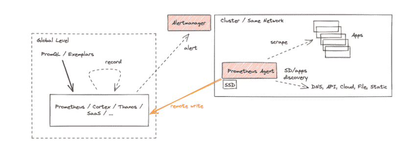

# Could 普罗米修斯公司的代理人可能会改变 Edge 的游戏规则

> 原文：<https://thenewstack.io/cncf-prometheus-agent-could-be-a-game-changer-for-edge/>

普罗米修斯的创造者已经对一个由云计算原生计算基金会(CNCF)支持的项目的抓取功能进行了重大改变。借助这一新功能，代理模式针对远程写入用例优化了 Prometheus。

新功能表面上看起来可能不多，但它特别适用于边缘计算和网络，对于这些应用来说，能耗和资源节约至关重要。这是因为这些应用程序不一定是为传统使用[普罗米修斯](https://prometheus.io/)进行监控而构建的。在这种方式下，代理模式是 CNCF 生态系统中某些部署的“游戏规则改变者”， [Bartlomiej Plotka](https://uk.linkedin.com/in/bwplotka) ，Red Hat 的首席软件工程师和 CNCF 的 TAG/SIG observability 技术负责人在[博客文章](https://prometheus.io/blog/)中写道。

## 代理模式有效

代理模式禁用了 Prometheus 的一些常用功能，并优化了二进制文件以抓取和写入远程位置。Plotka 写道，该功能引入了一种模式，在实现新的使用模式的同时减少了功能的数量。

[企业管理协会(EMA)](https://www.enterprisemanagement.com/) 的分析师 [Torsten Volk](https://www.linkedin.com/in/torstenvolk/) 告诉新堆栈，新代理如何通过可靠地将数据直接写入中央时序数据库进行分析，将近乎无状态的监控带到边缘，这确实是一个“游戏规则改变者”。

“以可靠的方式支持远程写入，并且不需要大量本地存储来支持查询和防止数据空白，这是这种方法背后的“秘方”。现在，你可以用最少的本地存储拥有大量间歇在线的边缘设备，并在它们的整体应用环境中近乎实时地集中监控它们，”Volk 说。“这符合横向扩展计算的本质，即整个群体的健康不依赖于每只羊。”

代理模式功能针对远程写入用例优化了 Prometheus。它禁用查询、警报和本地存储，并代之以定制的时序数据库(TSDB)预写日志(WAL)。“其他一切都保持不变:抓取逻辑、服务发现和相关配置，”普洛特卡写道。“如果您只想将数据转发到远程 Prometheus 服务器或任何其他远程写入兼容项目，它可以作为 Prometheus 的替代产品。”

图片:Bartlomiej Plotka。

如上所述，新的代理模式功能尤其适用于边缘集群和网络。电信、汽车和其他为云原生网络部署和管理来自物联网设备的数据的行业应该重视代理模式提供的电力和资源节约。

“我们看到越来越多资源有限的小集群，”普罗特卡写道。这迫使所有数据(包括可观察性)都被传输到更大的远程对等节点，因为这些远程节点上几乎无法存储任何数据

## 边缘计算的优势

Volk 说，对于边缘计算，Prometheus 的传统推拉能力对资源造成了限制。沃尔克说，随着新代理模式的使用，存储瓶颈似乎基本消除，因为代理现在能够以接近实时的方式将他们的“部分情况”直接写入中央时序数据库。“你可以认为这是潜在的成千上万个代理中的每一个都在近乎实时地贡献自己在高度分布式应用难题中的一部分，而不必担心耗尽本地存储空间或内存，”Volk 说。"这些通常稀缺的资源可以被其他边缘应用程序使用."

普洛特卡传达的定制代理 TSDB·沃尔提供的关键方面包括:

*   提高了总体操作数据效率，因为它会在成功写入后立即删除数据。如果无法到达远程端点，它会将数据临时保存在磁盘上，直到远程端点重新联机。“这意味着我们不需要在内存中构建大块的数据——我们不需要为查询目的维护完整的索引，”普洛特卡写道。“实际上，代理模式使用的资源只是普通 Prometheus 服务器在类似情况下使用的一小部分。”
*   为摄取提供更容易的水平可伸缩性。Plotka 描述说，代理模式本质上是将发现、抓取和远程写入移动到一个单独的微服务上，从而允许一个专注于摄取的运营模式。普罗特卡写道，代理人模式下的普罗米修斯“或多或少是无国籍的”。

<svg xmlns:xlink="http://www.w3.org/1999/xlink" viewBox="0 0 68 31" version="1.1"><title>Group</title> <desc>Created with Sketch.</desc></svg>