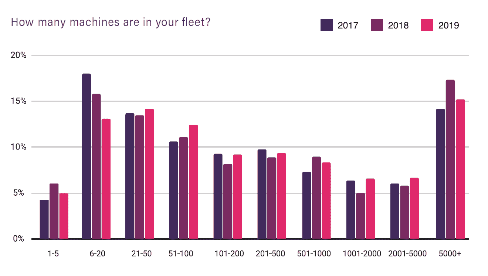
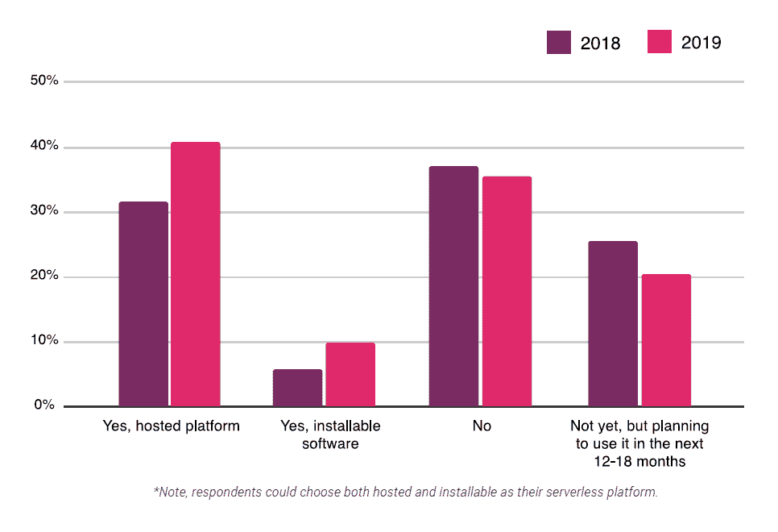
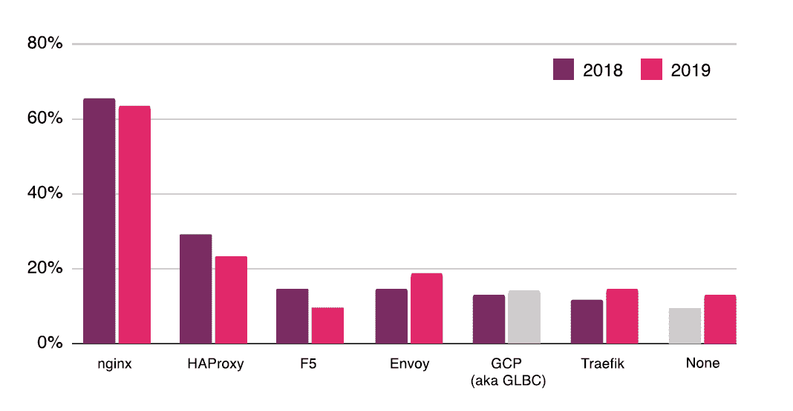
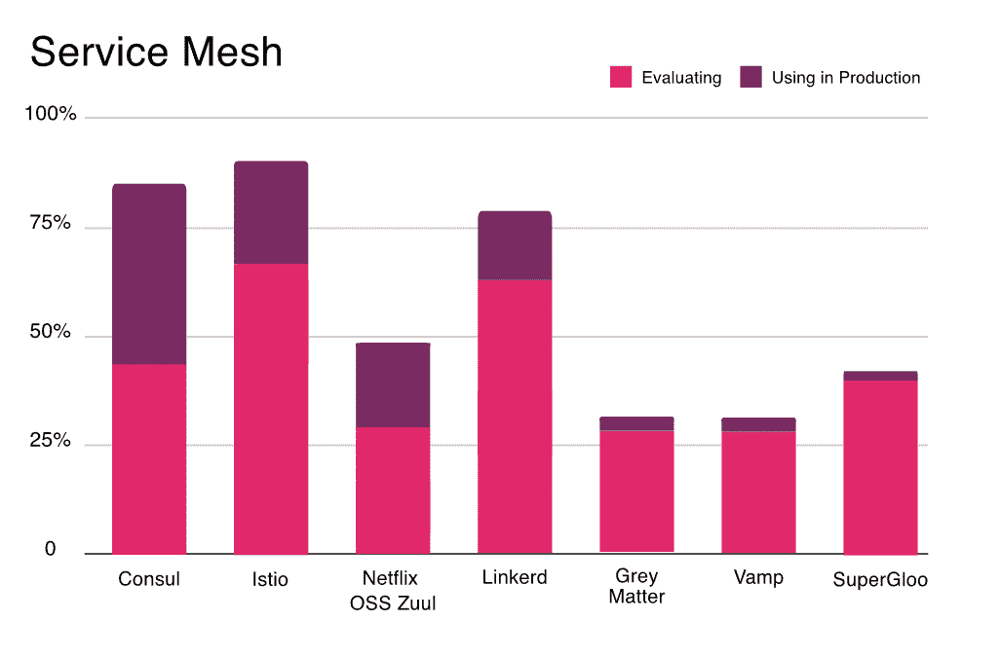
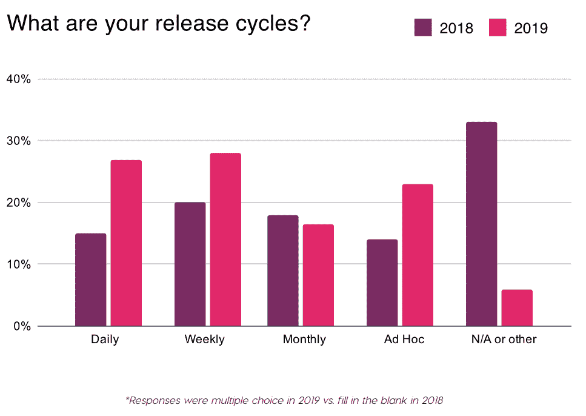

# CNCF 调查快照:云本地世界的技术采用

> 原文：<https://thenewstack.io/cncf-survey-snapshot-tech-adoption-in-the-cloud-native-world/>

云计算本地计算基金会(CNCF)在 2019 年 9 月/10 月进行的最新[调查](https://www.cncf.io/blog/2020/03/04/2019-cncf-survey-results-are-here-deployments-are-growing-in-size-and-speed-as-cloud-native-adoption-becomes-mainstream/)的结果值得进一步讨论。希望我们对[以前版本的研究的经验能够提供一个你在其他地方找不到的视角。来自 CNCF 社区的 1，337 名受访者本质上比其他 IT 专业人员更有可能拥有先进的云原生实践。](https://thenewstack.io/china-vs-the-world-a-kubernetes-and-container-perspective/)

以下是一些快速拍摄:

[**尽管集装箱使用量增加，但管理的机器数量几乎没有增加**](#anchor1)

*   生产中采用容器的比例从 2018 年的 73%上升到 2019 年的 84%。在这一群体中，运营至少 250 个集装箱的人从 2018 年的 46%上升到 2019 年的 58%。从 2017 年到 2019 年，其机队中拥有 50 台以上机器(物理或虚拟)的受访者数量从 2017 年的 77%上升到 2019 年的 81%。
*   ***含义:**容器的采用似乎减缓了需要管理的虚拟机的增长。但是，要警惕被管理的原始机器数量将会下降的说法。*

[**采用无服务器平台跳转**](#anchor2)

*   生产级托管无服务器平台的使用率逐年从略高于 30%上升到 40%。然而，在这些用户中，对 AWS Lambda (70%至 53%)、谷歌云功能(25%至 18%)和 Azure 功能(20%至 14%)的采用率都有所下降。
*   可安装无服务器平台的使用率从 2018 年的 6%上升到 2019 年的 10%。在这些用户中，Knative 是首选。
*   这个问题在某种程度上没有得到答复，这意味着报告的采用率可能比要求答复时低几个百分点。
*   ***寓意:**最初公司同时评估多个 FaaS 的发行。在多云环境中扩大无服务器采用范围的机会可能仅限于独特的使用案例和与计算无关的服务。*

[**广务网组件**](#anchor3)

*   当列出八个与服务网格相关的产品或项目时，18%的人说他们在生产中至少使用了其中一个。47%的人也在评估这些技术中的一种。大约 20%的研究没有回答这个问题，所以实际采用率很可能比报告图表中报告的要低。使用和考虑的总体水平似乎在我们之前写的范围之内。
*   超过 40%回答这个问题的人使用哈希公司的[领事](https://www.consul.io/)。大约 27%的人提到在制作中使用 [Istio](https://istio.io/) ，网飞[OSS Zuul](https://github.com/Netflix/zuul)和 [Linkerd](https://linkerd.io/) 位列前四。
*   大约 60%的研究称他们使用 ngnix 作为 Kubernetes 入口提供商。然而，有可能许多受访者提到了该技术的用途，即使它主要部署在与 Kubernetes 无关的环境中。HAproxy 和 F5 Networks 的采用率下降，而 [Envoy](https://www.envoyproxy.io) 和 Traefik 的使用率上升。
*   该调查还涉及了 CNCF 的毕业项目、孵化项目和沙盒项目。不幸的是，根据报告中数据的呈现方式，我们无法对 generic Envoy 和 Linkerd 的采用情况与更具体的服务网格应用程序进行比较。
*   ***含义:**许多 Consul 用户甚至在听说服务网格这个术语之前就可能使用它来进行服务发现。HashiCorp 的营销和产品开发努力似乎正在资本化，因为他们将它宣传为多云服务网格技术。这项研究的原始数据可能为如何以及何时在同一堆栈中使用 Istio、Envoy 和其他工具提供了难得的见解。当这种情况发生时，新的堆栈阅读器应该继续关注更多的分析。*

[**关于发布周期加速的发现有待解读**](#anchor4)

*   该报告的结论是“CI/CD 工具的数量和可靠性的增加正在推动手工发布周期的减少和发布周期的加速。”
*   粗略阅读一张图表，显示每日或每周发布周期的受访者从 2018 年的 35%上升到 2019 年的 55%。然而，这种上升在很大程度上可以归因于去年没有回答问题或在 2018 年开放式问题中被编码为“不适用”的人的比例大幅下降。说他们的发布周期是“临时的”的人可能上升了，部分原因是在多项选择问题中可以得到回答。
*   另一个图表(不包括在本文中)表明，拥有人工管理的发布周期的人从 27%下降到 14%。然而，下降最有可能是因为今年的问题特别提供了混合动力(手动和自动)作为答案选择。
*   ***寓意:**开发者和部署的速度很难衡量。最新的《CNCF 报告》在捕捉软件发布经常临时进行的细微差别方面做得更好。许多 CI/CD 系统不是 100%自动化的，所以不应该有自动化和非自动化的二元分类。*

除了“6-20”类别有所下降之外，受访者车队中的机器数量几乎没有变化。来源:2019 年 CNCF 调查。

问:您的组织是否正在使用无服务器技术？来源:2019 年 CNCF 调查。

问:您使用的是什么 Kubernetes 入口提供商(即服务代理)？请选择所有适用的选项。来源:2019 年 CNCF 调查。

云原生计算基金会和 HashiCorp 是新堆栈的赞助商。

来自 Pixabay 的罗兰·施泰因曼特写。

<svg xmlns:xlink="http://www.w3.org/1999/xlink" viewBox="0 0 68 31" version="1.1"><title>Group</title> <desc>Created with Sketch.</desc></svg>