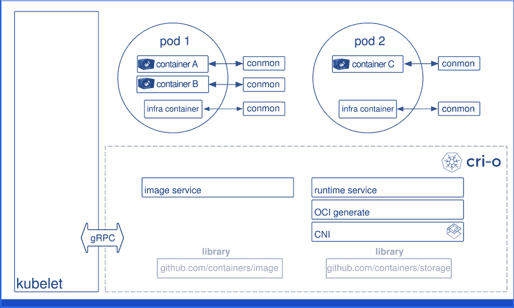

# CNCF 将主办 CRI-O 作为孵化项目

> 原文：<https://thenewstack.io/cncf-to-host-cri-o-as-incubated-project/>

云本地计算基金会(CNCF)已经投票同意接受(T2)CRI-O(T3)作为孵化级项目，CRI-O 项目的主要维护者(T4)Vincent Batts(T5)称这是此类项目中的第一个。

Batts 在一次采访中说:“以前没有一个项目达到毕业水平，但它已经在生产中，有来自几家公司的维护者，人们正在使用它。”。“几年来一直是 1.0。所以，从某些方面来说，这已经是一个非常成熟的项目了。”

Batts 是一名 Red Hat 员工，他解释说 CRI-O 是 Kubernetes 容器运行时接口(CRI)的一个实现，旨在支持使用与[开放容器倡议](https://www.opencontainers.org/) (OCI)兼容的运行时，它以前由 Kubernetes 特别兴趣小组(SIGs)托管。Batts 说，作为 Kubernetes SIGs 的一部分，CRI-O 被一些人认为不如它本来的样子。

“Kubernetes SIGS 是广大 Kubernetes 社区的一个地方，他们可以在这里提出与 Kubernetes 本身直接相关的想法。所以，它不是一个孵化器，不像 CNCF 那样需要 CNCF 的任何指导或存在。这只是一个为 Kubernetes 社区运作的地方，”Batts 说。“因为它与 Kubernetes 紧密相连，而且因为它生活在这个特殊利益集团组织中，CRI-O 一直被视为一种次要的东西，但它不仅仅是一个次要的项目或辅助工具。这是 Kubernetes 战略的重要组成部分。可以说，把它从翅膀中取出来，让它自己站起来，这样，就把它带进了家庭。CNCF 家族不仅仅是一个临时的助手项目。”

根据 CNCF 的一份声明，CRI 是在 2016 年作为“一个插件接口推出的，该接口使 [kubelet](https://kubernetes.io/docs/reference/command-line-tools-reference/kubelet/) (一个用于创建 pod 和启动容器的集群节点代理)能够使用不同的容器运行时，而无需重新编译 Kubernetes”。从那里，CRI-O 项目被开发来提供一个轻量级的运行时，它被严格地绑定到 Kubernetes。CRI-O 的版本与 Kubernetes 保持同步，正如 Batts 解释的那样，它致力于保持 Kubernetes 的“乏味”、安全和稳定。

“所有其他工具，如 Containerd 和 Docker，都支持多种用例。这样，CRI-O 非常固执己见，因为它仅仅支持 Kubernetes 用例。这让 It 部门可以自由地推出最低限度，确保安全足迹得到充分考虑，”Batts 说。“不必适应所有的华而不实，而是真正做它能做的事情，高效、稳定、安全、乏味。许多为 CRI-O 做出贡献的工程师也在为 systemd 和内核等上游社区做出贡献，以实现更好的秘密处理和用户名称空间处理，因为这就像是，对用例持己见，然后将其推向确保用例是 100%的极端。”

CRI-O 加入了许多其他处于孵化阶段的项目，包括 OpenTracing、Fluentd、Linkerd、gRPC、rkt、CNI、耶格、公证人、TUF、维特斯、NATS、Linkerd、Helm、Rook、Harbor 和 etcd，以及上周刚刚从沙盒毕业的 OPA。

[https://www.youtube.com/embed/NVa8xR4Eyj8?feature=oembed](https://www.youtube.com/embed/NVa8xR4Eyj8?feature=oembed)

视频

云计算原生计算基金会是新堆栈的赞助商。

来自 Pixabay 的 mmuller 的特征图像。

<svg xmlns:xlink="http://www.w3.org/1999/xlink" viewBox="0 0 68 31" version="1.1"><title>Group</title> <desc>Created with Sketch.</desc></svg>