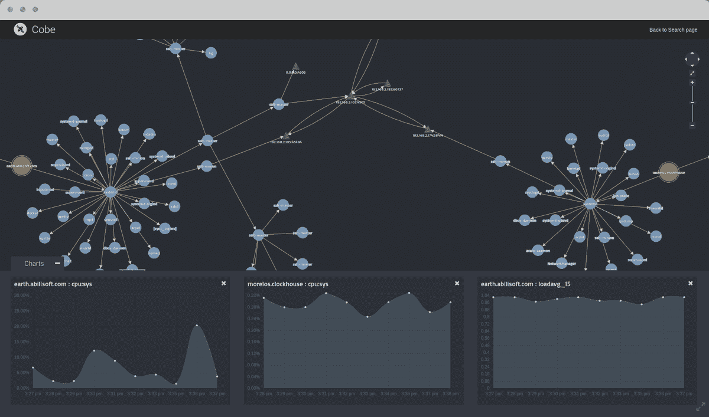

# Cobe.io 承担 Kubernetes 监控

> 原文：<https://thenewstack.io/cobe-io-embeds-vet-kubernetes-monitoring/>

说到监控， [Cobe.io](https://cobe.io/) 将兽医嵌入马体内。

备份:Cobe.io 的高管们喜欢讲述这样一个故事:一位客户在马厩里等待兽医照料一匹生病的马。一个专家解决方案提供者(兽医)在给定的地点和时间接到紧急呼叫时被呼叫去照顾一个关键的资产(马)。但是如果它在一个马厩里生病了，但是在兽医接到紧急呼叫之前，这匹马在别的地方呢？

在 Cobe 对监控 [Kubernetes](/category/kubernetes/) 开源容器编排的分布式本质的方法中，“无论哪里有马出现，兽医也在那里。”

它是总部位于伦敦的 [Abilisoft](http://www.abilisoft.com/) 的一部分，Abilisoft 自 2005 年以来一直在开发监控解决方案，但它表示，复杂、短暂的微服务和集装箱化的环境正迫使监控和管理解决方案的供应商回到“我们需要把基础做好”的阶段。

基于 Python 的 Cobe 处于测试阶段，它是一个可搜索的实时拓扑平台，可以捕获完整上下文中的所有关系、性能数据和警报。

它专注于 Kubernetes，但也监控一些常见的技术，如 NGINX、Redis、MySQL 和 PostgreSQL。

使用一个名为 [entityd](https://cobe.io/blog/) 的代理，它是开源的——或者只是通过部署其 [Docker 映像](https://hub.docker.com/r/cobeio/entityd/) — Cobe 从您的 Kubernetes 集群中收集数据，并为您的环境构建一个拓扑模型(有向多图)。该模型跟踪实时发现的所有 Kubernetes 资源及其属性(相关的性能数据、警报等)。)和每个资源之间的关系。这些数据在 API 上公开，因此可以被使用。

Cobe 的用户界面就是这些消费者之一，但是 API 使用 REST 之类的标准方法，因此很容易连接其他工具、解决方案和自动化来支持您的工作流。

所有数据都被索引以供搜索，这使得通过用户界面或 Cobe 模型 API 查找关于集群的信息变得很容易。您可以搜索“redis pod”并在集群上的容器中发现所有运行 redis 的 Kubernetes pods，包括一堆相关指标和相关资源，比如这些 pod 运行所在的名称空间。

它说 Kubernetes 的监控和可视化工具还处于起步阶段。它的竞争对手包括 [Prometheus](https://thenewstack.io/cloud-native-computing-foundation-prometheus-second-hosted-project/) (嵌入到 [CoreOS](https://coreos.com/blog/monitoring-kubernetes-with-prometheus.html) 、 [Weaveworks](https://www.weave.works/prometheus-kubernetes-perfect-match/) 和其他软件包中)、 [Heapster](http://blog.kubernetes.io/2015/05/resource-usage-monitoring-kubernetes.html) (Deis)、 [Datadog](https://www.datadoghq.com/blog/corral-your-docker-containers-with-kubernetes-monitoring/) 、 [Sysdig Cloud](https://sysdig.com/) 等，尽管它指出该领域的许多竞争对手并不仅仅专注于 Kubernetes。它也将竞争对手视为潜在的合作伙伴。

它指出了三个不同点:

*   **成为“平台第一”:**它提供了一个易于扩展的平台，具有开放的 API，允许您互操作和扩展模型中的数据或编写自己的模型。“我们的 API 的客户是一等公民，因为 Cobe 自己使用这些 API。因此，如果有人想使用这些 API 与 Cobe 集成，他们会得到真正的交易，而不是一个糟糕的扩展途径，”Abilisoft 董事罗伊·库蒂尼奥说。

*   **关系建模:**这意味着客户可以理解基础设施中的底层关系，例如“服务”和“pod”资源是如何相关的，或者“pod”和“秘密”资源是如何相关的。

*   **Search:** Cobe 允许您搜索任何内容:与警报相关联的资源、带有特定标签或存在于特定名称空间中的资源、进程的命令行文本、端口号、IP 地址；和结果在它们在基础结构中的位置的上下文中是可用的。

它的客户是传统的企业和电信提供商，他们将继续提供传统应用，但也需要在开始部署微服务时统一服务发现和管理。

“成熟的监控解决方案提供商正式认识到集装箱化的重要性，同时淡化它，为自己争取更多的时间，”库蒂尼奥说。

“他们面临着扩展数据分析引擎的巨大挑战，更重要的是，要解决微服务的本质问题，微服务的来去只需几秒钟。他们都需要改变运营模式，以应对微服务带来的挑战。他们会的，但这需要时间。”

[英特尔的乔纳森·唐纳森探讨库伯内特](https://thenewstack.simplecast.com/episodes/intels-jonathan-donaldson-discusses-kubernetes)

与此同时，IT 运营和开发运维团队仍然需要合适的工具来完成工作。

Cobe 使使用微服务的组织能够大规模扩展其基础架构，而无需额外的运营开销。据该公司称，它可以与现有的基础设施管理和活动管理系统集成，使公司能够继续从其原始投资中受益。

展望未来，它希望添加保留“历史模型”的功能，以便分析可以确定发生了什么变化以及任何相关的影响，并向组合中添加可搜索的日志数据。

CoreOS、Docker、Sysdig 是新堆栈的赞助商。

特征图片: [Celeste Lindell](https://www.flickr.com/photos/averagejane/) 的“兽医标志”，以 **[CC BY-SA 2.0](https://creativecommons.org/licenses/by/2.0/)** 授权。

<svg xmlns:xlink="http://www.w3.org/1999/xlink" viewBox="0 0 68 31" version="1.1"><title>Group</title> <desc>Created with Sketch.</desc></svg>