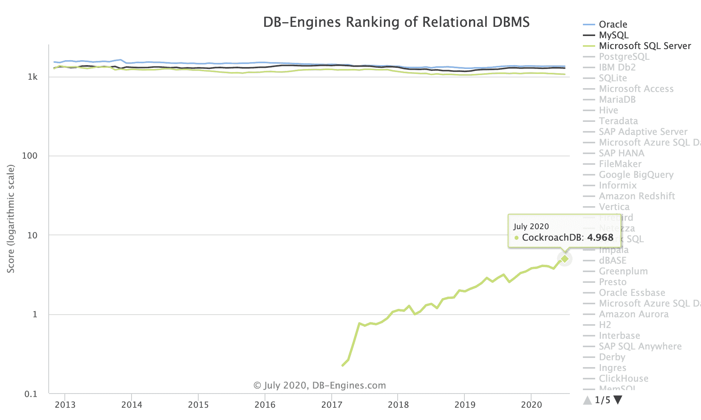

# 蟑螂实验室和分布式 SQL 的可伸缩性

> 原文：<https://thenewstack.io/cockroach-labs-and-the-scalable-power-of-distributed-sql/>

“我们真正想做的是改变甲骨文的市场，”[蟑螂实验室](https://www.cockroachlabs.com/)联合创始人兼首席执行官[斯潘塞·金博尔](https://www.linkedin.com/in/spencerwkimball/)在最近的一次采访中告诉我。这是他解释为什么蟑螂实验室选择在云计算时代中期建立一个关系数据库系统的一部分。

 [理查德·麦克马努斯

Richard 是 New Stack 的高级编辑，每周撰写一篇专栏文章，探讨云计算原生互联网的未来。此前，他在 2003 年创立了读写网，并将其打造为全球最具影响力的科技新闻和分析网站之一。](https://twitter.com/ricmac) 

当该公司在 2015 年推出时，Redis 和 MongoDB 等 NoSQL 系统风靡一时。当时人们认为 Oracle、微软和其他 SQL 巨头已经垄断了关系数据库市场——那么为什么要和他们直接竞争呢？

蟑螂实验室有其他想法。它的主要产品，[cocroach db](https://www.cockroachlabs.com/product/)，是一个所谓的“分布式 SQL”系统。金博尔和他的联合创始人彼得·马蒂斯和本·达内尔[从](https://www.cockroachlabs.com/blog/what-is-distributed-sql/)[2012 年的一篇论文](https://static.googleusercontent.com/media/research.google.com/en//archive/spanner-osdi2012.pdf)中获得了这个想法，这篇论文描述了谷歌的“全球分布式数据库”Spanner。三位创始人都曾在谷歌工作过，因此在 2015 年成立一家初创公司将分布式 SQL 概念推向市场是一个短暂的飞跃。

五年过去了，CockroachDB 现在是领先的分布式 SQL 解决方案之一，与谷歌的[云扳手](https://cloud.google.com/spanner)(其当前名称)[亚马逊 Aurora](https://aws.amazon.com/rds/aurora/) 和相对较新的 [Yugabyte](https://www.yugabyte.com/) 并列。也就是说，Oracle 等传统关系数据库供应商仍然在 SQL 数据库市场占据着巨大的领先地位。来自 DB-Engines 的下图[显示，排名前三的关系型 DBMS 产品——Oracle 是第一名——比 CockroachDB(排名第 37，尽管其趋势线很强)更受欢迎。](https://db-engines.com/en/ranking/relational+dbms)

资料来源:数据库引擎

鉴于甲骨文的市场优势，我问金博尔，为什么今天的企业首席信息官会选择分布式 SQL 系统？尤其是因为许多公司的 IT 部门不一定需要或想要数据的全球分布。

“所以我认为分布式 SQL 有三个主要好处，”他回答道。“一个是可扩展性。尤其是当您可以水平扩展时，您所期望的那种可扩展性。”

Kimball 承认，虽然“您可以扩展 Oracle 系统”，例如通过使用 [Oracle 数据库云服务器](https://www.oracle.com/engineered-systems/exadata/)，无论是在内部还是在云中，但最终这只能实现他所说的“企业规模”

根据 Kimball 的说法，企业规模无法满足“世界上大多数下一代用例，尤其是高增长技术公司”的需求他说，这些公司需要的是分布式 SQL 系统提供的“谷歌级别的规模”。

“没有人想在旧模式中购买极其昂贵的硬件[和]极其昂贵的软件，”他继续说道。“他们想要使用公共云基础架构，想要商用服务器。”

Kimball 说，分布式 SQL 的第二个主要好处是弹性。他再次承认，“在传统的整体数据库中，你显然可以拥有弹性”——对于 Oracle，他引用了使用异步数据复制的 [GoldenGate](https://www.oracle.com/middleware/technologies/goldengate.html) 。但问题是，他说，如果你必须进行故障转移恢复(由于软件或硬件故障)，你可能会丢失数据。

“受 Spanner 的启发，蟑螂正在使用基于共识的复制，”金博尔解释说，这意味着“即使你失去了整个复制设施，如数据中心，你也不会丢失数据。”

“因此，这两个方面(可扩展性和弹性)与 Oracle 有很大不同，当然，还有全球数据架构方面。”

公平地说，甲骨文可能会反驳说，它的产品是 Gartner 评价最高的[之一，Gartner](https://www.gartner.com/doc/reprints?id=1-1XT9MEFJ&ct=191125&st=sb)赞扬了甲骨文的创新、功能和性能，以及客户满意度。它在关系型 DBMS 市场上排名第一是有原因的。

即使是在云领域，尽管是后来者，甲骨文已经进行了[重大投资](https://www.datacenterknowledge.com/oracle/can-oracle-catch-cloud-race)来适应。

因此，虽然蟑螂实验室可能会随着时间的推移侵入甲骨文的市场份额，但就目前而言，这相当于一只小昆虫(或蟑螂)试图咬大象一口。

我认为蟑螂实验室最有可能产生影响的领域是下一代人工智能应用。当您处理运行这些应用程序所需的大量数据时，规模和弹性将非常重要。虽然 CockroachDB 不会被用来训练人工智能——为此你需要一个像 [TensorFlow](https://www.tensorflow.org/) 或 [PyTorch](https://pytorch.org/) 这样的平台——但它可以存储和管理数据。这类似于 Redis 实验室对人工智能的定位。

Kimball 说，“蟑螂真的是为了成为终极的记录系统而构建的”，并补充道，“例如，你不用数据湖作为你的记录系统。”

## 智能代理

那么我们谈论的是什么类型的应用呢？金博尔认为将从人工智能和机器学习中受益匪浅的领域之一是智能代理。

“所以采取行动的非人类代理，通常使用 API 作为正在创建的大量服务的前端。”

金博尔表示，这将导致从“人类速度交互到机器速度交互”的转变，这将导致“交易型大数据”成为标准。他认为智能代理与新兴的物联网(IoT)相结合将带来“潜在的数千亿甚至数万亿次互动。”

这就是蟑螂实验室的最终目标:人工智能交互记录数据库。

“无论是物联网，还是正在观看股票报价机和进行机器人自主训练的虚拟代理，所有这些事情都与 API 交互。API 是由应用程序和服务支持的，它们背后有数据库。这就是蟑螂适合的地方。”

这种类型的用例也正在被一家 NoSQL 数据库公司 DataStax 探索。事实上，当我问金博尔蟑螂实验室是否与任何 NoSQL 系统直接竞争时，他告诉我卡珊德拉是唯一的竞争对手。

“在大规模(如 webscale)类型的应用程序方面，Cassandra 是无可争议的领导者。我的意思是，苹果有超过 10 万个这样的例子。”*【作者注:苹果没有正式披露其 Cassandra 的使用数量，但去年 11 月苹果的一次演示中引用了 [150，000 个实例](https://mobile.twitter.com/cra/status/1197023973071974400)。】*

然而，金博尔认为，“尽管 Cassandra 很好地处理了规模，但它没有很好地处理(交易)一致性。”他说，虽然一个应用程序开始时可能很简单，但随着时间的推移，它会变得越来越复杂。

这让我们回到了 SQL 作为一种数据库编程语言经受住了时间考验的核心原因(导致 SQL 诞生的一篇 IBM 论文发表于 50 年前的[上个月的](https://www.ibm.com/blogs/research/2020/06/sql-relational-model-50-years-later/))。即使 Redis 和 [Neo4j](https://thenewstack.io/illuminating-the-anonymous-with-neo4js-graph-database/) 等公司在过去十年左右进行了创新，关系数据库仍因其结构、强大的查询和处理复杂性的能力而在云原生世界中拥有巨大的吸引力。

这就是为什么 CockroachDB 有一个 SQL 引擎。虽然现在，它就像红色的小守车相比，甲骨文的蒸汽机在火车的前面。

Redis、MongoDB 和 DataStax 是新堆栈的赞助商。

通过 Pixabay 的特征图像。

目前，新堆栈不允许直接在该网站上发表评论。我们邀请所有希望讨论一个故事的读者通过[推特](https://twitter.com/thenewstack)或[脸书](https://www.facebook.com/thenewstack/)访问我们。我们也欢迎您通过电子邮件发送新闻提示和反馈: [feedback@thenewstack.io](mailto:feedback@thenewstack.io) 。

<svg xmlns:xlink="http://www.w3.org/1999/xlink" viewBox="0 0 68 31" version="1.1"><title>Group</title> <desc>Created with Sketch.</desc></svg>