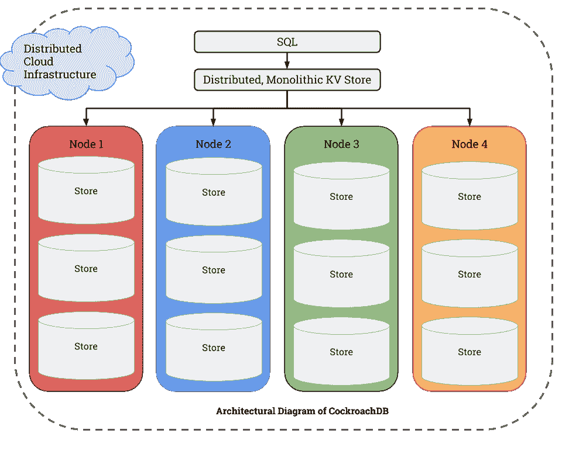
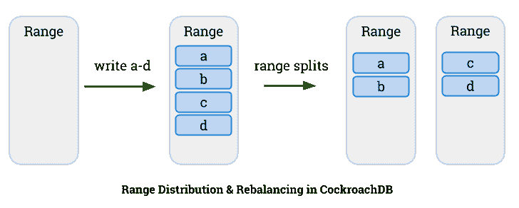
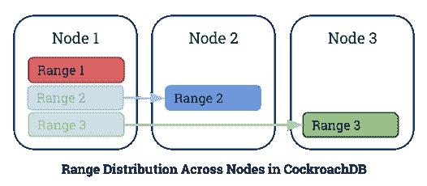
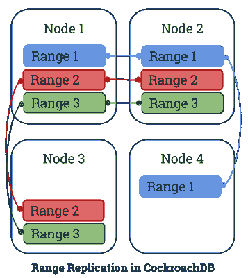

# Hello World:认识一下 CockroachDB，弹性 SQL 数据库

> 原文：<https://thenewstack.io/cockroachdb-unkillable-distributed-sql-database/>

**Editor’s Note**

:这个世界还需要另一个数据库系统吗？除非它能满足现有技术无法满足的新需求。对于 CockroachDB，目标是高度可伸缩性和事务性。我们

[first heard](http://venturebeat.com/2015/06/04/peter-fentons-latest-investment-is-a-database-startup-called-cockroach/)

关于蟑螂实验室，去年 6 月，这家初创公司获得了 625 万美元的投资

[Benchmark Capital](http://www.benchmark.com/)

因此，我们要求该公司分享其 alpha 阶段、开源、分布式 SQL 数据库的技术细节:

CockroachDB 的目标是让数据变得简单。如果你能把所有浪费在解决数据库缺陷上的精力，投入到让你的公司更强大、产品更好的时间、金钱和工程中，每个人都会更好。

数据库是每一个现代企业的生命线，然而尽管经历了近 45 年的发展，开发人员只剩下很少的选择:

1.  RDBMS :具有事务和索引的完整特性，但是不可伸缩和容错。如果您的业务增长超出了单个节点的能力，您将不得不求助于分片，这不是一个好的选择。
2.  **NoSQL** :这些系统是为大规模横向扩展而设计的，牺牲了事务和一致性，并且避开了显式模式。这些是日益复杂的应用程序所需要的特性。
3.  **托管服务**:这些存储服务需要供应商锁定，并且都是专有的。它们的功能保证很难验证。

这些选择的最大挫折是，如果一家公司成功了，特别是如果它取得了巨大的成功，那么无论是在财务资源还是工程资源方面，扩大规模都将极其昂贵。这些解决方案没有一个是可伸缩的、事务性的和可用的，这就是为什么我们被启发来构建 CockroachDB。

CockroachDB 是一个分布式 SQL 数据库，构建在事务性和一致的键值存储之上。主要的设计目标是支持 ACID 事务、水平可伸缩性和生存性(因此得名)。CockroachDB 实施了一种 [Raft](https://raft.github.io/) 一致性算法，旨在容忍磁盘、机器、机架甚至数据中心故障，同时将中断降至最低，并且无需人工干预。

那么 CockroachDB 是如何工作的呢？让我们先来看看架构。

## 分层架构

CockroachDB 的体系结构是分层的，这使得复杂性更容易管理。架构中的每一个较高层都将较低层视为功能性黑盒，而较低层则完全不知道较高层。

1.  **SQL 层:**最高级别的抽象和为开发者建立的完善的 API。提供熟悉的关系概念，如模式、表和索引，使用 Postgres 语法的衍生物，并加入一些现代元素。
2.  **分布式键:值存储:**我们将分布式键-值存储实现为一个整体排序映射，使得开发大型表和索引变得容易(Hbase、BigTable 和 Spanner 都使用类似的架构)。
3.  **分布式事务**:不一定是分层架构的一部分，但却是系统的基础部分。分布式事务的实现遍布体系结构的各个层:从 SQL 到商店和范围。
4.  **节点:**包含商店的物理机、虚拟机或容器。分布式 KV 存储将消息路由到节点。
5.  **商店:**每个节点包含一个或多个商店，每个商店可能包含许多范围。每家商店都由 [RocksDB](https://rocksdb.org/) 管理，这是一个来自脸书的开源存储引擎，基于谷歌的 [LevelDB](https://github.com/google/leveldb) 。
6.  **范围:**每个商店都包含范围，范围是键值数据的最低级别单位。每个范围覆盖了更大的键空间的一个连续部分——一个在字母表的开始，下一个在字母表的中间，依此类推。它们一起构成了完整的整体排序图。该范围是我们进行同步复制的地方，通常是三路或五路，使用 [Raft](https://raft.github.io/) consensus 算法，这是 Paxos 的一个变体。

从这里开始，我们将从最底层开始，逐步介绍 CockroachDB 的设计，展示它如何实现三个关键属性:事务性、可伸缩性和可生存性。

## **水平缩放**

让我们考虑一下最底层的 CockroachDB，它运行在一台机器上。即使数据在逻辑上被组织成表格、行、列等。在最底层，单独的数据片段(想象一个单独的列值)存储在磁盘上一个排序的键值映射中。

CockroachDB 从包含整个键空间的一个空的键值数据范围开始。随着您将更多的数据放入这个范围，它最终将达到一个阈值大小(默认为 64MB)。当发生这种情况时，数据会分成两个范围，每个范围都可以作为一个单独的单元来访问，每个范围覆盖一个连续的键空间段。随着数据的增加，这一过程会无限期地继续下去(见下图)。

CockroachDB 中的整体排序图由所有范围的排序集组成——一个在字母表的开头，另一个在字母表的中间，依此类推。我们选择小范围，因为在修复或重新平衡数据时，它们很容易在机器之间移动。随着新数据的流入，现有的范围将继续划分为新的范围，目的是保持一个相对一致的范围大小，介于 32MB 和 64MB 之间。

当我们的集群跨越多个节点和商店时，新划分的范围会重新平衡到具有更多可用容量的商店。

这种设计为您提供了一个可以跨许多不同节点运行的可伸缩数据库。为了使数据库具有可生存性，CockroachDB 必须复制数据。

## **复制**

默认情况下，每个范围在三个节点上复制。可以配置任何数量，但 3 和 5 通常被认为是最有用的。范围副本旨在位于不同的数据中心，以提高生存能力(例如{纽约、弗吉尼亚、加利福尼亚}、{爱尔兰、纽约、加利福尼亚}、{爱尔兰、纽约、加利福尼亚、日本、澳大利亚})。

当您的数据存储在多台机器上时，副本之间的数据保持一致非常重要。CockroachDB 使用 Raft 作为其共识协议。每个范围都是 Raft 协议的一个独立实例，所以我们有许多范围都独立运行 Raft。这提供了相当大的灵活性，包括针对不同的键空间段的任意复制配置。

在任何一组副本中，其中一个节点将被选为领导者，然后协调该组的决策。每当您想要向数据库中写入内容时，它会被提交给集群的领导者，并在被大多数人(3 个副本中的 2 个或 5 个副本中的 3 个)确认后立即提交。

我们实际上与 [etcd](https://etcd.io/) 团队共享了 Raft 协议的实现，但是增加了另一层可伸缩性。在 CockroachDB 中，每个范围对应一个 Raft 实例，它们的数量远远高于托管它们的物理节点的数量。为了帮助扩展 Raft，我们构建了 [MultiRaft](https://www.cockroachlabs.com/blog/scaling-raft/) ，这是 Raft 之上的一层，它对副本发送的消息进行分组。

## **分布式交易**

CockroachDB 的基础之一是强一致性和对分布式 ACID 事务的全面支持。CockroachDB 使用多版本并发控制(MVCC)提供分布式事务。MVCC 数据在每个本地存储设备上用一个 [RocksDB](https://rocksdb.org/) 实例进行存储和管理。使用 [Raft](https://raft.github.io/) 持续复制 MVCC 数据的突变。

CockroachDB 提供了[快照隔离](https://en.wikipedia.org/wiki/Snapshot_isolation) (SI)和可序列化快照隔离(SSI)，允许从历史快照时间戳和当前挂钟时间进行外部一致的无锁读写。SSI 是作为默认隔离级别提供的；SSI 消除了 SI 中存在的一些罕见异常，但在发生争用时性能会变差。客户必须有意识地决定用正确性来换取性能。

有关 CockroachDB 如何处理事务的更多信息，请阅读这篇[博客文章](https://www.cockroachlabs.com/blog/how-cockroachdb-distributes-atomic-transactions/)。

CockroachDB 的 SQL 实现利用分布式事务和整体排序的键值映射所提供的强大一致性来一致地编码、存储和检索 SQL 表数据和索引。支持的 SQL 语法是 PostgreSQL 的衍生物，带有一些现代风格，支持任何对象关系映射(ORM)。

要了解 CockroachDB 的 SQL 实现的更多信息，请阅读这篇[博文](https://www.cockroachlabs.com/blog/sql-in-cockroachdb-mapping-table-data-to-key-value-storage/)并查看我们在 Github 上的 [SQL 分支](https://github.com/cockroachdb/cockroach)。

## **部署和管理**

我们构建 CockroachDB 是为了拥有一个非常适合容器模型的简单部署。节点是对称的和自组织的——没有单点故障，没有复杂的配置(事实上，只有少数命令行选项)，也没有需要管理的不同角色的混乱。只需要在每个节点上运行一个二进制文件(很容易放入容器中),就可以加入集群并导出本地存储以接受新的写入和重新平衡。

CockroachDB 通过使用八卦网络进行自组织，八卦网络是一种对等网络，节点之间相互通信。一个新节点可以加入八卦网络，只要它可以与任何其他已经加入的节点对话。gossip 网络不断地自我平衡，以最小化 RPC 流量和向网络中的每个节点传递新信息所需的跳数。节点交换它们的网络地址并存储容量信息。如果一个节点发现它的容量大于其邻居的平均值，它将开始重新平衡其他节点的范围。类似地，如果一个节点关闭，其组成范围的副本将注意到它的缺失，并寻找另一个它们可以重新复制到的节点。

CockroachDB 可以在笔记本电脑、企业开发集群或私有云上本地运行，也可以在任何公共云基础设施上运行。我们已经开发了[蟑螂产品](https://github.com/cockroachdb/cockroach)，在撰写本文时，它可以让你在亚马逊网络服务和谷歌云引擎上建立一个集群。对其他公共云基础架构和附加功能的支持正在进行中。

## **下一步是什么**

CockroachDB 目前处于 alpha 阶段，我们正在积极地为 beta 版的发布做准备。如果您有兴趣贡献或使用该产品的 alpha 版本，请查看我们的 [Github repo](https://github.com/cockroachdb/cockroach) 。

CockroachDB 旨在使数据变得简单，它通过击中最佳点来做到这一点:将传统 SQL 数据库的事务保证和查询语言与 NoSQL 解决方案的可伸缩性相结合。此外，通过 Raft 进行的同步复制提供了强大的一致性，甚至跨广域部署，从而将生存能力和灾难恢复提升到新的水平。另外，当然，它是开源的。

<svg xmlns:xlink="http://www.w3.org/1999/xlink" viewBox="0 0 68 31" version="1.1"><title>Group</title> <desc>Created with Sketch.</desc></svg>