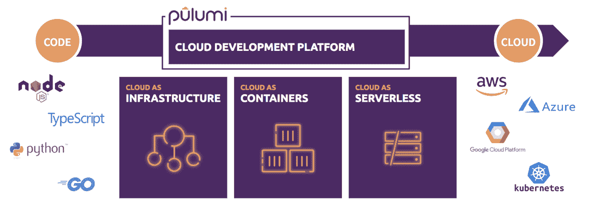
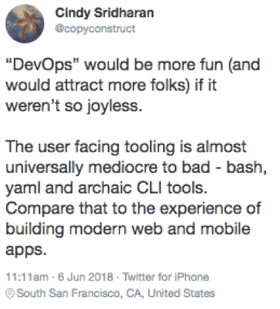
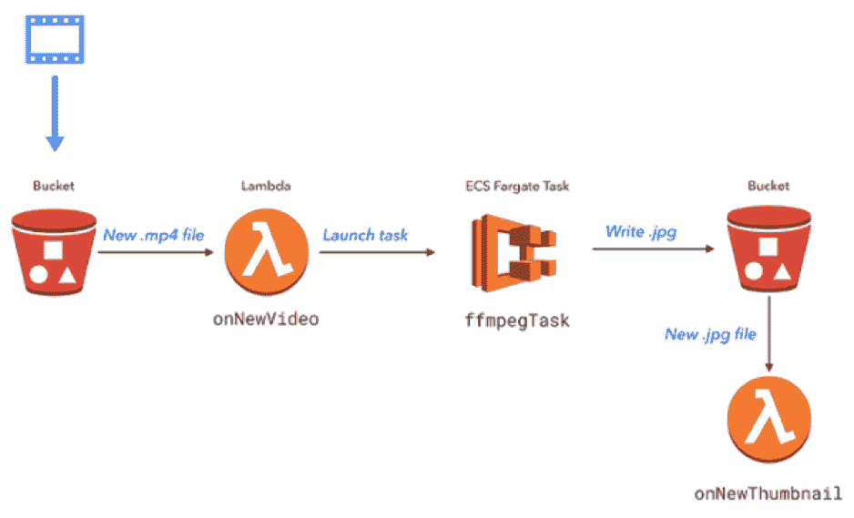

# 鸡尾酒和梦想:云的编程层

> 原文：<https://thenewstack.io/cocktails-and-dreams-a-programming-layer-for-the-cloud/>

[](https://pulumi.io/)

 [马克·霍姆斯，CMO，普鲁米

马克·霍姆斯是普鲁米的 CMO，这是一家西雅图的初创公司，正在重新构想团队构建云软件的方式。在加入 Pulumi 之前，Marc 曾在各种开发工具和平台公司担任领导职务，包括 Chef、Docker、Hortonworks、Meteor 和 Microsoft。他热衷于开发人员受众、开源技术，以及构建正确的产品和体验来帮助开发团队在接下来的事情中取得成功。](https://pulumi.io/) [](https://pulumi.io/)

现代云平台为开发人员提供了不断扩展的强大构建模块、减轻开发团队运营负担的托管服务，以及自动扩展和弹性。这些功能承诺使开发人员能够想象、构建和交付下一代应用程序，其中 AWS Lambda、Docker、Google Kubernetes 引擎和 Azure Cosmos DB 等服务成为当今开发的几乎任何新应用程序的基础构建块。

然而，利用这些新的托管服务仍然太难了，云基础架构自动化太难了。使用这些服务不可避免地会涉及到点击式控制台、低级 REST APIs 和 CLI，以及深奥的 YAML 和 JSON 文档。

虽然这在云编程仅仅意味着“将我的代码放在云托管的 VM 中”时可能有效，但现在云已经成为每个应用程序架构的基础部分，配置不再是事后的想法——我们迫切需要改进的开发工具。

作为开发人员，我们只想写代码。拥有一种真正对云编程的方法可以释放生产力、可重用性和云计算的真正前景。在 Pulumi，这就是我们要做的。

## CoLaDa:集装箱、兰姆达、数据服务和基础设施

云供应商的创新步伐，加上可用服务的数量，不断为开发人员创造新的机会。虽然关于“容器还是无服务器”的争论可能会很激烈，但是对于任何合理规模的大多数团队来说，实际的答案总是“和”。

云使我们能够从基于服务器转向基于容器，再转向基于功能的应用交付。通过这样做，我们将重心从以基础架构为中心的运营转移到了以应用程序为中心的交付。



此外，人们仍然希望在内部提供类似云的功能，因此尽管所有云供应商都提供了 Kubernetes 的风格，但许多大型企业将选择部署自己的云，希望获得云的固有优势，如可移植性。

## 通过真实代码实现更好的开发人员和 DevOps 协作

开发人员角色向 SRE 角色转变的趋势是由运营专家对编码和理解开发代码的日益增长的需求推动的。DevOps 技能正在“向上移动”

相反的趋势是正确的:开发人员越来越多地将基础设施和服务选择与他们的应用程序逻辑捆绑在一起，以利用特定的托管功能，因此需要对这些选择负责。

这种协作缺乏通用语言——开发人员说代码，而开发人员不情愿地说 DSL 和配置——导致沟通失败，最终导致脆弱的系统和风险。或者正如苹果工程师[辛迪·斯里德哈兰](https://twitter.com/copyconstruct)指出的:



## 单一云的孤岛和专业化

多云开发是真实的，许多组织都开始探索它，但是由于需要掌握大量的开发工具和框架，它通常看起来难以实现。

每个云都有专门的服务，但至少在高层次上，许多服务旨在提供相同的功能:例如 AWS Lambda/Azure Functions/Google Functions 或 AWS S3/Azure Blob Storage/GCP 云存储。随着时间的推移，我们看到了这种整合的趋势，就像我们在过去 20 年中看到的操作系统一样，这使得 Java 等高效的编程环境成为可能。NET、Node.js 和 Ruby on Rails，而 Kubernetes 正在帮助加速这一趋势。

对于开发人员来说，使用这些服务需要适当的抽象级别，以便在任何云上都是高效的，并保留可移植性和特定实现的优化选项。

## 使用 Pulumi 交付云编程模型

认识到这些架构、角色和能力的转变，我们开始通过提供框架和工具来将云应用和基础设施表达为真实代码，从而构建一种“云编程”的方式。

这意味着该功能集可以提供:

*   一个在每个云上公开全套服务的编程框架，它公开了每个供应商提供的精确的、非个性化的粒度。
*   多种语言的绑定，对给定的语言有惯用的感觉。首先，Pulumi 的框架有 JavaScript/TypeScript、Go 和 Python 版本。
*   一个能够理解如何部署应用程序和基础设施，并以“不可变基础设施”的模式运行的引擎:能够不变地管理和更改架构的最小必要部分，同时保留完美的可审计性和历史记录。
*   一个 CLI 和托管服务来高效地提供这些功能，并以一种集成到熟悉的流程和工具中的方式在团队环境中工作:从 ide 到 CI/CD。
*   这些服务之上的多个抽象层提供了更高的生产力和多种云的机会:更容易编程的标准对象，如“函数”、“队列”和“表”。

我们在一个月前发布了我们的“云开发平台”,成千上万的开发者和 DevOps 实践者已经试用了它。作为新产品，我们渴望您的反馈，所以请[试用](https://pulumi.io)，[加入社区](https://slack.pulumi.com)，并让我们知道您的反馈。

## 示例应用程序:AWS 上的视频缩略图

那么，这种对云编程模型的承诺，组件的混合，以及以一种有表现力和有意图的形式交付所有这些是如何实现的呢？

考虑下面的例子:我们想建立一个简单的应用程序，从上传的视频创建缩略图。([你可以在这里看到这份申请的全部细节](http://blog.pulumi.com/build-a-video-thumbnailer-with-pulumi-using-lambdas-containers-and-infrastructure-on-aws))。



这个例子很容易通过组合组件来实现——一个简单的“CoLaDa”应用程序:

*   使用长时间运行的任务来处理上传的视频。
*   新上传视频的事件触发器和输出缩略图。
*   **数据服务。**存储上传的视频和缩略图。

对于这些组件，可以使用任何种类的工具来组装应用程序。但是每一种都有自己的配置要求和/或用于控制的 DSL。此外，简单地将组件粘合在一起变得不简单，或者很乏味。

能够在一个地方编写所有这些组件提供了显著的生产力优势:真正的代码意味着代码完成、在您最喜欢的 IDE 中进行交互式错误检查、以通常的方式进行包管理和版本控制、可重用的组件以及其他好处。它还提供了描述现代云应用程序的最有意图、最有表现力的方式，而这种方式在导航配置脚本和 ui 的泥沼时会丢失。

最棒的是，使用代码是非常高效的。这个应用程序仅用了大约 25 行代码开发——这里没有隐藏的 YAML，它只是表达应用程序逻辑和基础设施需求的真实代码(尽管有预先存在的容器)。

```
<strong>const</strong>  cloud  =  require("@pulumi/cloud-aws");

<em>// Define a bucket to store videos and thumbnails.</em>
<em>// As we're using AWS, this will create an S3 bucket.</em>
<strong>const</strong>  bucket  =  <strong>new</strong>  cloud.Bucket("bucket");
<strong>const</strong>  bucketName  =  bucket.bucket.id;

<em>// A task which runs a containerized FFMPEG job to extract a thumbnail image.</em>

<strong>const</strong>  ffmpegThumbnailTask  =  <strong>new</strong>  cloud.Task("ffmpegThumbTask",  {

build:  "./",  <em>// folder containing the Dockerfile, which is built as part of the deployment</em>

memoryReservation:  128,

});

<em>// When a new video is uploaded, run the FFMPEG task on the video file</em>
<em>// Use the time index specified in the filename (e.g. cat_00-01.mp4 uses timestamp 00:01)</em>

bucket.onPut("onNewVideo",  <strong>async</strong>  (bucketArgs)  =&gt;  {
console.log(`***  New video:  file  ${bucketArgs.key}  was  uploaded  at  ${bucketArgs.eventTime}.`);
<strong>const</strong>  file  =  bucketArgs.key;  <strong>const</strong>  thumbnailFile  =  file.substring(0,  file.indexOf('_'))  +  '.jpg';
<strong>const</strong>  framePos  =  file.substring(file.indexOf('_')+1,  file.indexOf('.')).replace('-',':');
<strong>await</strong>  ffmpegThumbnailTask.run({

environment:  {
"S3_BUCKET":  bucketName.get(),
"INPUT_VIDEO":  file,
"TIME_OFFSET":  framePos,
"OUTPUT_FILE":  thumbnailFile,
},
});

console.log(`Running thumbnailer task.`);
},  {  keySuffix:  ".mp4"  });

<em>// When a new thumbnail is created, log a message.</em>
bucket.onPut("onNewThumbnail",  <strong>async</strong>  (bucketArgs)  =&gt;  {
console.log(`***  New thumbnail:  file  ${bucketArgs.key}  was  saved  at  ${bucketArgs.eventTime}.`);
},  {  keySuffix:  ".jpg"  });
<em>// Export the bucket name.</em>

exports.bucketName  =  bucketName;

```

## 未来的发展意味着能够对云进行编程

对于开发人员来说，永远不会有无聊的时候，但是这个“真正的”云计算时代特别令人兴奋，因为任何开发人员现在都只局限于他们的想象力，因为他们在大规模交付方面是无限的。

在 Pulumi，我们希望帮助以前所未有的速度将代码移植到云上，并使新一代云应用程序的开发和操作富有表现力、有目的性，并且——我们敢说——令人愉快。[让我们知道我们做得如何](https://pulumi.io)。

通过 Pixabay 的特征图像。

<svg xmlns:xlink="http://www.w3.org/1999/xlink" viewBox="0 0 68 31" version="1.1"><title>Group</title> <desc>Created with Sketch.</desc></svg>