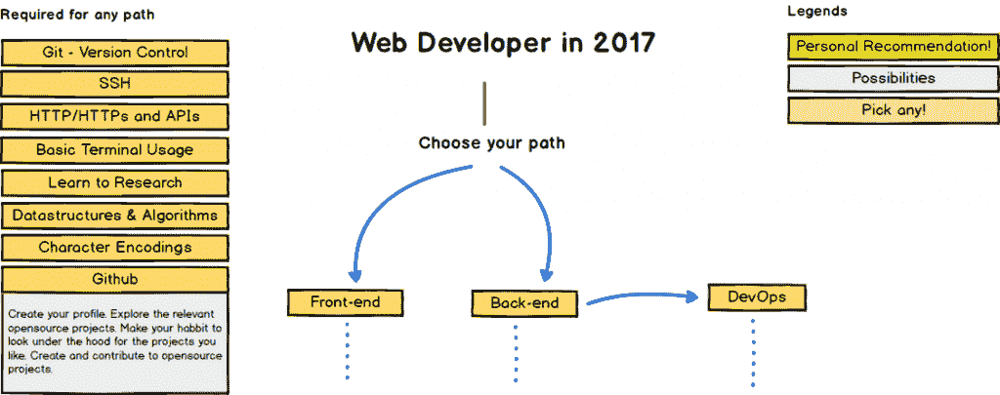
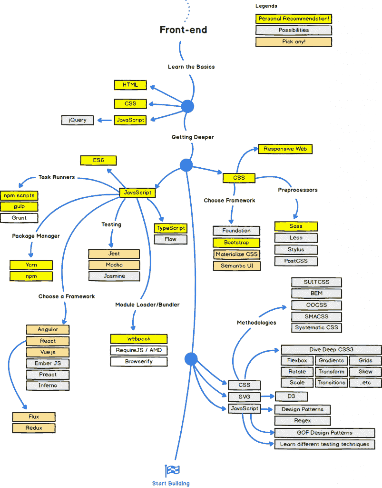
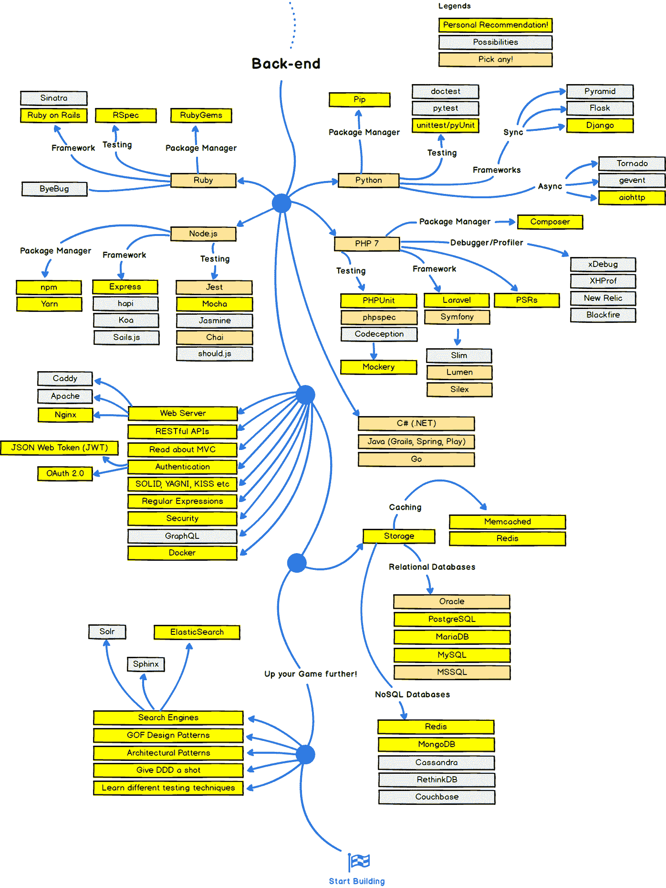

# 代码 n00b:小心你的愿望，或者“2017 年网络发展路线图”

> 原文：<https://thenewstack.io/code-n00b-careful-wish-web-dev-roadmap-2017/>

所以，最近几个不同的人，来自我生活中非常不相关的方面，都给我发来了同一个链接:Kamran Ahmed 的 GitHub repo "[Web Developer Roadmap 2017](https://github.com/kamranahmedse/developer-roadmap)。Ahmed 是迪拜的一名网站开发人员，他创建了一个非常全面和真实的——并且用颜色编码！—前端、后端和 DevOps 职业道路的流程图，包括一系列您显然需要学习的技术。

这是一个非常棒的视觉地图集。至少在一开始，这也让我的大脑崩溃了。我已经[努力了一年成为一名前端 web 开发人员，尽管我对 JavaScript 的迷恋让我偶尔瞥一眼后端(停止窃笑)。Ahmed 的前端路径在“一无所知”和终点“开始构建”之间有四个步骤。所以我应该先知道这些东西，然后才能造东西？我怎么能这么努力地工作了这么长时间，才勉强完成第一步(“学习基础知识:HTML/CSS/Javascript”)？SMH。又来了。再一次。](/tag/code-n00b/)

我的意思是，我甚至没有听说过一些，好吧，可能很多，这个流程图上的东西。(据我所知，“[茉莉](https://github.com/jasmine/jasmine)、“[柴](http://chaijs.com/)”和“[摩卡](https://mochajs.org/)”可能是最新的星巴克星冰乐口味，尽管事实证明它们是 JS 测试框架。)Dang。尽管我知道，非常感谢，JavaScript 框架是存在的，我甚至可以说出最流行的框架。

为此，Ahmed 列出了八个，其中五个是推荐的选择，并建议我们学习其中的两个。但是我选择的依据是什么呢？把它们写在便利贴上，蒙上我自己的眼睛，随便挑两张？哦，太好了，看来我要学习牛奶/面包/培根/卫生纸了！

不过，在对着一个空的 Dunkin Donuts 袋子喘了几分钟气之后，我冷静下来，足以欣赏这个家伙试图提供我抱怨了很长时间的东西:某种逻辑进展，一条从 BootCamp 点到 GotAJob 点的路径。这是一个很有帮助的路线图，清楚地展示了我们在努力成为专业的 web 开发人员时应该了解的(很多很多)技术。

艾哈迈德没有提供的有用信息。伙计，我们不需要知道这些。即使有经验的 web 开发人员也不知道这些技术中的每一项。实际上，专业程序员在熟练的专家水平上知道其中的一些。他们知道它们，因为他们每天都在工作中或在做兼职项目时使用它们。他们可以检查其他技术的名称，这些技术是为了一些一次性的应用或出于简单的编码好奇心而短暂使用的。

症结在于:没人指望我们知道所有这些东西。但是我们中的许多人在学习如何成为程序员的高级初学者，开始变得有点好的阶段，不知何故似乎没有意识到这一点。我一直和我的学习伙伴交谈，我们不断强调我们应该致力于学习哪个平台或框架，交换内部消息(“是的，Vue.js 是一个新人，但也是 GitHub 上最受欢迎的回购协议！”)以及哪些知识基础会让我们最(不寒而栗)适销对路。举个例子:上周我和一些年轻的网络开发人员一起喝啤酒，我们整个欢乐时光的谈话都在争论知道 [Vim](http://www.vim.org) 是否会给面试官留下深刻印象，或者只是浪费在人力资源简历看门人身上，他们认为[纱线](https://hadoop.apache.org/docs/current/hadoop-yarn/hadoop-yarn-site/YARN.html)是你用来织可爱围巾的东西。

我认为发生这种情况是因为，当你是一个绝对的初学者时，你正在从零开始同时学习一切，语言、工具和技术，所有这些都是在同一时间进行的。所有的消防水管都是开放的——我的前两节前端 web 开发训练营课包括命令行、Git、node.js 和 npm、GitHub、HTML 和 CSS(难怪 [Betamore](https://betamore.com/) 的冰箱里有免费的红牛和啤酒)。因此，很自然地会有这样的想法:你应该知道，或者至少正在积极地学习，在你的特定领域里，几乎所有你应该知道的东西。

当与已经在这个领域工作的人交谈时，或者，但愿不会，在像 [Hackernoon](https://hackernoon.com/) 和 [Stack Overflow](https://stackoverflow.com/) 这样的论坛上阅读时，这种必须学习所有东西的心态就会延续下去。每个人都有自己的观点，认为哪些技能和知识对你的简历最重要，并以绿色 GitHub 小方块的形式出现。每一个观点都是不同的。

最终让我免于对这一切大发雷霆的是，我意识到这些最终都只是观点。没有伟大的 JavaScript 权威告诉我们应该擅长使用哪些任务运行器或测试平台等(尽管如果有，那也是一种解脱)。所以，是的，所有技术的路线图概述:它是有帮助的。至少在知道我不知道的方面——也就是说，量化那些知识，因为我已经知道我还不知道很多。

我所知道的是，我还没有能力预测在这个自助餐的无数项目中，哪一个最好放在我的盘子里。

我还知道的是，所有这些都只是技术，它们来来去去。JavaScript、PHP、Python——无论你选择从哪种语言开始学习——都是所有这些语言的基础。因此，深入而流利地学习 JavaScript，连同基本的编程技能，是我孤注一掷的目标。知道如何编码，如何解决问题，如何提问，如何阅读、重构和调试代码:无论你选择什么语言，这都是对程序员的意义。

不幸的是，即使你使用了很多漂亮的颜色、箭头和废话，这也不能构成一个非常令人兴奋的个人流程图。但我不介意。至少现在是这样。

谁能给我一杯摩卡爪哇茉莉星冰乐:michellegienow@gmail.com。

Felix Russell-Shall 通过 Unsplash 提供的特写图像。

<svg xmlns:xlink="http://www.w3.org/1999/xlink" viewBox="0 0 68 31" version="1.1"><title>Group</title> <desc>Created with Sketch.</desc></svg>