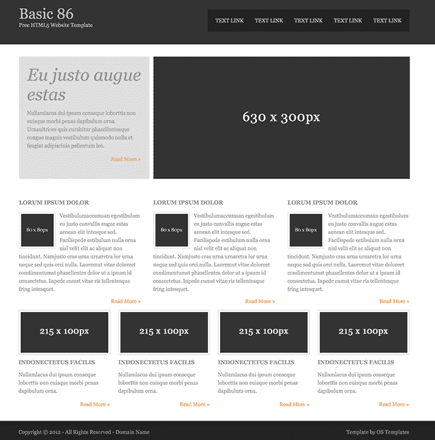

# 代码 n00b:万岁，Web 开发机器人大师们！

> 原文：<https://thenewstack.io/code-n00b-hail-web-development-robot-masters/>

互联网上充斥着一些极其令人沮丧的东西，但迄今为止，我上周读到的最令人沮丧的东西是埃米尔·沃纳在 FloydHub 上的博客文章。实际的标题是“通过深度学习将设计模型转化为代码”，但一个同样适用的标题可能是，“认为你的 Web 开发工作不会被机器人接管吗？再猜一次！”

埃米尔的论文不错吧？“在不到两年的时间里，我们将能够在纸上绘制应用程序，并在不到一秒的时间内拥有相应的前端。”他解释说，深度学习算法，以及合成的训练数据，现在已经发展到这样一个地步，如果给定一个设计模型，神经网络可以被训练为“基本”网站编写 HTML 和 CSS 代码。作为一个在印刷新闻业工作了几十年后转向网络开发的人——另一个正在枯竭的职业——这并不是一个受欢迎的消息。我进一步阅读了博客，希望发现这只是一些蓝天下的博客，而不是我新发现的职业即将实现人工智能自动化的迹象。

不幸的是，沃纳提出了一个非常有说服力的案例。一个我不太了解的领域，因为神经网络不是我的专长。基本过程包括用相应的 HTML 为神经网络提供几种布局:

之前:给神经网络的样本截图。

然后，它获得一个屏幕截图模型来自行构建，并通过预测 HTML 标记进行“学习”，然后通过将预测与训练示例进行匹配来验证它们是否匹配。一次一个标签地进行，它自我修正并迭代，直到生成一个完成的标记。然后，类似的过程使用“生成的引导网站数据集”来生成相关的 CSS 代码。假设幕后没有一些 Photoshopping，他的输出令人印象深刻:

After:示例截图的编码版本(单击以嵌入)。

好消息是，至少暂时来说，这一过程目前需要如此巨大的计算能力，以至于它还不是一个实际上自动化网站商业制作的可行选择。即使创建一个基本的“Hello World”实验版本也很糟糕:“预计要租用一个带有 8 个现代 CPU 核心和 1 个 GPS 互联网连接的钻机才能有一个像样的工作流，”Emil 指出。然而，随着计算能力逐渐变得越来越便宜和可用，这种情况不会永远存在。(另外，全栈的朋友们，不要自满，因为你也不安全:下一个前沿是将标记和样式表绑定到脚本，并最终绑定到后端)。

那么，我们的未来会是什么样子呢？

现实情况是，一个静态网站的前端开发，是应用机器学习的合乎逻辑的地方。数据并不复杂，即使是目前的深度学习算法也能跟随并映射逻辑。沃纳对不到两年内自动生成的前端应用程序的预测听起来不错:正如他指出的那样，Airbnb 的设计团队和 T2 的 Uizard 已经建立了两个工作原型。

对于那些想近距离了解即将发生的火车事故的人来说，沃纳实验的开源代码——用 Python 和 [Keras](https://keras.io/) (一个基于 [TensorFlow](https://www.tensorflow.org/) 的框架)编写——可以在 [Github](https://github.com/emilwallner/Screenshot-to-code-in-Keras/blob/master/README.md) 和[FloydHub](https://www.floydhub.com/emilwallner/projects/picturetocode)Jupyter 笔记本[中找到。](http://jupyter.org/)

如果这是不可避免的未来，至少它是开源的。

那么我们能做些什么准备呢？当然，除此之外，练习我们的机器人抛光技术？(我们未来的霸主大概会更喜欢漂亮闪亮，很难外包真正细致的收尾工作。至少他们仍然需要人类。)自从上周看了沃纳的博客后，我一直在琢磨这个问题，老实说，我认为答案是什么都没有。鉴于当前的技术和看起来很快就会到来的东西，开发人员无能为力，无法领先机器学习一步。首先，他们永远不会累，也不需要咖啡因或生物休息。

然而，现实地说，这与阿帕网建立以来互联网和网络发展的方式并没有太大的不同。想象一下，最初的广域网先驱之一展望四五十年后的今天:我们认为理所当然的技术对他们来说一定是惊人的，就像我们现在看到的自动化编码机器人形式的未来一样。

然而，我们大多数人都不是先驱者；我们每个人都在网络的小角落里挖掘。我们都必须学习新的东西，然后下一个新的东西，再下一个，至少为了保持就业。总有更多的新事物。这是其中之一。但也不是全部。至少，在下一个目前无法想象的突破之前，计算机仍然是线性的、受逻辑约束的实体。所以我们只是跟着机器一起不断学习，看看我们灵活、有创造力的猴子思维下一步会把我们带到哪里。

而我们却让他们做所有的粗活。

*查看更多[代码 n00b](/tag/code-n00b/) 栏目。*

塞缪尔·泽勒*在 [Unsplash 上的专题图片。](https://unsplash.com/search/photos/robot?utm_source=unsplash&utm_medium=referral&utm_content=creditCopyText)*

<svg xmlns:xlink="http://www.w3.org/1999/xlink" viewBox="0 0 68 31" version="1.1"><title>Group</title> <desc>Created with Sketch.</desc></svg>