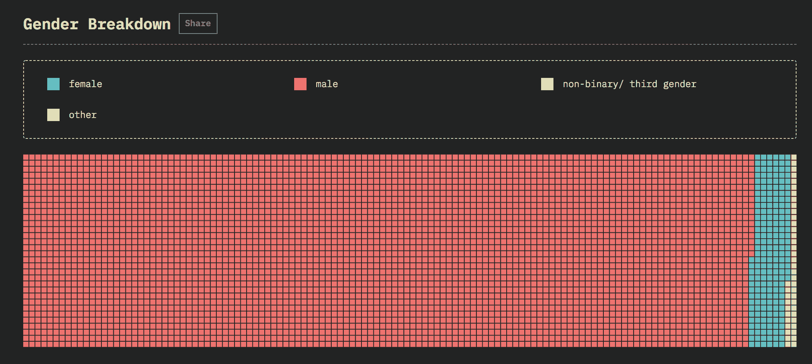

# 代码 n00b:(有一个)JavaScript 性别细分

> 原文：<https://thenewstack.io/code-n00b-having-a-javascript-gender-breakdown/>

我们都知道科技领域存在性别差距。那里没有消息。有时候这让人抓狂——在一个会议中，在一个团队中，甚至在一家该死的初创公司中，成为唯一的女性会让人感觉很奇怪。

但是这种差距有时也是一件好事。就像去年的 Node Interactive 大会一样，在主会议厅的男厕前一度排起了长队。相比之下，女洗手间有大片闪闪发光的空隔间，等待着我们这些尿尿时不站起来的人。我们中的几个人享受着宽敞的厕所设施，在洗手池旁大笑，谈论着 Node 的人是如何看到排队上厕所是什么样子的！

不过，说真的，作为少数派的安慰通常是微不足道的。我参加过的国家级活动中，node.js 和 JavaScript events 在参与者方面比其他类型的活动更加性别均衡。也许是因为如今从事前端 web 开发的女性比从事容器和 Kubernetes 的女性多。但是我也注意到，很多时候，当我第一次在这些活动中见到其他开发者时，他们的第一个猜测是我没有出席。也许我是一个从礼品桌上逃出来的销售代表，或者是一个真正主持会议的组织者。也许我会在其中一个不可避免的、通常很少有人出席的“科技多样性”专题讨论会上发言。

我很快就纠正了他们——我来这里是为了和你一样的分享技能和积累知识的机会，小子。检查我的 [Heroku](https://www.heroku.com/) 袜子，我赢得了那些坏男孩，我可以通过不设置正确的 env 变量来搞砸事情，然后用你们最好的站立小便者运行新的 DROP DB 脚本。真的，一切都很友好。无论如何，我对事情感觉很好，因为有新闻报道说越来越多的女性选择了科技职业——科技公司投资让她们实现这一目标。我的假设是这是一个暂时的现象，我们将逐渐在你的普通 DevOps 团队中接近类似性别平衡的东西。作为房间里唯一的女性的经历将不会再发生了。

> 当我第一次在这些活动中见到其他开发者时，他们的第一个猜测是我没有出席。也许我是一个从礼品桌上逃出来的销售代表，或者是一个真正主持会议的组织者。

然后，上周我看了一眼 2018 年 JavaScript 调查状况。我真的很喜欢这些调查 [Sacha Greif](https://twitter.com/SachaGreif) 在过去的几年里带头。它们是对 JavaScript 生态系统和我们所有在其中辛勤工作的人的诚实和智慧的审视。然而，在 2018 年，当我填写调查时，第一次有了一个关于性别的问题。我当然点击了“女性”(其他选项:男性，非双性，其他。其他？).我当时停顿了一下，试图猜测如今我们中有多少人会抛弃 JavaScript。百分之十五？二十？也许更高？从我参加的 JavaScript 聚会来看，这似乎是一个合理的数字。

当我看到结果出来时，性别数字是我看的第二件事(在前端框架的结果之后…哦，可怜的[恩伯](https://www.emberjs.com/))。我很好奇我 20%的猜测是否很接近。其实不是。不是四个数量级。(或者那是 1/4？看，我就是活生生的例子，你不一定要擅长数学才能成为一名程序员！)

在那片#ED736F 红方的海洋里游泳，不是 80/20 崩溃，而是 95/5 崩溃。接受调查的 JavaScript 开发人员中，大约有 5%是女性。加上非二进制和其他因素，我们得出非男性占 7.5%。Stack Overflow 做了一项类似的调查，并获得了类似的数字:女性占 6.9%，其他占 0.9%。

我被难倒了。现在也是。只有二十分之一的 JavaScript 开发者是女性？这似乎……有些极端。但数字就是数字。我仍然愿意相信这个数字是人为降低的。最初级的 JavaScript 人员中女性与男性的比例更高，只是出于某种原因，他们觉得没有资格参与调查。尽管这个理论被数字抛弃了，数据显示几乎 40%的被调查者有 1-5 年的工作经验。

关于为什么科技行业女性如此之少，有很多严肃的文章。我不会再写另一篇了，至少今天不会。让我感到困惑的是，一项又一项的研究表明，在高中阶段，男生和女生在 STEM 科目上的能力相当。是的，双 X 染色体携带者作为一个类别，在语言相关学科中确实有明显的优势。但是男生对成为作家感觉还可以。女孩和编码是怎么回事？

没有简单的答案。如果有的话，我们现在已经解决了——技术人员是聪明人。然而，这并不意味着我们可以停止问这个问题。

我们需要继续坚持，继续讨论，努力解决这个问题。重要的不仅仅是技术团队的数量/性别划分。[艾米丽·史密斯](http://www.emjsmith.com/writing/)，在计算机科学和电子工程领域拥有近 15 年的经验，也是[女孩编码](https://girlswhocode.com/)的前总监，他这样说:

*其影响比你想象的要深远。更加多样化的团队[构建更好的解决方案](https://hbr.org/2016/11/why-diverse-teams-are-smarter)。谁愿意生活在一个我们使用的所有东西都是由同一类人制造的世界里，尤其是当这些产品是全球数百万人使用的社交网络时？同质团队留下了未解决的基本问题，比如 Twitter 难以处理的 [troll 问题](https://www.linkedin.com/pulse/twitters-evan-williams-says-trolling-could-have-been-curbed-chang/)，这是男性工程师在设计平台时没有考虑的问题。或者他们解决问题的能力很差，就像最近亚马逊推出的充满性别偏见的自动招聘程序一样。在“编程女孩”( Girls Who Code ),我看到女孩们开发应用程序来帮助她们的社区，传播关于赋权的信息，并为多年来被忽视的妇女解决紧急问题。*

同样，没有简单的答案。但是所有的部分都在这里——下一代聪明的女孩在做很酷的东西。如何鼓励他们加入我们？好吧，我们可以从不假设通知会议室外面的咖啡壶已经干了的自然人碰巧是该地区唯一的女性开始。

所以我的梦想是有一天，比如说 2029 年，我将不得不在 JavaScript Interactive 的女厕所里等一个摊位。让我们实现它吧，伙计们！

*查看 [Michelle Gienow](https://twitter.com/michellegienow) 的代码 n00B 专栏，仅在新堆栈的[这里。](https://thenewstack.io/tag/code-n00b/)*

<svg xmlns:xlink="http://www.w3.org/1999/xlink" viewBox="0 0 68 31" version="1.1"><title>Group</title> <desc>Created with Sketch.</desc></svg>