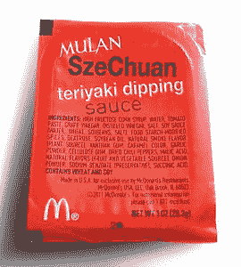

# 代码 n00b :(变量)命名是最难的部分

> 原文：<https://thenewstack.io/code-n00b-naming-hardest-part/>

当我开始编码时，我知道这不是一件容易的事。编写任何计算机语言都需要学习语法、数据和控制模式——更不用说(经常被提及的)重新安排你的大脑以像程序员一样思考的必要性。堆积组合盘上的一些项目不可避免地会带来挑战。但是如果我们坚持工作，所有必要的技能和知识最终会融合在一起:时间加实践等于能力。

然而，关于计算机编程还有一个永远不会消失的严酷事实。你做得越多，事情也不会变得越容易——事实上，你经历得越多，你就越有可能发现你实际上不得不做这件特别困难的事情。而且，不，我不是指和营销团队谈。

我说的是命名变量。类、id、对象、函数、方法、道具，无论你有什么——没有什么能像 [create-react-app](https://github.com/facebookincubator/create-react-app) Mozart 那样，比实际命名所有事物的需要更快地从你的手指间流出漂亮稳定的代码流。我知道我不是唯一有这种经历的人。在任何类型的编程会议上提到变量名，大家都会抱怨:我们都讨厌它。

或者，正如[菲尔·卡尔顿](http://www.meerkat.com/karlton/)——[最初的 Netcsape Navigator 浏览器](https://en.wikipedia.org/wiki/Netscape_Navigator)的设计师之一，在 1996 年所说:“在计算机编程中只有两件困难的事情:缓存失效和命名。”

但是为什么呢？为什么给变量命名这么难？或者更确切地说，为什么想出一个好名字如此困难？

> 给你的变量命名，就好像下一个阅读你的代码的人是一个知道你住在哪里的拥有电锯的精神病患者。

第一个最重要的原因可能是因为没有集体持有的最佳实践，没有既定的“正确方法”来指导编码人员提出完美的概念上简洁、清晰和适当的 yourVarNameHere。不要误解我——有大量的资源解释了创建变量名的规则和语法。但是，正确地构造一个语法正确、区分大小写的 Unicode 字母和数字序列(可能再加上一些符号)不是我要说的，这一点您是知道的。我说的是一开始就想出这该死的东西。

我的意思是，我们都知道拥有清晰的、描述性的和简洁的变量引用会让我们的工作生活变得非常非常好。更不用说以后要进来看我们代码的人的生命了。最好的方法就是构造一个名字，指明这个特定的代码块要做什么，为什么要做，同时将它与相似或相关的代码块区分开来。没问题，对吧？

但愿如此。再说一次:实际上很难做到。为什么？

我对此已经思考了一段时间，并且有了一些想法。我相信，尽管我们都知道想出合乎逻辑且容易记忆的变量名很重要，但这也不像是“实际”工作的一部分。我的意思是，如果我们的工作是通过编写、使用或修改代码来解决问题 X，我们就应该编码，而不是停下来细读 thesaurus.com 寻找 ["$data "的同义词](http://archive.oreilly.com/pub/post/the_worlds_two_worst_variable.html)

当我发现自己对着屏幕低声抱怨时，因为我的工作流程突然停止，就像走鹃来到卡通悬崖边一样，因为是时候为某事想出另一个名字了——这感觉很糟糕。令人沮丧；这种中断会打乱你的编码计划，然后浪费时间重新开始。对我来说，感觉就像字面上的齿轮在脑子里磨。然而，我不希望我的命名不当的类在面向对象软件的类层次结构中到处传播，这样一些糟糕的维护者以后会恨我。那个人可能就是未来的我，所以最好从一开始就做好。

所以，是的，没有简单的出路。给你的变量命名，就好像下一个阅读你的代码的人是一个知道你住在哪里的拥有电锯的精神病患者。这意味着花时间去思考你在那种特殊情况下做了什么，以便发明一个对未来的你有意义的好名字。

真实故事:我在工作中感到无聊，有时会用变量名来娱乐自己。上周，在麦当劳的“瑞克和莫蒂四川酱”惨败后，我发现自己给一个对象构造函数起了一个类似“四川失败”的名字，这实在是太弱智了。它与代码上下文毫无关系，我只是想搞笑。幸运的是，我及时发现了自己，并把它重新命名为一些无聊但合适的东西，让未来的我不想打现在的我(实际上，想想看，这将是一个最危险的场景)。

但是我跑题了。摆在专家小组面前的最初问题是，为什么给变量命名是一件如此痛苦的事情？我确实认为这可以归结为齿轮研磨的事情——编写代码使用了我们大脑的线性、逻辑编程部分。而发明恰当的描述性变量名意味着进入大脑中一个完全不同的面向语言的区域。这样做不可避免地会有破坏性，可能会令人不愉快，甚至可能会有点痛苦。但这也是必要的。

我们能做到！在编写代码时，开发人员很容易产生创造力。发明同样正义的 var 名称只是穿着不同衬衫的创造力。最后，我们为其他人写代码——交流我们如何试图解决手头的问题——就像为编译器写代码一样。所以就像你说的那样命名吧。把瑞克和莫蒂的笑话留给专家吧。

flickr 用户 Joe deSousa 的《特征图像:齿轮》的基础，由 Creative Commons 授权。扳手，火花，由米歇尔吉诺文本。

<svg xmlns:xlink="http://www.w3.org/1999/xlink" viewBox="0 0 68 31" version="1.1"><title>Group</title> <desc>Created with Sketch.</desc></svg>