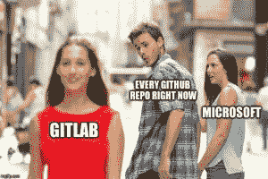
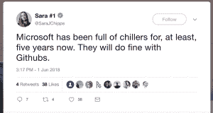
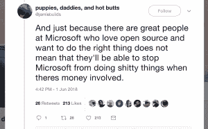

# 代码 n00b:欢迎来到 GitHub，这是微软为您带来的

> 原文：<https://thenewstack.io/code-n00b-welcome-to-github-brought-to-you-by-microsoft/>

所以，正如任何一个写代码和有脉搏的人已经知道的，[微软正在收购 GitHub](https://thenewstack.io/microsoft-to-acquire-github-to-expand-developer-reach/) 。实际上还没有钱被转手，但是这笔交易有望在今年年底完成。GitHub 加入微软 20 亿美元以上的收购俱乐部——其名单包括 [LinkedIn](https://www.linkedin.com/feed/) 、[《我的世界》/Mojang](https://mojang.com/) 和 [Yammer](https://www.yammer.com/) (还记得 Yammer 吗？是啊，我也是)——基本上已经是板上钉钉的事情了。把 GitHub 称为家的 2800 万开源开发者中的许多人都吓坏了。

我也是。嗯，至少一开始是这样，但我现在已经冷静下来，可以开始考虑事情了。因为我的蜘蛛感官是兴奋的，尽管保证“GitHub 将保持其开发者至上的精神，并将独立运作，为所有行业的所有开发者提供一个开放的平台。”新闻稿是这么说的。无论如何，我们应该相信这个新的、仁慈的微软，它拥抱开源，已经成为 GitHub 的头号贡献者，已经提交了超过 200 万份。

然而，在那下面，我们❤OPEN SOURCE conference swag t 恤衫，仍然跳动着同样的专有闭栈心脏，它最初帮助微软成为世界上最大的软件公司。我不得不告诉你，尽管微软最近高调转向积极拥抱一切开源，但这个科技巨头反对开放软件已经有很长时间了。

就像在,[自由软件](https://en.wikipedia.org/wiki/Freeware)和开源运动——被视为对该公司商业模式的威胁，因为它是一家创造专有产品的商业软件公司。以至于[时任首席执行官史蒂夫·鲍尔默(Steve Ballmer)将](https://web.archive.org/web/20011108013601/http://www.suntimes.com/output/tech/cst-fin-micro01.html)开发人员创建开源项目并在 GitHub 等网站(尤其是 Linux)上共享的趋势称为“癌症”，并补充说这“违背了美国的方式”2014 年，当鲍尔默下台，微软新任首席执行官[塞特亚·纳德拉](https://twitter.com/satyanadella)宣布公司将“拥抱】开源社区时，这一切被认为发生了改变。哦？比如，蟒蛇如何“拥抱”它的早餐？就在刚刚过去的这个周末，开源开发者杰米·凯尔指控微软窃取代码。

请注意@Jamiebuilds 最终决定公开发言背后的动力。第一次发生的时候，凯尔并没有大吵大闹。TL；其中的博士版本是 Kyle——他强大的开源血统包括贡献 [Babel](https://babeljs.io/) 、Flow、 [Yarn](https://yarnpkg.com/lang/en/) 和 TC39 指导委员会成员——创建了 [Lernajs](https://lernajs.io/) ，一个组织和管理跨项目 JavaScript 包的精简工具。阅读整个故事的 Twitter feed，但结果是微软的一个团队显然模仿了 Lernajs 的代码库，并将其重命名为 [Rushjs](https://rushjs.io/) 。他们没有分叉，这是完全合法的开源行为。相反，根据 Kyle 的事件时间表，这是非常令人信服的，哦，是的，公开记录在 GitHub 上，看起来微软员工基本上复制/粘贴了 Lernajs。

像一个成年人一样，Kyle 试图找出发生了什么，接近另一方，并合作解决问题。基本上，凯尔只是想要公众承认拉什的出身。“所以我联系了我在微软认识的人。这大概是一年前的事了。他们感到震惊并道歉。但从那以后什么也没发生，”凯尔写道。“哦，等等，是的，确实发生了一些事情。Rush 的提交历史被篡改，大量代码被移动，函数被重命名、重写……他们经历了所有这些麻烦，而不仅仅是更新一个许可证，甚至只是添加一个脚注。”

请注意，除了是一个开源超级英雄之外，Kyle 显然也是一个一流的行为，他终于站出来回应那些对 GitHub 现在将在微软手中的消息不屑一顾的开发人员。不是合作伙伴，而是完全由所有。受到推文的刺激，比如:

我在声明后的经历和凯尔很相似。当我认识的开发人员对 GitHub 的收购表示担忧时，我并不感到惊讶。但是一个惊人的数字似乎完全没有受到新闻的影响:一切都会好起来的，什么都不会改变，毕竟，GitHub 正在大出血，这样的事情是不可避免的，至少甲骨文或 IBM 不是新的所有者。嘿，看看微软的开源软件:

“微软是一家开发者至上的公司，通过与 GitHub 联手，我们加强了对开发者自由、开放和创新的承诺，”纳德拉在宣布这笔交易的新闻稿中说。

对我来说，这感觉就像当可怕的海盗微软试图登上 GitHub 这艘好船时，我们正在航行。这些人没有击退入侵，或者至少制定出相互行为的条件，而是都像这样，“嘿，他们可能是嗜血的海盗，有拿走他们想要的东西的历史，是的，但是你看！他们和我们一样！他们也喜欢航海、游泳和唱海洋圣歌。我们会成为朋友。事情会好起来的！”

也许他们会。如果微软真的只是在 GitHub 下放一张金融网，而让开源世界的中心像以前一样旋转，那将是多么令人敬畏。这种乐观情绪确实有一些真正的基础:在纳德拉的领导下，微软越来越多地在其专有产品中使用操作系统工具。所以摧毁 GitHub，一个已经成为微软编写自己软件的关键部分的公司，是没有意义的。此外，微软现在甚至提供支持许多风格的 Linux 的产品——曾经谴责“癌症”——并在一些重要的云和开发产品上使用开放模型。

不过，也许不会。这就是为什么我们开源社区必须对此保持清醒和警惕。首先，有你的低层次的关注，像 GitHub 现在可能会得到横幅广告(恼人的)和跟踪(恼人的和邪恶的)。微软将开始让 GitHub 用户转向集成的微软产品——例如，如果构建一个云原生项目，GitHub 向 Azure 提供一键热连接，阻力最小的途径将是按下那个按钮。还有:你好 VSCode！再见了，亚当，不要让出口撞到你被上帝劈开的地方。

所有这些都是可能的，但可以导航。对于我和其他真正试图思考这意味着什么和可能会发生什么的人来说，最大的担忧是，微软现在正处于一个使用 GitHub 托管其代码的每个人的知识产权的监护人的位置，无论是公共的还是私有的。这方面有很多保证:“我们永远不会偷看你的代码！”

对于我们大多数人来说，这并不是一个很大的问题:就像我真的担心微软会把我的通过构建来学习 JavaScript 的待办事项列表应用程序卖掉一样。但是那些接受 GitHub 精神并选择在私有回购中托管私有代码的组织呢？微软现在可以完全了解你内心深处的秘密。感觉不会太好。此外，如果一些政府机构命令微软交出竞争对手的源代码怎么办？甚至是他们自己的？接下来的问题是，对于一个日益垄断的科技行业来说，这又是一个里程碑式的事件。(或者，正如凯尔在推特上指出的那样:“如果你信任少数几家拥有整个工具链的公司，并希望他们不会欺负你，我有一座桥可以卖给你。”)

归结起来就是，是的，微软在过去的四年里改变了它的论调。我喜欢纳德拉。但这是开源开发领域的一个结构性转变。假装不是这样就是故意天真。我确信微软有很多伟大的人，他们为开源生态系统做出了巨大的贡献。但是这些伟大的人在一个多头的，非常盈利的九头蛇里工作，有着自己漫长的盗版历史。对于一些优秀的开发者来说，这是一个疯狂的势头。再来看看杰米·凯尔最近的经历:似乎微软内部仍有整个团队以这种方式工作，没有任何道德问题。

我不是说我要把代码转移到 GitLab，stat。“煎锅”和“火”这两个词是伴随着那种下意识的跳跃想到的。而且我真心喜欢 GitHub，不想分手。因此，我试图保持开放的心态，相信这一切实际上可能会让世界上最大/最富有的软件公司*和*开源生态系统都受益。

但我也在睁大眼睛。创建一个 GitLab 账户。

米歇尔·吉诺的[代码 n00B](/tag/code-n00b/) 每隔一天出现一次，只在新堆栈中出现。

<svg xmlns:xlink="http://www.w3.org/1999/xlink" viewBox="0 0 68 31" version="1.1"><title>Group</title> <desc>Created with Sketch.</desc></svg>