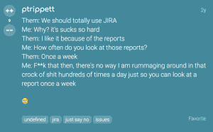
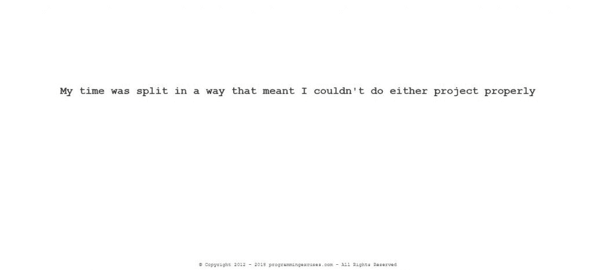

# 代码 n00b:今年开发者真正想要的是什么

> 原文：<https://thenewstack.io/code-n00b-whats-really-on-developer-wish-lists-this-year/>

这是季节。尽管如此，我们还是来讨论一下开发人员真正想要的东西，而不是通常的“给程序员的礼物”十大清单。真正持续一整年的礼物。

### 1.自动化

是的，这是一种刻板印象，但是许多开发人员根本就不是社交蝴蝶。我们喜欢戴着耳机在角落里工作，这样可以更好地屏蔽世界，同时专注于为实际工作的应用程序编写代码。麻烦的是那些讨厌的用户/客户不断闯入我们快乐的编程聚会，提出他们的“需求”和“问题”

所以，我们能不能已经让神经网络机器学习，比如，自动化我们工作流程中的人的因素？假设您有一个应用程序功能请求。太好了！在我们的梦想系统中，AI 将已经通过更高层次的集中智能向我们发出警报。现在请让我们单独做你想要的东西。

### 2.一个更好的吉拉

经理们喜欢这个神奇的管理层仪表盘，但是每天都必须使用吉拉的人可能会有…其他的感受。所以我想说，我所知道的几乎所有开发人员的假日愿望清单上的第一件事是一个全新版本的吉拉，它更快、更简单，并且实际上解决了许多长期存在的问题。

Slow:当你试图使用吉拉的时候，你有没有坐在那里感觉你生命中宝贵的几分钟在流逝——你永远也不会回来的时间？首先，计算打开吉拉页面所需的时间……然后点击“创建门票”键盘快捷键……找到/选择你的项目……等待它加载字段……说真的，帝国在比访问吉拉工作流程更短的时间内衰落了。

过于复杂:Atlassian 自己建议授权第三方客户端来实际使用它。说得好听点，这种极其缓慢、无响应的设计有很多怪癖。如此之多的人实际上是在赚钱，他们制作平台覆盖在吉拉上，让它更容易使用。这才说得通。描述吉拉 UI 非直觉设计的最好方式是，如果伏地魔把他最后的魂器藏在了吉拉，他应该还在附近。

有问题吗？:任何时候，当你遇到吉拉的问题并寻求支持时，基本上可以保证你会找到一张两三年前或五年前的票，那时同样的问题也是一个问题。

因此，是的，吉拉合法烂的原因如上。然而，我慢慢开始意识到我们有点讨厌这里的信使。就像，吉拉是一个工具，这是最大的问题。但是，就像生活中的许多其他情况一样，这里最令人烦恼的问题不是来自工具本身，而是如何使用它们。

换句话说，我们正在利用吉拉的特征制造我们自己最糟糕的问题。像吉拉这样的项目管理工具负担着可定制性。你创建的定制工具越多，让每个用户都满意(让他们现在的任何任务变得更容易，不要管一个月或一年后实际需要什么)，UX 就变得越臃肿和不灵活。当你在一个仍然遵循瀑布思维的系统中工作时，这一点变得特别明显，即，一个分层的工作流程，其中项目和领导从上到下“流动”到我们这些实际构建事物的人。不幸的是，那些在瀑布顶端的人想和酷孩子一起游泳？所以我们需要给他们浮动空间。这就是膨胀真正爆发的地方:定制负载的很大一部分位于不可避免的 C-suite 转换层。漂亮闪亮的大按钮仪表板应该让非技术团队成员也能轻松使用吉拉。

### 3.真正的 DevOps

所以除了一个神奇改进的吉拉禁止任何不知道如何使用 JRASERVER-29184 的人使用之外，解决:不会修复，今年我的开发人员愿望清单上的另一件事 DevOps 实际上变得更有意义了。正如我不得不告诉你的，DevOps 是最近的商业流行语，许多公司正在重塑自己，至少在理论上，是“更多地以开发者为导向”作为一个想法，它很棒——一个神奇的领域，我们实际上作为一个团队一起工作，而不是两个对立的力量。考虑到开发的一个关键部分在于理解你正在构建的东西是如何失败的，以及一旦认识到，如何围绕这些障碍进行设计。最好的方法是让设计和构建人员与部署和支持人员一起工作。他们知道坑洞在哪里。这很有意义，各位。

也就是说，我还没有在 DevOps 团队中工作过，所以我只能希望这是真的，而不是像“我们正在打破我们的筒仓，重构我们的人力资本以在敏捷 scrums 中工作”这样的宣传不管那是什么意思。我愿意相信这是一件真实的事情，因为组织实际上正在转向这一点，并且它是可行的…但是我很难在现实世界中描绘它。开发人员对等式的运营方面感到沮丧是因为这样一个事实，即当我们生产新的软件和系统来做新的和令人兴奋的事情时，他们有一种压倒性的愿望，试图通过他们的流程和策略将它融入他们的运营模型，从而阻碍我们以不同的方式和创新的方式做事情的尝试。他们的工作就是在我们的泳池里撒尿。把我们两个相互竞争的目标放在同一个团队中，那么…你最终会得到像吉拉一样的东西。

然而，无论你站在哪一边，当听到“更新你的票，每个人！”这句话时，我们都有同样的恐惧

### 4.给我一个理由

本着这种团结的精神，这里是我给你的礼物:[编程借口](http://programmingexcuses.com/)。

当被一个突击测验项目状态检查弄得措手不及时，只需跳到这个网站，自动生成一个听起来似乎合理的解释短语，如“该代码不打算投入生产”，为您赢得宝贵的时间来掩盖自己的过失。说真的，这个网站上有成千上万的单线救生器，只要不断地重新加载，直到一个感觉正确。“我的时间被分成两部分，我不能很好地完成任何一个项目”可能是我最喜欢的出狱自由卡。

这里的美妙之处在于，不管您是开发人员还是运营人员；这些借口都管用。快乐快乐！

通过 Pixabay 的特征图像。

<svg xmlns:xlink="http://www.w3.org/1999/xlink" viewBox="0 0 68 31" version="1.1"><title>Group</title> <desc>Created with Sketch.</desc></svg>