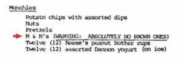

# 代码 N00b:谁吃了所有的棕色 M & Ms 巧克力豆？？？

> 原文：<https://thenewstack.io/code-n00b-who-ate-all-the-brown-mms/>

当我们第一次学习编程(不管是什么编程语言)时，它是关于创造新事物的——第一个实际运行的 hello world 代码块，你的第一个小程序，baby web dev 的第一个“待办事项”应用程序。从来没有被提及的一件事是，一旦你足够擅长(不管是什么编程语言)以至于可以被雇佣，你就不会被雇佣去开发新的东西。你的工作几乎肯定会涉及到在现有的，甚至是遗留的代码库中工作，这些代码库是在很久很久以前编写的……或者至少是在当前的(无论什么语言)编程标准出现之前。假设一开始捻起这团满是虫子的意大利面的人读过时尚指南。

(我甚至没有谈论那些神秘的情况，在这些情况下，一个单独的代码块，甚至一行代码看起来完全没有任何作用——然而，如果仅仅因为一个空格而改变，就有可能使整个应用程序崩溃并烧毁。我们都见过这个。你们应该知道这个神秘的代码，通过它周围的评论领域的爆炸区，尖叫着，在所有的大写字母中，为了对所有邪恶的爱，请不要碰它。神秘代码不一定是坏代码。我们中没有人能够预测依赖于一个简单的，比如说，解析函数的依赖关系，以及那些依赖关系上不断堆积的依赖关系，直到你发现自己在一个程序员的镜子大厅里。不知道你是怎么来到这里的，也不知道该走哪条路，并且不顾一切地想要砸碎一切。)

因此，对我来说，最终发现我们应该学习的——在学校、训练营或深夜坐在办公桌前自学——与其说是如何编写代码，不如说是如何阅读代码，这并不是一件令人高兴的事情。这是一种相关但不同的技能。

尤其是当你是一个网页开发者的时候。如今，由于不断的范式转变反映了 web 惊人的发展，许多低级别的开发人员倾向于专注于简单地保持事物的正常运行。这意味着，作为初级开发人员，你不太可能在生产中编写一行代码，除非你计算测试和批处理脚本。坦率地说，这更像是软件保姆，而不是软件工程，但这也是我们许多人刚刚起步的现实。因此，想办法解析在你之前的编码员的工作就成了一项基本的生存技能。

起初，学习我的方式，我没有太多的继续下去。主要是祈祷在我之前陷入这种混乱的人(a)是一个体面的编码者，并且(b)也是一个足够体面的人，实际上已经用体面的注释记录了代码，甚至可能将他们的变量命名为有意义的东西，并且，你知道，与所讨论的函数的实际目的相关。不过，慢慢地，我开始发现一些线索，这些线索帮助我预测未来代码之路的质量(或者严重缺乏质量)。代码库的一致性是一个关键——例如，所有的事情都是以同样的方式缩进的吗，还是什么都可以？空白是如何处理的？骆驼大小写还是断字？(或者，但愿不会如此，完全忽略大小写——“我不在乎，因为 SQL 不区分大小写。”).

是的，它们通常是小线索，但它们指出了前方更大的潜在问题。你看到了对一致性和普遍接受的编程实践的那种漫不经心的程度，你可以打赌，同样缺乏努力将会在实际的编程逻辑中产生回报——产生最终会反过来咬你一口的效果。大时代。

对我来说，很难向其他人，甚至是其他开发人员阐述这个理论。但后来我看到了范·海伦的一条商业建议。是的，头发浓密的 70/80 年代超级组合“与魔鬼共舞”和超紧身弹力裤的名气。似乎，在过去，这个乐队因为他们的演唱会合同中的一个附加条款而出名，该条款规定他们在后台的零食必须包括一碗 M & M 糖果，所有棕色的都要去掉。乍一看，这位摇滚歌星的要求似乎很古怪，但这个古怪的要求实际上有着严肃的目的。如果乐队到达一个地点，发现确实有棕色的 M &女士混在碗里，这是一个信号，表明他们合同中的其他细节——实际的、重要的——可能也被忽略了。这是他们更深入了解这场特别演出的后勤工作，并对从灯光设备到放大器接地的一切进行线下检查的信号。

听到这里，我不得不钦佩地摇摇头。李尚义·罗斯是行动专家。艾迪·范·海伦担任质量保证。布朗 M & Ms 作为一种快速评估场馆运营商是否关注细节的方法——因为如果他们不关注，事情可能会出错。像完全崩溃，演出中途变黑这样的大事。或者只是音质或反馈方面的小问题。

我意识到，在每一种编程风格中都是如此。像大小写和坚持使用连字符和下划线这样的小细节(看在上帝的份上，人们选择其中一个并坚持下去)本身可能不是问题。但是，它们是一个非常可靠的指针，表明您最好仔细阅读这段代码，寻找之前出现的疏忽甚至懒惰代码的实际和重要表现。失陪了，我要去挤虫子了。和棕色 M & Ms 巧克力豆。

罗伯特·阿纳奇在 [Unsplash](https://unsplash.com/search/photos/m%26m?utm_source=unsplash&utm_medium=referral&utm_content=creditCopyText) 上拍摄的特写照片。

<svg viewBox="0 0 68 31" version="1.1" xmlns:xlink="http://www.w3.org/1999/xlink"><title>Group</title> <desc>Created with Sketch.</desc></svg>