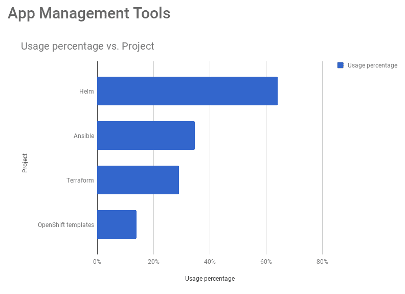

# Codefresh 通过与微软 Azure 的集成弥合了与 Helm 之间的差距

> 原文：<https://thenewstack.io/codefresh-bridges-the-gap-to-helm-with-microsoft-azure-integration/>

Codefresh 提供了它所说的第一个 Kubernetes-native 持续集成/持续交付(CI/CD)平台，最近发布了针对 Azure Helm 仓库的本机集成[。](https://codefresh.io/kubernetes-tutorial/codefresh-adds-native-integration-azure-helm-repositories/)

该公司此前在今年早些时候推出了自己的托管库，但根据 Codefresh 的一份声明，这一最新集成使其用户可以“用易于使用的 Codefresh GUI 构建、测试和部署掌舵图，并将它们存储在 Azure 容器注册表中”。这种集成允许 Codefresh 用户使用 Kubernetes“将 Kubernetes 应用程序与他们一起引用的图表和图像打包在一起。”

“Codefresh 公开并简化了 Helm 真正设计的模式，即制作应用程序、打包、存储，然后使用它。Codefresh 首席技术宣传员[丹·加菲尔德](https://www.linkedin.com/in/dan-garfield/)在声明中说:“这样，你就拥有了内置的灾难恢复功能，因为你可以随时回滚。”。

这次发布是及时的。就在一年前，当一些人将 2018 年称为 Kubernetes 年的时候，仍然有人认为实现这项技术仍然太难了。然而，现在，当我们进入 2019 年时，Kubernetes 已经成为容器编排技术中明显的主导力量，一个生态系统正与它一起快速增长。

作为 Kubernetes 配置的包管理器，Helm 在这个生态系统中迅速被采用，并享有类似的主导地位。在[2018 年的一项调查](https://www.cncf.io/blog/2018/08/29/cncf-survey-use-of-cloud-native-technologies-in-production-has-grown-over-200-percent/)中，[云本地计算基金会](https://www.cncf.io/) (CNCF)将 Kubernetes 的开源包管理器称为“打包的首选方法”Kubernetes 的另一项 2018 年调查[也将 Helm 置于竞争对手之上。](https://kubernetes.io/blog/2018/04/24/kubernetes-application-survey-results-2018/)

Helm 使用 [Helm charts](https://docs.helm.sh/developing_charts/) 允许用户定义 Kubernetes 应用程序，这些应用程序可以是“简单的，如 memcached pod，也可以是复杂的，如带有 HTTP 服务器、数据库、缓存等的完整 web 应用程序堆栈。”现在，一个新宣布的集成据说会使访问这个工具更加容易，集成了 [Codefresh](https://codefresh.io/) 、Helm 和 [Microsoft Azure](https://azure.microsoft.com/en-us/) 。

几个月前，微软[宣布为 Azure Container Registry(ACR)](https://azure.microsoft.com/en-us/blog/azure-container-registry-public-preview-of-helm-chart-repositories-and-more/)添加 [Helm chart 库，加菲尔德表示，两家公司正在共同努力帮助 Helm 生态系统的发展。根据 Codefresh 公告，用户现在可以:](https://docs.microsoft.com/en-us/azure/container-registry/container-registry-helm-repos)

*   使用 Azure 登录以向 Codefresh 添加存储库；不需要额外的身份验证配置
*   从 Codefresh 消费和推送图表
*   管理所有连接的 Kubernetes 集群中的图表部署
*   使用 Azure Container Registry 地理复制功能跨多个地区地理复制图表。

微软容器注册中心的首席项目经理史蒂夫·林泓在 Codefresh 声明中表示，“随着我们看到越来越多的客户进入生产环境，需要一种部署图像和配置集合的方法，Helm Chart 仓库是 Azure 容器注册中心的一个自然而明显的补充。能够使用通用身份认证将舵图与其参考图像一起进行地理复制简化了海图部署。”

关于如何利用这种整合的更多细节，Codefresh 提供了一篇带有详细说明的[博客文章](https://codefresh.io/kubernetes-tutorial/codefresh-adds-native-integration-azure-helm-repositories/)。Codefresh 还将于 11 月 28 日举办一场网络研讨会，讨论创建、测试和部署舵图的最佳实践。

云计算原生计算基金会是新堆栈的赞助商。

通过 Pixabay 的特征图像。

<svg xmlns:xlink="http://www.w3.org/1999/xlink" viewBox="0 0 68 31" version="1.1"><title>Group</title> <desc>Created with Sketch.</desc></svg>