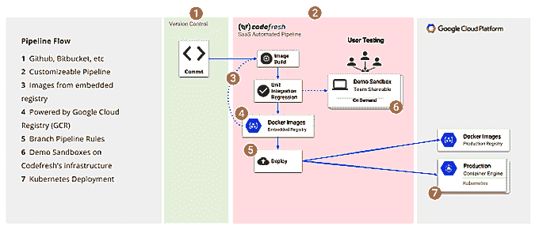

# Codefresh 构建平台获得了一个免费的私有 Docker 注册表

> 原文：<https://thenewstack.io/codefresh-build-platform-gets-free-private-docker-registry/>

正如开发人员非常了解的那样，传统的开发管道并不适合容器和云服务。由于这种体系结构预先存在着像容器化和分布式应用平台这样的新技术，这是可以理解的，但也是有问题的。

Docker-native 持续集成/持续交付(CI/CD)平台和服务的制造商 Codefresh 进入。有了一个专门与 [Docker](https://www.docker.com/) 和云服务一起工作的全新平台，所有这些都在 [Kubernetes](https://kubernetes.io/) 上本地运行，Codefresh 用户可以简化他们的整个管道，并快速轻松地构建、测试和使用 web 应用。

从现在开始，Codefresh 还在菜单中添加了一个完整的私人内置注册表，这意味着所有用户都可以向 Codefresh 的注册表添加无限的公共和/或私人回购，没有网络或存储费用，也没有合作者的上限。当然，开发人员仍然可以连接他们喜欢的所有外部注册中心——但是现在，这里有一个现成的。

Codefresh 联合创始人兼首席执行官[拉结尔·塔比布](https://www.linkedin.com/in/razielt/)表示:“我们非常高兴能够免费为我们的用户提供完整的注册表。“通过将我们的 Docker Registry 与 Codefresh 的 CI/CD 和按需暂存环境相结合，开发人员拥有了交付容器的完整工具链。”

免费的全规格注册表——由[谷歌的容器注册表](https://cloud.google.com/container-registry/)提供支持——将 Codefresh 与类似的 CI/CD 服务区分开来。拥有一个可用的内置注册表可能会减少开发周期中的一个步骤，从而加快构建和测试。部署后，它也使得删除和调试损坏的映像变得更加容易。

Codefresh 新的嵌入式注册表并不打算取代生产注册表。相反，它为测试和开发提供了一个以开发人员为中心的平台。嵌入式注册表维护开发所需的映像，而生产注册表则成为“生产级映像的唯一真实来源”

塔比布说，这种方法还有其他几个很大的优势:

*   图像质量控制更高，因为它内置于测试流程中。
*   构建辅助映像(例如，那些与 Java 和其他编译语言一起使用的映像)在开发空间中组织得很好。
*   Codefresh 使用有价值的元数据(例如，测试结果、提交信息、构建 SHA、日志、问题 id 等)扩展映像。)，为开发者创建一个类似沙盒的注册表。
*   构建速度更快，因为嵌入式注册表“更靠近”构建机器。

此外，嵌入式注册表允许开发人员从构建流程中通过标记和扩展元数据调用图像。例如，如果您想基于一个服务如何与另一个服务的不同版本一起工作来测试它，您可以基于它们的 git commit ID (build SHA)来引用映像。

“在与我们的用户交谈时，他们最兴奋的是能够根据需要为注册表中的任何图像或图像集旋转环境，”Tabib 说。"在没有供应的情况下在应用程序环境中启动映像是巨大的."

Codefresh 生产环境由运行在 Google 容器引擎上的 [Kubernetes](/category/kubernetes/) 容器编制器管理。该公司增加了 Kubernetes 部署图像，可在 UI 和 Codefresh YAML 中使用，使推送新图像成为传递凭证的简单事情。自动化部署变得简单，而且，当与分支机构权限配合使用时，任何获得授权的人都可以批准代码并将其投入生产。瞧啊。一键式部署到[谷歌的容器引擎，由 Kubernetes 支持的](https://cloud.google.com/container-engine/)。

“作为 Docker 原生，CI/CD Codefresh 对 Docker 用户需求有着深刻的理解。使用 Codefresh 的团队大大加快了他们的构建、测试和部署，这要归功于我们缓存层的能力，所有这些都包含在一个简单易用的用户界面中，”Tabib 说。

注册 Codefresh 的免费介绍计划只需要一个 GitHub 帐户，并提供一个托管的暂存环境、五个并发构建以及无限的用户和存储库，尽管构建每月限于 200 个。Codefresh Pro 提供打折的年度和月度现收现付计划，起价为每月 249 美元，并根据您的项目所需的托管暂存环境和并发构建的数量而上涨。

此外，Pro plan 还提供嵌入式注册表、端口映射、静态 IP 和支持，其中包括一个专用的 Slack 通道。

由 [Andre Benz](https://unsplash.com/@trapnation) 通过 Unsplash 拍摄的特写图片。

<svg xmlns:xlink="http://www.w3.org/1999/xlink" viewBox="0 0 68 31" version="1.1"><title>Group</title> <desc>Created with Sketch.</desc></svg>