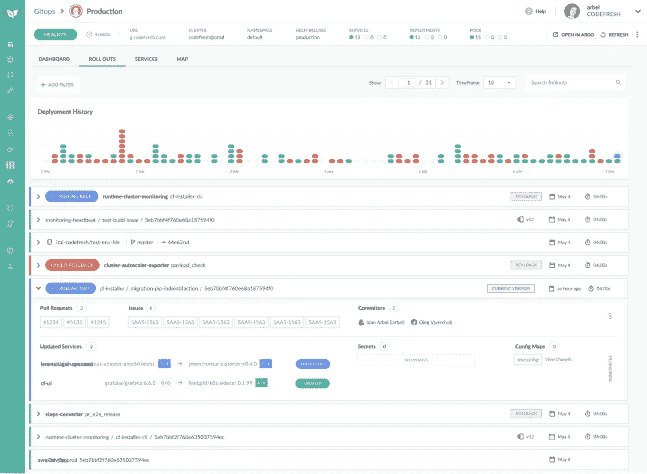

# Codefresh 发布 GitOps 2.0，GitOps 工作组开始运作

> 原文：<https://thenewstack.io/codefresh-launches-gitops-2-0-as-a-gitops-working-group-takes-flight/>

[Honeycomb](https://www.honeycomb.io/) 正在赞助新 Stack 对 Kubecon+CloudNativeCon 北美 2020 的报道。

在今年的 [KubeCon+CloudNativeCon 北美](https://events.linuxfoundation.org/kubecon-cloudnativecon-north-america/)大会上，Codefresh 宣布了其对 GitOps 新演进的愿景，称为 [GitOps 2.0](https://codefresh.io/devops/launching-future-devops-gitops-2-0/) 。这一声明是在 GitOps 工作组成立前几天发布的，该工作组试图确定 GitOps 1.0 的基础，在这种情况下，该工作组在本月早些时候接受了 Codefresh [的任务](https://codefresh.io/devops/pains-gitops-1-0/)。

首先，Codefresh 提供了一个基于 Kubernetes 的持续部署和持续集成(CI/CD)平台，它专注于提供可观察性和指标，推出了一个详细的视图，让您可以看到与发布相关的所有内容，通过控制回滚和更大的聚合视图来查看多个应用程序之间发生的事情。

该工作组由亚马逊、Codefresh、GitHub、微软和 Weaveworks 组成，将在[云原生计算基金会(CNCF)](https://www.cncf.io/) 的支持下开展工作，致力于“为公司和个人提供实施 GitOps 工具和方法的技能、知识和能力，以简化基础设施和云原生应用的运营和管理。”目前，该小组列出了 GitOps 的五个基本原则，即声明式配置、版本控制和不可变存储、自动化交付、软件代理和闭环。该组织将致力于教育计划和认证项目，但首先，它计划创建一个“GitOps 宣言”，以进一步扩展这些基本原则，它表示它的目标是到 2021 年 3 月。

Codefresh 的首席技术宣传员 Dan Garfield 解释说，他认为 GitOps 2.0 是 GitOps 工作组的上游，这是一个沙箱，Codefresh 可以在其中更积极地行动，并试图修复它认为当前 GitOps 工具的局限性，而工作组将是更可靠、真实、一致同意的方法和想法的家园。

“我们选择的第一个是可见性、可追溯性和可观察性。如果您有 500 个微服务，即使您使用 GitOps，也很难理解宏观层面上发生了什么。有一个很大的担忧阻止人们在那个规模上采用它，因为如果他们不能告诉正在发生什么，他们的部署就开始感觉像一个黑匣子。加菲尔德说:“如果出了问题，你就迷失了方向。所以，我们真正想用 GitOps 2.0 做的是利用所有信息来理解 GitOps 的体验。”

Garfield 进一步解释了这些计划之间的关系，作为 GitOps 2.0 对这些问题的展望之一，而 GitOps 工作组将不同的参与者和供应商聚集在一起，以达成一个共同的基础。

“GitOps 2.0 是 Codefresh 发布的标准，GitOps 工作组是公司之间的交叉合作。我们想象在 GitOps 2.0 上也会有合作，但是现在，我们已经出来说我们认为需要围绕可观察性的这些部分。加菲尔德说:“为了扩大规模，我们认为 GitOps 2.0 需要完成一些规模方面的事情，以便在下游变得足够强大，这些都是 GitOp 旅程的一部分。如果我们不能扩展它，如果我们不能处理 5000 个微服务，那么这个标准就死定了。”

Garfield 解释说，Codefresh 期待 GitOps 2.0 的第二部分是进一步处理部署中的规模。

“必须有某种逻辑层，如果我试图在数百个不同的地点和地理位置大规模推出软件，我需要一种方法来决定这些推出将如何发生，”加菲尔德说。“GitOps 目前的工作方式是，您要部署到的每个环境都有一个存储库，如果我有 500 个，这是否意味着我必须有 500 个 git 存储库来代表我所有部署的状态？我可以拥有一个单独定义了它们的单一回购协议吗？或者我可以定义一次，然后定义状态应该如何全面应用？”

Garfield 说，这个逻辑块正在使用 [Argo CD](https://argoproj.github.io/argo-cd/) 构建，最初将为可以基于管道逻辑触发 git 同步的管道提供不同的部署步骤，允许“更高级的流程，如部署，将 PRs 开放到其他基础设施回购，或跨不同集群和部门的部署，以及带回滚的已部署版本的自动测试，”根据一份声明。

展望未来，Garfield 说，他希望 GitOps 2.0 工具的引入能够让客户处理比目前可能处理的规模大得多的规模，但也有可能转移到完全不同的领域。

“我们总是让顾客来引导我们。我们正致力于将这些 GitOps 原则实际应用于无服务器之类的东西。Codefresh 是一个专注于云的原生平台，而不仅仅是一个专注于 Kubernetes 的平台，所以我们的许多客户也在使用无服务器平台，所以我们认为我们有机会将 Git ops 原则和流程引入该标准，”Garfield 说。“我们认为，除了潜在的 Kubernetes 和无服务器之外，还有一些尚未开发的场所可以受益于 GitOps。”

由[大卫·克洛德](https://unsplash.com/@davidclode?utm_source=unsplash&utm_medium=referral&utm_content=creditCopyText)在 [Unsplash](https://unsplash.com/s/photos/observe?utm_source=unsplash&utm_medium=referral&utm_content=creditCopyText) 上拍摄的特写图片。

<svg xmlns:xlink="http://www.w3.org/1999/xlink" viewBox="0 0 68 31" version="1.1"><title>Group</title> <desc>Created with Sketch.</desc></svg>