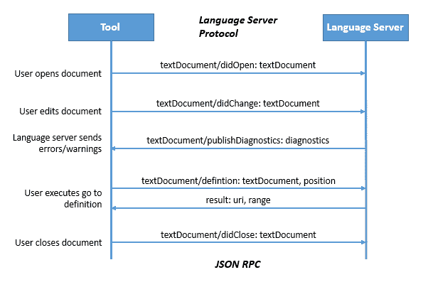
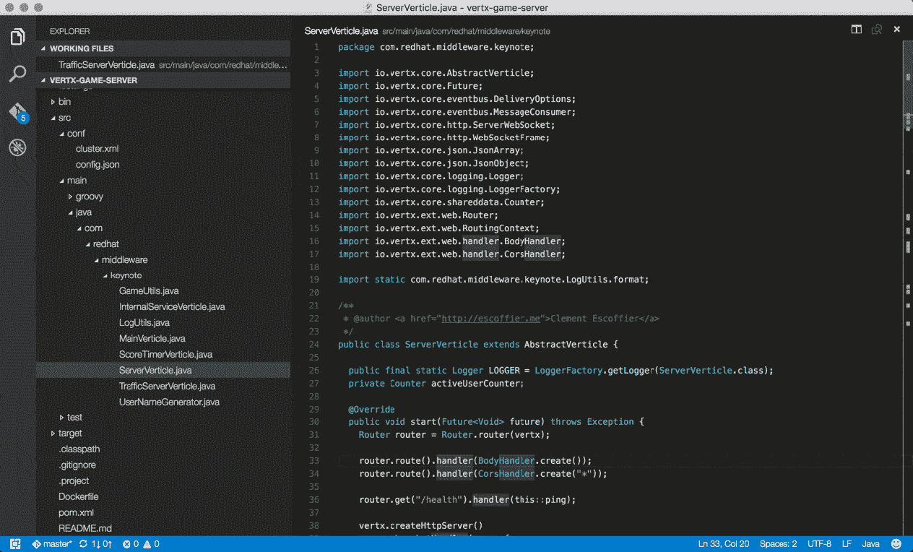

# Codenvy、微软和 Red Hat 合作开发了一个共享编程语言指南的协议

> 原文：<https://thenewstack.io/codenvy-microsoft-red-hat-collaborate-protocol-sharing-programming-language-guidance/>

Codenvy、微软和 T2 红帽已经联合起来，通过一种新的协议，允许任何编辑工具根据每种语言的一套规则和最佳实践来检查用户的代码，从而为不同的代码编辑器带来更加一致的开发体验。

对于编程语言的管理者来说，[语言服务器协议项目](https://github.com/Microsoft/vscode-languageserver-protocol)可以帮助他们为用户提供更好的支持，而不用担心底层平台。

有了这些规范，代码编辑器可以提供为特定语言设计的高级功能，如语法分析、代码完成、大纲和重构。到目前为止，[微软 Visual Studio Code](https://code.visualstudio.com/blogs/2016/06/27/common-language-protocol) 和今年晚些时候 Codenvy 的 [Eclipse Che](https://thenewstack.io/eclipse-che-provides-portable-shared-development-workspaces-built-runtimes/) 协作代码编辑器都支持该协议。

这项技术是在本周于旧金山举行的 Red Hat[dev nation 2016](http://www.devnation.org/)大会上宣布的。

“这解决了一个没有人真正谈论的问题，即编程语言通常在不同的 ide 之间不能很好地工作，特别是在重构和跳转到定义这样的重要事情上，”Codenvy 首席执行官兼项目负责人泰勒·朱厄尔说。"这些功能通常内置于语言本身."

语言服务器协议是基于 JSON 的数据交换协议，它充当用户编辑器和保存语言规范的服务器之间的连接点。朱厄尔说，该协议的目的是让“任何编程语言都能与任何代码编辑器一起工作”。

当用户在支持的编辑器中编辑文档时，更改被传递到编程服务器，编程服务器分析程序的语义状态和任何更改，寻找可以为开发人员标记的错误或警告。对于桌面编辑器，该服务可以在后续使用中作为后台守护程序在用户机器上运行。

“这是我们可以将 IDE 的安装从语言智能中分离出来的方法，”Tyler 说。

如今，JSON、C++和 Powershell [可用于 VS 代码或 VS 代码扩展的](https://github.com/Microsoft/language-server-protocol/wiki/Protocol-Implementations)。今年晚些时候， [C#(通过在 Omnisharp 项目](https://github.com/omnisharp)中完成的工作)、 [xText](https://github.com/eclipse/xtext-core/wiki/Language-Server-Protocol) 和 [R](https://www.r-project.org/) (均来自 [Typefox](https://typefox.io/) )、 [JavaFX(来自 Ensime](https://github.com/ensime) )和 [CSS](https://www.w3.org/Style/CSS/Overview.en.html) (微软)的语言包将可用。Red Hat 正在构建一个 Java 语言服务器，并计划将其捐赠给 Eclipse Foundation。

该协议的代码托管在 GitHub 上，并获得了知识共享和麻省理工学院的许可。

所有的语言服务器都将作为全球库[的一部分发布，由 Codenvy 作为 Eclipse 项目管理，并由 Eclipse 基金会托管。](https://github.com/Microsoft/vscode-languageserver-protocol)

Codenvy 和[红帽](https://www.openshift.com/)是新堆栈的赞助商。

专题图片:泰勒·朱厄尔在 2016 年发展大会上发言。亚历克斯·威廉姆斯的照片。

<svg xmlns:xlink="http://www.w3.org/1999/xlink" viewBox="0 0 68 31" version="1.1"><title>Group</title> <desc>Created with Sketch.</desc></svg>