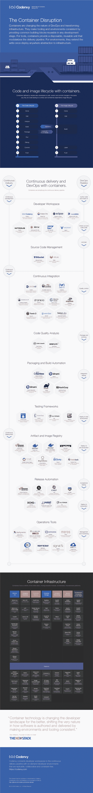

# Codenvy 的 DevOps 容器生态系统市场地图，已完善

> 原文：<https://thenewstack.io/codenvys-devops-container-ecosystem-market-map-refined/>

容器与整个堆栈相关，并且有许多公司、产品、服务和开源项目在他们寻求解决的问题上重叠——尽管各种基金会正在寻求就其中一些技术达成共识，但到目前为止，生态系统只会越来越大。

由于项目、工具和服务的数量以及容器技术发展的速度，容器生态系统被证明是非常难以封装的。在新的堆栈中，我们为我们的 [Docker 和容器生态系统电子书系列](https://thenewstack.io/ebookseries/)创建了三个不同的生态系统目录，我们非常熟悉这些项目的范围。

去年， [Codenvy](https://codenvy.com/) 咨询了我们关于创建[集装箱](https://thenewstack.io/containers-disrupting-devops-infographic/)图解市场地图的事宜。这张市场地图被证明是观察生态系统的一个很好的工具，尤其是通过连续交付如何工作的镜头。它涵盖了从代码开发到部署的整个过程，展示了每个供应商和工具是如何被分类的。该地图有助于将这些工具、产品和公司与它们要解决的问题可视化地联系起来。

[泰勒·朱厄尔解释了 Codenvy 的连续交付故事和按需工作空间](https://thenewstack.simplecast.com/episodes/tyler-jewell-explains-codenvys-continuous-delivery-story-and-on-demand-workspace)

而现在有了新版本，嵌在下面。这份最新版本的市场地图反映了 2016 年春季的生态系统，包括对第一版的一些改进。除了逐步淘汰或收购产品类别的变化(如 [HPE 收购 ActiveState Stackato](https://thenewstack.io/hp-acquires-stackato-activestate-will-integrate-helion/) )，还有许多首次出现的选项，以及涵盖类别的进一步细化。

该版本市场地图的一些变化包括:

*   源代码管理类在 [Bitbucket Server](https://thenewstack.io/atlassian-announces-bitbucket-rebranding-new-features/) 和 [GitLab](https://thenewstack.io/gitlab-returns-4m-series-new-release-adds-continuous-integration/) 有了第一批产品。
*   [Twistlock Trust](https://thenewstack.io/twistlock-future-container-security/) 和 Flawcheck 被添加到工件和图像注册表部分。这个领域仍然会产生许多新的注册产品。
*   container infrastructure 类别被细分为几个子类，包括平台、运行时、安全性、存储、服务发现、集群管理等等。
*   开发人员工作区类别也随着 SAP Web IDE for SAP HANA 和 [Samsung ARTIK IDE](https://eclipse.org/che/artik/) 的加入而增长，这两个产品都是基于 [Eclipse Che](https://thenewstack.io/eclipse-che-provides-portable-shared-development-workspaces-built-runtimes/) 构建的。

我们很高兴成为地图上的研究合作伙伴，帮助进一步定义这项正在进行的工作。Codenvy 在 GitHub 上管理这个[项目，并将随着市场的发展继续更新它。](https://github.com/codenvy/container-devops)

点按以查看完整尺寸的图表:

coden vy 2016 年春季集装箱市场地图

Codenvy 是新堆栈的赞助商。

<svg xmlns:xlink="http://www.w3.org/1999/xlink" viewBox="0 0 68 31" version="1.1"><title>Group</title> <desc>Created with Sketch.</desc></svg>