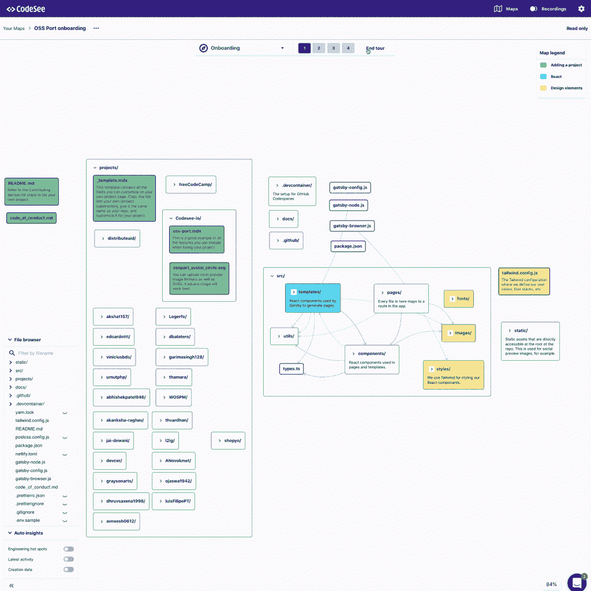

# CodeSee 帮助开发人员“理解代码库”

> 原文：<https://thenewstack.io/codesee-helps-developers-understand-the-codebase/>

作为一名开发人员，你可能在职业生涯中一次又一次地面临一个问题:努力理解一个新的代码库。无论是缺乏文档，还是简单的糟糕和混乱的代码，理解一个代码库需要花费大量的时间和精力，但是 [CodeSee](https://www.codesee.io/) 旨在帮助开发人员不仅获得最初的理解，而且随着时间的推移不断理解大型代码库。

“我们真的在努力帮助开发者掌握对代码库的理解。CodeSee 首席执行官兼联合创始人 [Shanea Leven](https://www.linkedin.com/in/shaneak) 说:“我们通过可视化他们的代码来做到这一点，因为我们认为一张图片真的抵得上一千个单词、一千行代码。“我们试图做的是真正确保开发人员，以及我们必须管理的所有代码——我们的代码库在过去十年中呈指数级增长——能够立即深入了解我们的代码是如何工作的。”

本月早些时候，仍处于测试阶段的 CodeSee 推出了 [OSS Port](https://www.oss-port.com/) ，将它的代码可见性和“持续理解”产品引入开源项目，并为潜在贡献者和维护者提供了一种找到下一个项目的方法。OSS Port 列出了开源项目，而不是像 GitHub 上那样按字母顺序排列，按照使用的主要语言、开发者的关注点，如 iOS、Android、frontend 或“社会行动主义”，甚至按照项目在潜在贡献者中寻找的角色类型。

[https://www.youtube.com/embed/gDAvFPnNFyo?feature=oembed](https://www.youtube.com/embed/gDAvFPnNFyo?feature=oembed)

视频

此外，OSS Port 允许每个开源项目访问其核心产品之一:项目本身的代码图，Leven 表示他们将保证开源项目永远可以使用该代码图。

“这是我们对开源社区的承诺，以确保我们提供一个真正帮助维护者加入贡献者的社区，因为维护者已经有足够多的事情要做，加入对他们来说也应该非常非常容易，”Leven 说。

嵌入到每个开源项目的配置文件页面中的代码映射是通过 GitHub 动作自动创建的，该动作解析项目存储库以显示文件和文件夹是如何连接的。然而，地图只是 CodeSee 提供的理解的一个层面。

除了地图之外，CodeSee 用户还可以创建旅程来帮助开发人员入门或引导开发人员完成代码库的复杂部分。类似地，CodeSee 提供了一个“自动洞察”功能，该功能可以监控代码库的变化，并实时向开发人员显示代码库中的新内容。

“在任何时候，你都可以打开这个开关，查看最新的活动发生在哪里。这给了开发人员一个非常快捷的方式来问‘我应该如何划分优先级？“我应该从哪里开始呢，”您可以看到所有最新活动的位置，以及这些文件有多旧，”Leven 解释道。

虽然代码图和旅行有助于最初的理解和入门，但 Leven 说，提供对代码库的持续理解也很重要，这与拉式请求图一样。

“当你开始改变代码库时，我们向你展示你的改变如何适应更大的架构。我们不会在一个开发人员开始一个新公司或新代码库后就放弃他。在最初的几个星期里，我们用这些公关图作为一个健全的检查，”Leven 解释说。此外，它将开发人员在对他们的团队成员进行变更时所具有的同样的理解借给了他们，这样他们的团队成员就可以对他们的变更如何适应更大的架构有一个概要的了解。因此，我们持续支持他们，以确保他们深刻理解他们的代码是如何工作的。”

公关图目前在 GitHub(code see 是其技术合作伙伴)的 pull 请求中作为图像出现，但 Leven 表示，他们希望在未来提供交互式图像，并在未来提供额外的代码库支持。此时，CodeSee 还可以与 JavaScript、TypeScript、Go、Java 和 Python 一起工作，Rust 支持正在路上，Leven 说更多的交互性、语言支持和一般可用性都在地平线上。

<svg xmlns:xlink="http://www.w3.org/1999/xlink" viewBox="0 0 68 31" version="1.1"><title>Group</title> <desc>Created with Sketch.</desc></svg>