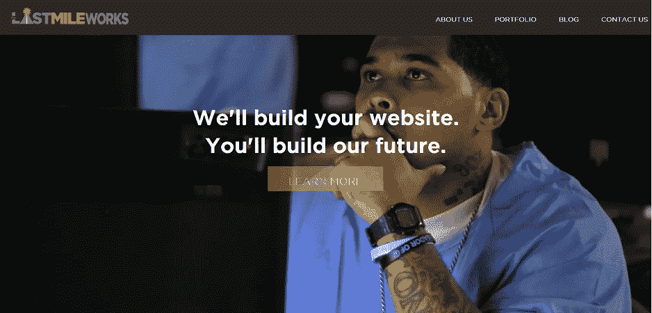
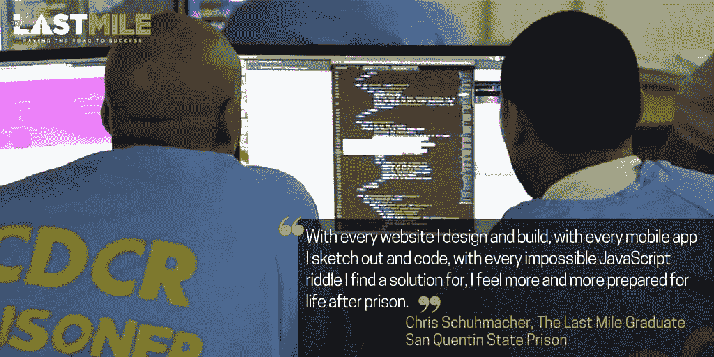

# 监狱中的编码:圣昆廷监狱的开发车间

> 原文：<https://thenewstack.io/coding-prison-dev-shop-san-quentin/>

当面对你将在哪里雇佣你的下一个程序员或者至少外包你的下一个项目的问题时，有一个资源你可能没有想到。

为什么不是监狱？

去年年底，一家网络开发店在圣昆廷监狱悄然开业。建于 1852 年的圣昆廷监狱是加州最古老的监狱。这座过度拥挤的监狱安静地坐落在旧金山湾的西北边缘，现在关押着 3774 名囚犯，其中 725 人在死囚区，而[被*旧金山纪事报*描述为“一个单调、受控、时而无聊、时而阴森的地方，回荡着迷失灵魂的呼喊。”这座占地 432 英亩的建筑甚至有自己的邮政编码。](http://www.sfgate.com/bayarea/article/INSIDE-DEATH-ROW-At-San-Quentin-647-condemned-2594023.php)

2010 年，两位硅谷慈善家开始认为监狱人口有未开发的潜力。风险投资家克里斯·雷德利茨(Chris Redlitz)曾拜访过这些囚犯，给他们做了一次鼓舞人心的演讲，讲述他们在获释后如何创业。这些人的商业知识水平和求知欲给他留下了深刻的印象，他开始酝酿在监狱内创建一个技术加速器的想法。

几年后，Redlitz 告诉《基督教科学箴言报》*,他和他的妻子/商业伙伴 [Beverly Parenti](https://twitter.com/thebev) 继续探访监狱一年多，试图获得囚犯的信任。“我是一个来自硅谷的老白人，现在正与在帮派中长大的年轻黑人打交道，”他说。Parenti 在技术社区也很突出，是第一虚拟控股公司(创建了第一个安全的在线支付系统)的创始成员。*

 *很快，这对夫妇决定在圣昆廷开始为期六个月的创业计划，并最终在监狱里开设一所编码学校，这是一场慈善活动，并在 350 名游客面前的演示日达到高潮。

“有权势的人来看我们……”一名心怀感激的囚犯回忆道。“我欣喜若狂，因为我看到了他们眼中的钦佩。政客、科技巨头、明星和我的狱友们都带着真诚的敬意看着我……当我结束演讲离开舞台时，纽森中尉州长站起来和我握手……

“演示日让我看到了自己的潜力。”

## 更大的事情

2010 年，两人创建了一个名为[最后一英里](https://thelastmile.org/)的 501(c) (3)非盈利组织，以使囚犯为技术职业做准备的工作正规化。今年 10 月，代码学校最终促成了名为“TLM 工厂”的监狱内开发工作室的创建，为囚犯带来了一个获得有偿工作经验的宝贵机会，以及为未来雇主建立投资组合的机会

“我们会建立你的网站。你将建设我们的未来，”[在其网站](https://tlmworks.org)上解释道。

根据*今日美国* 的报道，囚犯每小时的工资是 16.77 美元，是该州囚犯工作的最高工资(是美国最低工资的两倍多)。一些赚来的钱显然回到了监狱——或者，如网站所说，“抵消了食宿成本”——而一些进入了犯罪受害者的支持基金，一些进入了该项目囚犯的家庭。剩下的钱会进入为每个囚犯设立的储蓄账户，这样他们出狱后就可以领取这笔钱。

正如该网站所说，“你的发展需求可以赋予囚犯力量，改变他们的生活。”

囚犯们学习 HTML、JavaScript、Python、CSS 和网页设计，甚至数据可视化和一些 UI/UX 课程。最后一英里网站列出了参与者的核心能力，如 Node.js 和 WordPress，而其他页面指出他们也使用了 Express.js web 应用程序框架，以及 KeyStone、React、Angular.js、D3.js、Bootstrap 和 Ruby on Rails。

代码训练营的课程是与代码学校 [Hack Reactor](http://www.hackreactor.com/) 一起开发的，根据*今日美国*报道，到去年九月，已经有 51 名囚犯从该课程毕业。每个毕业生出狱后都会在科技行业实习。到目前为止，已经有 9 人从事技术工作。51 名毕业生中没有一人回到监狱。

“我们拥有的人才库相当惊人，”雷德利兹告诉《连线》杂志。甚至在参加“TLM 工厂”的面试之前，每个候选人都要接受超过 2000 小时的培训——该商店的网页上还引用了“不屈不挠的学习意愿”

他们在监狱服务器上工作——因为监狱规则禁止互联网接入——使用专有的编程平台“模拟现场编码体验”在其他地方，Last Miles [将它](https://tlmworks.org/about-us/)描述为“我们工作的一个类似互联网的基础设施……包括 StackOverflow、mock Twitter 和脸书 API、整个 npm 注册表等等。”客户通过也在监狱里的项目经理发送指示和反馈。

该网站将他们的员工描述为“雄心勃勃并被驱动为您的业务创建个性化的软件解决方案。”

最近的一个项目[是为 Airbnb](https://tlmworks.org/project/social-media-analytics-dashboard/) 做的:建立一个跟踪多个社交媒体账户的实时仪表盘。该网站解释说:“四名工程师一起工作，对脸书、Twitter、Pinterest 和 Instagram 提供的 API 进行了完美的模仿。”“从 OAuth 验证开始，并继续支持各种各样的查询参数，这些模拟 API 是不小的成就。”

这项工作得到了 Airbnb 社交营销和内容全球负责人的积极评价，他称赞该网站“在移动设备上看起来更好”。非常有用，我希望我们现在已经为所有事情都这么做了。”

今年 3 月，又有 18 名囚犯从该项目毕业。上个月，公共安全联盟(一个倡导改革刑事司法系统的组织)让囚犯们重新设计了他们的网站。

“这是一个实践我们价值观的机会，”联盟主席史蒂文·霍金斯说。"防止人们再次入狱的一个主要方法是提供就业机会。"

https://youtu.be/kLehyoI9HqY

当然，也有一些缺点。“有几天……我们的编码员被禁闭了，”Redlitz 说。但是他看到了现实世界经验的需要。“由于人们已经接受了编码培训，所以必须有机会实际参与测试他们技能的项目。”

在一个有趣的伙伴关系中，最后一英里还与 SiriusXM 合作制作了一个为期六周的广播节目 T10，名为“最后一英里广播”(在 Insight channel 121 上)，该节目“记录了被监禁的人通过项目、假释和返回社区的成功故事。”

“我们是故事的来源，但我们也编写了平台来讲述我们的故事。灵感和救赎的故事。”

“我们非常自豪能够创建这个网站，并有机会与您分享我们的故事。”

[https://www.youtube.com/embed/RsjwnFc_D0g?feature=oembed](https://www.youtube.com/embed/RsjwnFc_D0g?feature=oembed)

视频

广播节目包括帕伦蒂提出的一个尖锐的问题。“在某个时间点，他们将被释放回社会。

“所以问题是，你希望他们是谁？”

* * *

# WebReduce

专题图片来自[维基百科](https://en.wikipedia.org/wiki/San_Quentin_State_Prison#/media/File:SanQuentinSP.jpg)，公共领域。

<svg xmlns:xlink="http://www.w3.org/1999/xlink" viewBox="0 0 68 31" version="1.1"><title>Group</title> <desc>Created with Sketch.</desc></svg>*