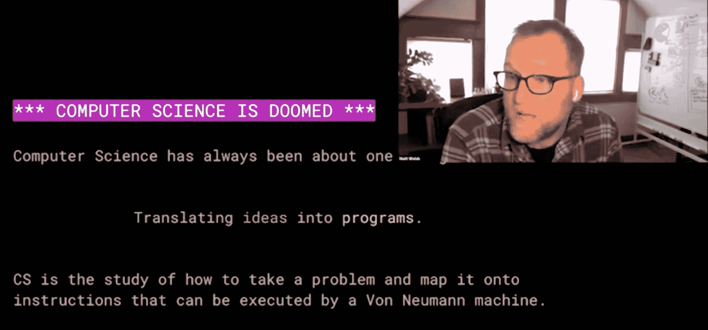
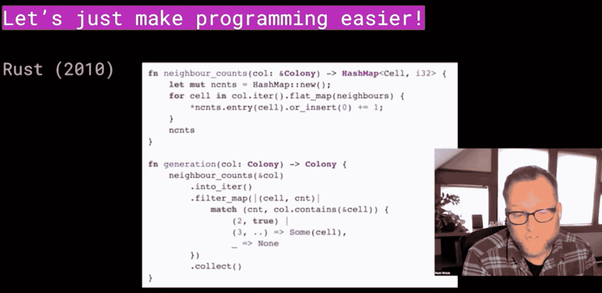
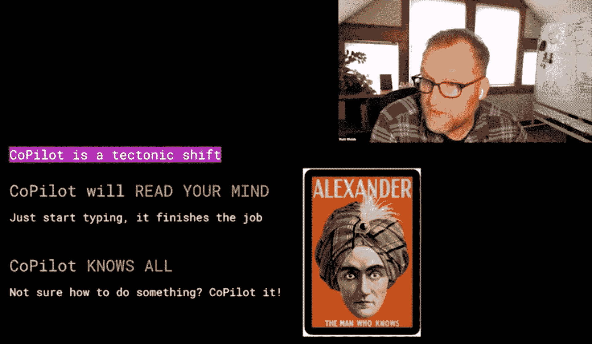
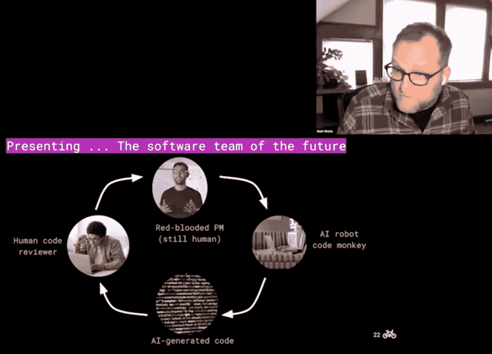
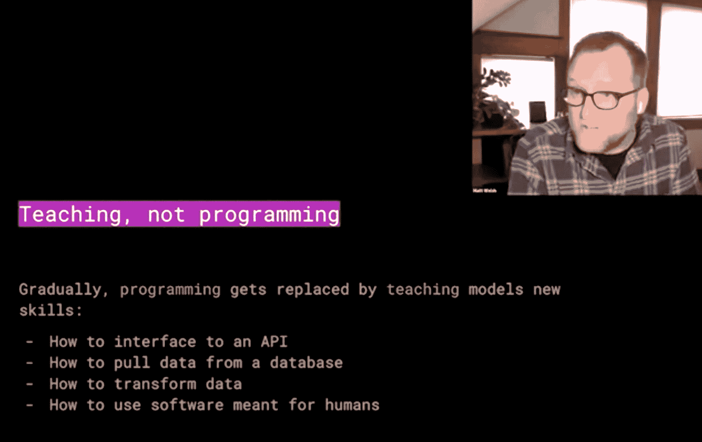
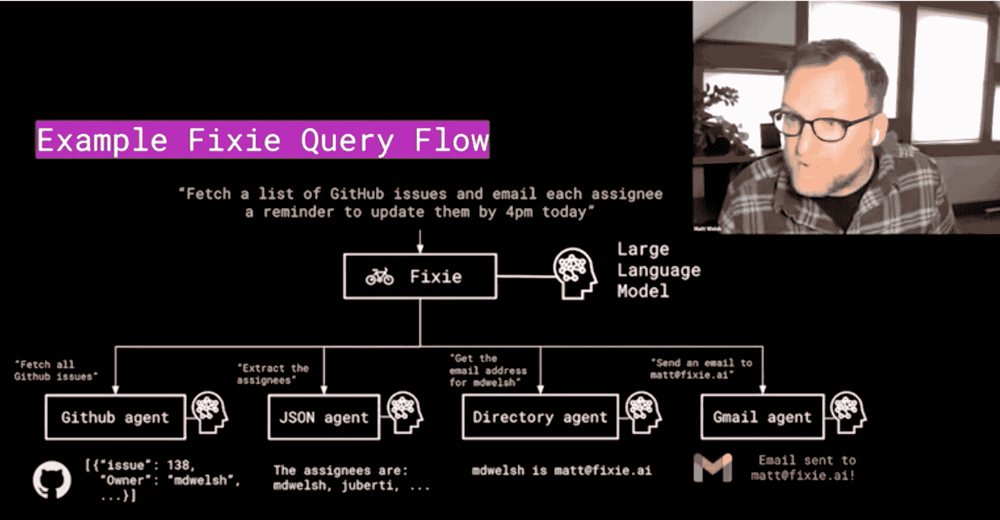
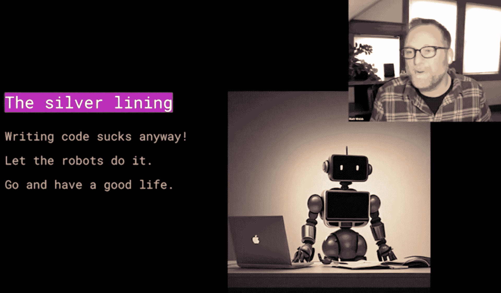

# 无论如何，编码是很糟糕的——马特·威尔士在《编程的尽头》

> 原文：<https://thenewstack.io/coding-sucks-anyway-matt-welsh-on-the-end-of-programming/>

本月[哈佛大学前计算机科学教授 Matt Welsh](https://www.mdw.la/) 在[芝加哥计算机械协会](http://www.chicagoacm.org/) (ACM)的虚拟会议上发言，解释他的论点 ChatGPI 和 GitHub Copilot 代表了编程终结的开始。

威尔士认为，由于 ChatGPT 和 Copilot 等技术，编程正处于从人类工作向机器人工作转变的尖端。在他看来，程序员需要进化成人工智能程序的“老师”——或者可能是产品经理或代码审查员，他认为这两种人类角色对机器人来说相对安全。但他说，不要指望继续你的职业生涯，成为真正的程序员，因为机器正在取代这个角色。

威尔士曾在谷歌和苹果担任高级工程职位，他为 2023 年 1 月版的《美国计算机学会通讯》杂志写了一篇关于这个主题的文章[。然而，直到这次 ACM 视频演示，威尔士才发现他已经成立了一家初创公司来证明他的理论。他担任首席执行官的 Fixie.ai 自称是“大型语言模型的自动化平台”。它旨在帮助企业使用 ChatGPT 和类似的机器学习程序编写定制软件。](https://cacm.acm.org/magazines/2023/1/267976-the-end-of-programming/fulltext)

## “计算机科学注定要失败”

威尔士在他的演讲开始时发表了高见，声称“计算机科学注定要失败。”

“我认为这个领域将会彻底改变，”他解释道。“如果你思考计算机科学作为一门学科是什么？它一直都是关于一件非常重要的事情，那就是将想法转化为程序。”

他接着说，在过去的 60 多年里，计算机编程一直在发展，试图让人类更容易理解代码。他将 1957 年的 Fortran 与 1964 年的 Basic 以及 2010 年的 Rust 进行了比较，但他表示，就人类程序员的易用性而言，这三者之间确实没有太大差异。

“人们今天开发的程序和以前一样复杂，一样难以维护，一样难以理解，一样充满了错误，”他声称。

是 GitHub Copilot 让威尔士从根本上重新评估了计算机科学的意义。“Copilot 从根本上改变了我们编写代码的方式，”他说，“至少在我的个人经历中，它是加速我发展的一种非凡而深远的方式。”

他已经认为 Copilot 是一款不可思议的产品。“在我打字的时候，Copilot 在经常帮我完成我的想法方面做得非常非常好——它比我真正认为它应该做的更多地读取了我的想法，”他说。他补充说，Copilot 是“一个了不起的生产力提升，因为它让我不必切换环境。”

尽管如此，威尔士认为当前版本的 Copilot“仅仅是个开始。”他说，只有两件事阻止 Copilot 变得更好:更多的数据和更多的计算。由于这两种东西都很丰富，他看不出“为什么 Copilot 在一两年或三年内不会达到这样的程度，你在源文件的顶部键入几行，它就写下其余部分。”

## 未来的软件团队

Welsh 有一些有趣的预测，关于这将如何改变软件开发的团队动态。基本上，一旦程序员被淘汰，他只看到人类的几个角色:产品经理和代码评审员。

他说，产品经理的角色不会有太大变化。

“想象一下，一个人类产品经理仍然能够用英语描述软件应该做什么——如果你愿意，可以称之为 PRDs(产品需求文档)。这是经前综合症已经在做的，对吗？”

但在不久的将来，威尔士说，“你只需将 PRD 交给人工智能，人工智能会在几秒钟内吐出代码，而不是将 PRD 交给工程团队，然后等待六周左右的时间来实现它。”

当然，生成式人工智能的早期教训之一是，这些人工智能的输出不一定是正确的。所以 Welsh 认为在这个没有程序员的未来，人类代码审核员会扮演一个角色。

“我们怎么知道代码有效呢？我们怎么知道它是好的？我们怎么知道这是对的？当然，我们需要进行彻底的测试，测试非常非常重要——这不会消失。我们过去几十年投资的所有 CI/CD 产品和所有东西在这里仍然适用。”

他认为，具有编程能力的人类将承担“审查和阅读人工智能生成的代码，并确保它工作，并做正确的事情”的任务。

至于程序员，以及那些即将加入该领域的人，他们将需要成为人工智能的老师，而不是程序员。“这一切都是为了教授人工智能，而不是编写计算机程序，”威尔士说。

## 输入 Fixie.ai

在设定了场景并吓退了参加 ACM 会议的 200 多名计算机科学家之后，威尔士解释了他的新公司是如何利用人工智能编程趋势的。

“Fixie 的想法是，你给它一个你想做的事情的描述，Fixie 接受它，使用一组大型语言模型*加上能够连接到外部系统的*代理，它可以为你产生一个结果——或者是一个问题的答案，或者是调用一个 API，或者是调用一个工具，或者是在一个数据库中进行更改。这些都是这些模型能做的事情。重要的是，我们不是通过写一大堆代码来做到这一点的；我们通过教人工智能模型如何做到这一点来做到这一点。”

## 编码糟透了

在这次演示中，Matt Welsh 显然对淘汰传统编码有很大的既得利益，因为他的公司旨在利用人工智能编程的趋势。然而，考虑到他自己作为计算机科学家的漫长而成功的职业生涯，你也必须认真对待他的预测。这是一个对编程如何工作有深刻理解的人，他认为 AI 已经接近掌握它了。

此外，威尔士认为“编码很糟糕”——所以让机器人去做吧。“用你的时间做些别的事情，”他建议道。"对每个人来说，编写计算机程序并不是最好的时间利用方式."

对于现在的程序员来说，说起来容易做起来难。但 Matt Welsh 可能是对的，这是编码的发展方向，所以这取决于我们人类去适应。

以下是 Matt Welsh 在芝加哥 ACM 上演讲的完整视频:

[https://www.youtube.com/embed/qmJ4xLC1ObU?feature=oembed](https://www.youtube.com/embed/qmJ4xLC1ObU?feature=oembed)

视频

<svg xmlns:xlink="http://www.w3.org/1999/xlink" viewBox="0 0 68 31" version="1.1"><title>Group</title> <desc>Created with Sketch.</desc></svg>