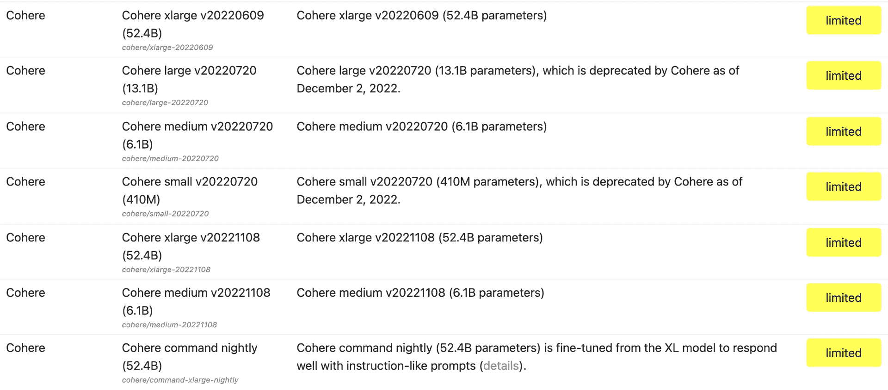
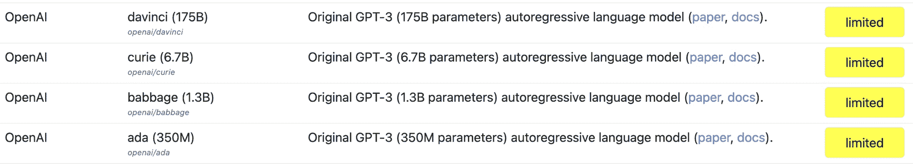
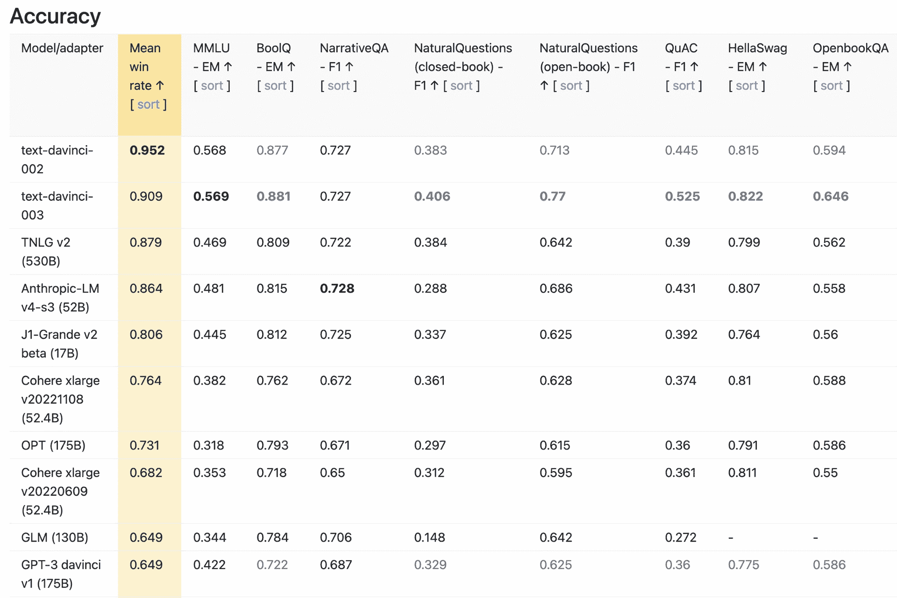

# 企业中的 Cohere vs. OpenAI:首席信息官们会选择哪一个？

> 原文：<https://thenewstack.io/cohere-vs-openai-in-the-enterprise-which-will-cios-choose/>

OpenAI 刚刚[宣布了](https://www.techmeme.com/230301/p23#a230301p23)其广受欢迎的生成式人工智能产品 ChatGPT 的企业版。但在这种情况下，OpenAI 是一个快速跟随者——而不是第一个上市的。[总部位于多伦多、与谷歌关系密切的 Cohere](https://cohere.ai/) 公司已经将生殖人工智能引入商业领域。

我与 Cohere 的总裁和首席运营官 [Martin Kon](https://www.linkedin.com/in/martin-kon-95188/) 谈论了其机器学习模型如何在企业中使用。

Cohere 只有几年历史，但它有着令人印象深刻的血统。Cohere 的两位创始人不久前曾为谷歌大脑工作，这引发了当前围绕生殖人工智能的热潮。2017 年，谷歌大脑推出了自然语言处理(NLP)的“变压器”模型 ChatGPT 中的“T”。Cohere 的首席执行官 Aidan Gomez 和首席技术官 Nick Frosst 随后与 Ivan Zhang 合作，在 Cohere 将这种形式的自然语言处理商业化。

Martin Kon 是公司的新人，上个月才开始工作。但和创始人一样，他也和谷歌有关系，在加入 Cohere 之前，他曾在 YouTube 工作了六年。他被请来负责 Cohere 的业务运营——业务似乎正在蓬勃发展。

根据 Kon 的说法，Cohere 经历了“在过去的一年里，API 调用的月环比增长 65%，开发人员的数量也差不多。”

既然 Cohere 有了吸引力，它已经将重点转移到将其大型语言模型和相关工具引入企业。

“我们正在与组织中的开发人员，即 AI/ML 团队合作，将这些能力引入他们的组织，”Kon 说。他声称它的方法与 OpenAI 的根本不同。

“OpenAI 希望你将你的数据带到他们的模型中，这是 Azure 独有的。Cohere 希望将我们的模型带到您的数据中，无论您在什么样的环境中都感到舒适。”

## Cohere 与 OpenAI 的技术比较

Cohere 有两种 LLM(大型语言模型):生成和表示。前者是 ChatGPT 做的事情，后者是为了理解语言(比如做情感分析)。每种类型都有不同的尺寸:小号、中号、大号和大号。在模型的大小和它的工作速度之间有各种权衡。

Cohere 的基础模型有 520 亿个参数，基于斯坦福 HELM 排名(语言模型的整体评估)。[斯坦福的 HELM 网站](https://crfm.stanford.edu/helm/latest/?models=1)注意到，这是针对 Cohere 模型的“xlarge”版本，最大的版本。OpenAI 最大的 GPT-3 达芬奇模型被斯坦福大学列为有 175 个参数。

斯坦福 HELM 目录中 Cohere 的模型列表

OpenAI 的主要模型

在我们的谈话中，Kon 说 Cohere 的模型被证明能更好地对抗 GPT-3。我向该公司求证这一点，它的回应是让我去找[斯坦福大学的精度测量](https://crfm.stanford.edu/helm/v0.2.0/?group=core_scenarios)。根据 Cohere 的说法，“该研究表明，Cohere xlarge 模型比一些知名的 3 倍大的模型更准确，包括 GPT-3，侏罗纪-1 Jumbo 和 BLOOM(每个模型都有大约 175B 参数)。”

但是，需要注意的是，Cohere 的模型仅领先于 GPT-3 模型。OpenAI 的[更近的 GPT-3.5 型号](https://platform.openai.com/docs/models/overview)，text-davinci-002 和 text-davinci-003，在准确性方面都比 Cohere 高。事实上，这些都是目前排名最高的所有模型的掌舵精度措施(见下文)。

斯坦福赫尔姆检验最大似然模型的准确性

今敏告诉我，Cohere 的最新型号 [Command](https://docs.cohere.ai/docs/command-beta) (目前处于测试阶段)，每周都会重新调整。“这意味着每周，你都可以期待 command 的性能有所提高，”他说。

根据文档，Command 是“一个生成模型，可以很好地响应类似指令的提示。”作为一个比较点，达芬奇被 OpenAI 描述为擅长“复杂的意图，因果，为观众总结。”

## 企业用例

生成式人工智能的最早用例基于内容生成和摘要——Stable Diffusion 的图像生成器、ChatGPT 的对话式搜索引擎、GitHub 的 Copilot 代码生成器等等。但我问今敏，它的技术还有哪些其他的使用案例，尤其是对企业而言。

首先，他说，公司正在用它来为他们自己的私人数据创建一种语义搜索引擎。

Kon 说:“以类似于我们习惯的谷歌搜索的方式，将语义搜索(上下文搜索)引入私人环境，如组织内部的信息。“因此，公司，尤其是跨国公司，可以搜索、分类或寻找他们内部的每一份材料，包括每一份文件、每一份客户电话记录、每一份视频聊天记录、电子邮件、文档等。”

他解释说，一个组织通常会将自己的数据添加到 Cohere 的基础模型中。他说，这将是“数量少得多、质量高得多的数据，通常是人类带注释的强化学习”(这里的“更小”只是指与基础模型中的数十亿个参数相比)。在所有这些之上，还有一个“对话”层，或对话层——像 ChatGPT。他补充说，Cohere 的对话模型正在内部测试中。

我之前问过一个大型零售商的用例是什么，Kon 在这里回答了这个问题。

“假设你是一名零售商，你想问我们在玻利维亚的生意怎么样？然后它(人工智能)可以说，这是从西班牙语中提取的最新销售结果，或者其他什么。不，[你说]，我指的是批发业务。好吧，[它回答]让我从别的地方拉一些不同的东西。所以你基本上是在对话。你正在以一种非常安全的方式访问(那些数据)，因为外部没有人可以看到它——你没有把它输入 ChatGPT，这是每个人都在做的事情。”

他给我讲了几个其他的例子，包括一个从零售商客户的角度讲的例子。说你买了一台电视，想退货；你可以与零售商的人工智能对话，实时检查当前的退货政策是什么。

## 谷歌合作伙伴

运行机器学习工作负载，尤其是具有数十亿个参数的工作负载，是极其硬件密集型的。所以我问 how Cohere 是如何处理的——他们主要是拥有内部硬件，还是与任何平台公司合作？

毫不奇怪，考虑到创始人和 Kon 本人的背景，Cohere 与谷歌在硬件方面进行了合作。

“我们现在与谷歌有战略关系，”今敏说。“因此，我相信我们是谷歌之外第一个——而且仍然是最大的 TPUs(张量处理单元)消费者。因此，我们可以使用这些庞大的计算资源，也有足够的资金来负担这些资源，我们需要对这些资源进行预培训。这些模型需要 4 到 6 周的时间来训练——基本模型。我们的指挥模型，我们可以在夜间进行，因为它的数据量小得多，但确实是具体的数据，所以我们每周都进行，但需要大约一个晚上的训练。”

当然，谷歌本身也在生成式 AI 游戏中。它有几个默默无闻的 ML 型号:T5、UL2、Flan-T5 和 PaLM。因此，正如云计算平台一样，企业人工智能市场正在变成一个“以马换课程”的局面。一些企业客户将是微软商店，因此可能倾向于 OpenAI。其他人将成为谷歌云的客户。但是许多人不希望被束缚在一个单一的云平台上，这也是 Cohere 最吸引人的地方。

企业公司显然有巨大的机会利用生成性人工智能技术超越竞争对手。至于生成式 AI 的提供商，包括 Cohere 和 OpenAI，我想不出今年还有比这更令人兴奋的企业 IT 类别值得关注。游戏开始了！

<svg xmlns:xlink="http://www.w3.org/1999/xlink" viewBox="0 0 68 31" version="1.1"><title>Group</title> <desc>Created with Sketch.</desc></svg>