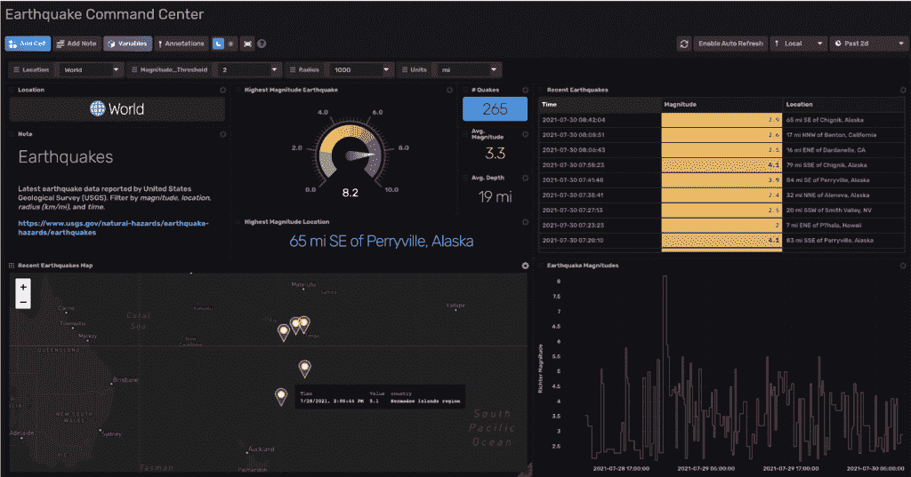

# 使用 AWS 和 InfluxDB 收集、存储和分析物联网数据

> 原文：<https://thenewstack.io/collect-store-and-analyze-iot-data-using-aws-and-influxdb/>

消费者想要更智能、更高效的服务，企业想要更多数据来做出更好的决策。其结果是，随着数十亿设备上线，物联网(IoT)市场迅速扩大。企业面临的最大挑战之一是将他们的硬件和软件捆绑在一起，以便他们可以从这些设备中产生商业价值。

第一个挑战是从现场的设备中收集数据并将其传输到云中。第二个挑战是能够有效地存储和分析这些设备生成的数百万个[时间序列](https://www.influxdata.com/what-is-time-series-data/?utm_source=vendor&utm_medium=referral&utm_campaign=2022-03-08_spnsr-ctn_iot-data-aws-influxdb_tns)数据点。像 [AWS](https://aws.amazon.com/) 和 [InfluxDB](https://www.influxdata.com/?utm_source=vendor&utm_medium=referral&utm_campaign=2022-03-08_spnsr-ctn_iot-data-aws-influxdb_tns) 这样的公司提供的工具可以帮助简化这些问题。在本文中，您将了解从收集到分析，可用于处理物联网数据的各种工具。

## 在边缘收集数据

 [查尔斯·马勒

查尔斯是 InfluxData 的技术营销作家。Charles 的背景包括从事数字营销和全栈软件开发。](https://www.influxdata.com/) 

每个人都希望实现业务现代化，并利用数据做出更明智的决策，但做到这一点说起来容易做起来难。主要挑战之一是做好从物联网设备可靠收集数据的基础工作。此阶段的一些常见挑战包括:

*   现场设备的间歇性互联网连接。
*   通过加密和认证确保传输数据的安全性。
*   在边缘过滤和转换数据，以减少带宽消耗。

这些问题仅仅是实现细节，并不能为企业提供价值。幸运的是，AWS 提供的服务抽象出了许多困难，这减少了开发时间，并允许开发人员专注于对他们的应用程序重要的事情。

第一个服务是 AWS 物联网 Greengrass，直接部署在你的物联网设备上。Greengrass 充当您的设备和云之间的中间人，并处理以下事项:

*   如果连接中断，自动重试向云发送数据。
*   在数据发送到云之前，在边缘过滤或转换数据。
*   设备之间的本地网络连接管理。

Greengrass 还提供连接器组件，使用各种不同的协议将数据发送回云端。在您的设备上使用 Greengrass 的最大好处是它在处理和移动数据方面为您提供了大量的架构选项。我将通过三个例子来说明如何使用 AWS Greengrass 将数据从设备转移到云中。

### 边缘和中心

一些应用程序需要实时处理和分析，不能承担将工作导出到云所带来的延迟或潜在停机风险。在这种情况下，一种架构模式被称为[边缘和中枢](https://www.influxdata.com/blog/how-influxdb-iot-data/?utm_source=vendor&utm_medium=referral&utm_campaign=2022-03-08_spnsr-ctn_iot-data-aws-influxdb_tns)。通过这种设置，InfluxDB 与物联网设备部署在同一个网络上，因此可以在本地存储和分析数据。数据通常会被“T2”降采样，并最终被发送到云存储中，以便进行长期分析。

这个用例的一个例子是挪威国有石油公司 [Equinor](https://en.wikipedia.org/wiki/Equinor) 。它希望能够实时检测海洋石油钻井平台的潜在问题，如发现潜在的泄漏并尽快关闭钻井平台。由于潜在的延迟或失去连接，在云中运行这种类型的分析风险太大，因此它在本地部署 InfluxDB。但它也希望能够分析长期数据，所以它也向下采样并导出到云。

AWS Greengrass 提供了向 InfluxDB 发送数据的能力，该用例包含两个不同的组件:

### AWS 物联网核心

AWS 物联网核心本质上是一个托管的 MQTT 代理，它与 Greengrass 很好地连接在一起。一旦数据被物联网核心接收，您就可以根据您的使用案例将该数据传递给任意数量的紧密集成的 AWS 服务。通过观看 2021 年 EMEA 时尚日的 AWS 演示，你可以了解更多关于这些服务的信息。

### Telegraf

从运行 Greengrass 的设备中获取数据的另一个选择是通过消费来自 Greengrass [MQTT 经纪人](https://docs.aws.amazon.com/greengrass/v2/developerguide/mqtt-broker-moquette-component.html)的消息来使用 [Telegraf](https://docs.influxdata.com/telegraf/v1.21/introduction/getting-started/) 。一旦 Telegraf 收集了数据，你就可以利用超过 [300 个不同的插件](https://www.influxdata.com/products/integrations/?utm_source=vendor&utm_medium=referral&utm_campaign=2022-03-08_spnsr-ctn_iot-data-aws-influxdb_tns)来处理、转换数据，然后将数据导出到云端。

## 在云中使用数据

一旦你的数据被收集并存储在云中，真正的乐趣就开始了，那就是使用这些数据进行分析、可视化和优化。让我们回顾一下物联网数据的一些典型使用案例。

### 形象化

可视化可能是最常见的，也是处理物联网数据的第一步。InfluxDB 提供了现成的仪表板工具，但也使您可以轻松地将数据导入您熟悉的第三方可视化工具，如 Grafana。这种类型的解决方案通常由内部团队使用。

在某些情况下，您可能希望向消费者公开这些数据。InfluxDB 通过[客户端库](https://docs.influxdata.com/influxdb/cloud/api-guide/client-libraries/?utm_source=vendor&utm_medium=referral&utm_campaign=2022-03-08_spnsr-ctn_iot-data-aws-influxdb_tns)和 REST API 使这成为可能。这方面的一个例子是一家智能恒温器公司，它允许用户通过移动应用程序查看他们的个人数据。

### 监视

可视化数据之外的下一步是主动监控并根据数据采取行动。在这里，您可以采取的最简单的措施是为某些数据点设置一个阈值，然后在违反这些阈值时提醒某人采取措施。这种情况的一个例子可能是来自传感器的温度值增加到不安全的水平，这触发了针对用户或待命员工的电子邮件、SMS 或空闲通知。

InfluxDB 通过[任务](https://docs.influxdata.com/influxdb/cloud/process-data/get-started/?utm_source=vendor&utm_medium=referral&utm_campaign=2022-03-08_spnsr-ctn_iot-data-aws-influxdb_tns)提供了开箱即用的功能。您可以设置任务运行和检查数据的时间间隔，然后根据结果采取措施。最终，您可以完全自动化该过程，并在触发任务阈值时采取编程操作来解决问题。

### 机器学习

随着你的设置越来越复杂，你可以开始考虑使用机器学习来优化你的业务。当处理时间序列数据时，通过机器学习可以做两件事:

*   试图通过预测来预测未来。
*   通过异常检测对系统的当前状态进行分类。

AWS 提供了许多用于培训、部署和运行您自己的模型的服务，以及允许您访问预培训模型以用于更一般的用例的服务。InfluxDB 的 API 和客户端库使数据可以访问您首选的语言生态系统，Python 是数据科学和机器学习用例中最受欢迎的。可以部署模型，然后使用模型进行预测，然后可以将预测作为预测项目写回到 InfluxDB 中。这些预测还可以用来用自动化操作代替人工干预。

## 额外资源

这篇文章实际上只是对通过 AWS 和 InfluxDB 处理物联网数据的可用工具的高级分析。有关物联网生态系统的更多信息和更具体的用例示例，请查看以下资源:

<svg xmlns:xlink="http://www.w3.org/1999/xlink" viewBox="0 0 68 31" version="1.1"><title>Group</title> <desc>Created with Sketch.</desc></svg>